# Technical Specification

# 0. SUMMARY OF CHANGES

## 0.1 USER INTENT RESTATEMENT

Based on the requirements, the Blitzy platform understands that the objective is to modernize a basic Node.js HTTP server tutorial application by integrating the Express.js web framework and expanding its endpoint capabilities. 

The user has provided a working Node.js server that currently uses Node's built-in `http` module to serve a single endpoint returning "Hello, World!" and requires:
1. Migration from the native HTTP module to Express.js framework for enhanced routing and middleware capabilities
2. Addition of a second endpoint to demonstrate multi-route handling with a "Good evening" response
3. Preservation of the existing "Hello world" functionality (implied by "add another endpoint" rather than "replace")
4. Maintenance of the tutorial nature of the project with clear, educational implementation

## 0.2 TECHNICAL INTERPRETATION

These requirements translate to the following technical implementation strategy:

### 0.2.1 Framework Migration Objectives
- **Modernize Server Architecture**: To achieve Express.js integration, we will replace the native `http.createServer` implementation with Express application initialization and routing
- **Enhance Routing Capabilities**: To support multiple endpoints, we will implement Express's declarative routing system replacing the single request handler
- **Improve Response Handling**: To standardize responses, we will utilize Express's response methods (`res.send()`) instead of manual header and status code management

### 0.2.2 Dependency Management Objectives
- **Package Configuration**: To enable Express.js, we will update the npm package manifest to include Express as a production dependency
- **Lock File Synchronization**: To ensure reproducible builds, we will regenerate package-lock.json with Express and its transitive dependencies

### 0.2.3 Endpoint Implementation Objectives  
- **Root Endpoint Preservation**: To maintain backward compatibility, we will map the existing "Hello, World!" response to the root path (`/`)
- **New Route Addition**: To fulfill the new requirement, we will create a dedicated endpoint returning "Good evening" at an appropriate path

## 0.3 COMPONENT IMPACT ANALYSIS

### 0.3.1 Direct Modifications Required

**server.js**: Refactor from `http` module to Express framework
- Remove: `const http = require('http')` and `http.createServer()` pattern
- Add: `const express = require('express')` and `const app = express()` initialization
- Transform: Single request handler to multiple Express route handlers
- Update: Server listening mechanism to use Express's `app.listen()` method

**package.json**: Add Express.js dependency
- Modify: `dependencies` field to include `"express": "^5.1.0"`
- Consider: Updating `scripts` section for better development workflow (optional enhancement)

**package-lock.json**: Regenerate with Express dependencies
- Auto-update: Will be regenerated when `npm install express` is executed
- Include: Express and all transitive dependencies with exact versions

### 0.3.2 Indirect Impacts and Dependencies

**Node.js Runtime Compatibility**:
- Current version 18.19.1 exceeds Express 5.x minimum requirement (Node.js 18+)
- No runtime upgrade needed

**Project Structure**:
- No new directories required
- No additional configuration files needed
- Maintains simple single-file architecture appropriate for tutorial

### 0.3.3 New Components Introduction

No new files will be created. The implementation will maintain the minimalist structure suitable for a tutorial project.

## 0.4 FILE AND PATH MAPPING

| Target File/Module | Source Reference | Context Dependencies | Modification Type |
|-------------------|------------------|---------------------|-------------------|
| server.js | Current HTTP implementation | Express.js API | Complete refactor to Express |
| package.json | Current manifest | npm registry | Add Express dependency |
| package-lock.json | Current lock file | npm resolution | Auto-regenerate with dependencies |

## 0.5 IMPLEMENTATION DESIGN

### 0.5.1 Technical Approach

First, establish the Express foundation by modifying `server.js` to:
- Import Express framework instead of native http module
- Initialize Express application instance
- Configure server constants (hostname, port) for consistency

Next, integrate the routing system by extending `server.js` with:
- GET route handler for `/` path returning "Hello, World!" to preserve existing functionality
- GET route handler for `/evening` path returning "Good evening" as the new feature
- Proper content-type headers managed automatically by Express

Finally, ensure server functionality by implementing in `server.js`:
- Express server listening on the same port (3000) and hostname (127.0.0.1)
- Console logging to confirm server startup with accessible URLs
- Graceful response handling through Express's built-in middleware

### 0.5.2 Critical Implementation Details

**Design Patterns Employed**:
- Middleware-based architecture pattern inherent to Express
- RESTful routing conventions for endpoint design
- Declarative route definition pattern

**Response Standardization**:
- Utilize `res.send()` for automatic content-type detection
- Maintain plain text responses for consistency with original implementation
- Preserve newline characters in responses for identical output format

**Route Path Selection**:
- Root path `/` for backward compatibility
- `/evening` path follows RESTful noun-based convention
- Alternative considered: `/api/greeting/evening` for more structured API design (not selected to maintain simplicity)

### 0.5.3 Dependency Analysis

**Required Dependencies**:
- express@^5.1.0 - Core web framework (Latest stable version providing modern Express features with Node.js 18+ support)

**Transitive Dependencies** (automatically resolved):
- body-parser - Request body parsing middleware
- cookie-parser - Cookie parsing functionality  
- Various utility libraries for HTTP handling

**Version Constraints**:
- Express 5.x requires Node.js 18 or higher, satisfied by current environment (18.19.1)
- Caret notation (^5.1.0) allows minor version updates for bug fixes

## 0.6 SCOPE BOUNDARIES

### 0.6.1 Explicitly In Scope

**File Modifications**:
- server.js - Complete refactoring to Express.js
- package.json - Dependency addition
- package-lock.json - Automatic regeneration

**Functional Changes**:
- Migration from http module to Express framework
- Implementation of `/` endpoint returning "Hello, World!\n"
- Implementation of `/evening` endpoint returning "Good evening\n"
- Preservation of server binding to 127.0.0.1:3000
- Console logging of server startup

**Quality Considerations**:
- Maintain tutorial-appropriate simplicity
- Preserve exact response format including newlines
- Keep single-file architecture

### 0.6.2 Explicitly Out of Scope

**Not Included**:
- Error handling middleware (beyond Express defaults)
- Request logging middleware
- CORS configuration
- Static file serving
- Template engine integration
- Database connections
- Authentication/authorization
- Unit or integration tests
- Docker configuration
- Environment variable management
- Production optimizations
- HTTPS/TLS configuration
- Process management (PM2, forever)
- API documentation (Swagger/OpenAPI)
- TypeScript conversion
- Modification of README.md

**Related Areas Not Modified**:
- The package.json "main" field pointing to non-existent index.js
- The failing test script in package.json
- Project naming or metadata
- Git configuration

### 0.6.3 Future Considerations

These items are noted for potential future iterations but are NOT part of current scope:
- Adding middleware for request logging (morgan)
- Implementing error handling middleware
- Creating a router module for better organization
- Adding environment configuration
- Implementing additional endpoints
- Adding request validation

## 0.7 VALIDATION CHECKLIST

### 0.7.1 Implementation Verification Points

**Dependency Installation**:
- ✓ Express appears in package.json dependencies
- ✓ package-lock.json contains Express and transitive dependencies
- ✓ `npm install` completes without errors

**Code Transformation**:
- ✓ server.js imports Express instead of http
- ✓ Express app instance created
- ✓ Two GET routes defined
- ✓ Server listens on 127.0.0.1:3000

**Functional Testing**:
- ✓ `node server.js` starts without errors
- ✓ Console displays "Server running at http://127.0.0.1:3000/"
- ✓ GET http://127.0.0.1:3000/ returns "Hello, World!\n"
- ✓ GET http://127.0.0.1:3000/evening returns "Good evening\n"
- ✓ Response Content-Type is "text/html; charset=utf-8" (Express default)

### 0.7.2 Observable Changes

**For Developers**:
- Cleaner, more maintainable code structure
- Easier route addition and management
- Built-in middleware capabilities available

**For End Users**:
- Existing root endpoint continues to work identically
- New `/evening` endpoint accessible
- Slightly different Content-Type header (includes charset)

### 0.7.3 Integration Points to Test

- Express framework initialization
- Route handler execution
- Response formatting consistency
- Server binding and listening

## 0.8 EXECUTION PARAMETERS

### 0.8.1 Special Execution Instructions

**Installation Process**:
- Use npm to install Express: `npm install express@^5.1.0`
- No special flags or configuration needed
- Installation will auto-update package-lock.json

**Development Workflow**:
- No changes to startup command: `node server.js`
- No additional build steps required
- No compilation or transpilation needed

### 0.8.2 Constraints and Boundaries

**Technical Constraints**:
- Must maintain Node.js 18.19.1 compatibility
- Must preserve existing endpoint functionality
- Must use Express.js specifically (not other frameworks)
- Must maintain single-file simplicity

**Process Constraints**:
- Standard npm installation procedures only
- No external service integrations
- No database setup required

**Output Constraints**:
- Plain text responses only
- Maintain newline characters in responses
- Preserve console log format

## 0.9 TECHNICAL DECISION RATIONALE

### 0.9.1 Framework Selection
Express.js was explicitly requested and represents the de facto standard for Node.js web applications, offering the right balance of simplicity for tutorials and power for real applications.

### 0.9.2 Route Path Design
- `/` preserved for backward compatibility
- `/evening` chosen for simplicity over more complex patterns like `/api/greetings/evening`
- Avoided query parameters or path parameters to maintain tutorial simplicity

### 0.9.3 Response Format
Maintaining plain text with newlines ensures output consistency with the original implementation while demonstrating Express's automatic content-type handling.

### 0.9.4 Version Strategy
Using ^5.1.0 for Express allows patch updates while preventing breaking changes, appropriate for a tutorial that should remain stable.

# 1. INTRODUCTION

## 1.1 Executive Summary

### 1.1.1 Project Overview

The **hao-backprop-test** system is a minimal Node.js HTTP server application <span style="background-color: rgba(91, 57, 243, 0.2)">built on the Express.js web framework</span> designed specifically as a test harness for backpropagation integration testing. This lightweight system serves as a foundational testing platform that provides a simple, controlled environment for validating backprop functionality through <span style="background-color: rgba(91, 57, 243, 0.2)">multiple HTTP endpoints</span>.

### 1.1.2 Core Business Problem

The system addresses the need for a <span style="background-color: rgba(91, 57, 243, 0.2)">minimal-dependency (single dependency) testing environment</span> that enables:
- **Integration Testing**: Provides a stable baseline for testing backprop system interactions
- **Verification Platform**: <span style="background-color: rgba(91, 57, 243, 0.2)">Offers two simple HTTP endpoints for functional verification</span>
- **Development Support**: Creates a controlled environment for integration development and debugging

### 1.1.3 Key Stakeholders and Users

| Stakeholder Group | Primary Interest | Usage Pattern |
|------------------|------------------|---------------|
| Integration Engineers | System integration testing | <span style="background-color: rgba(91, 57, 243, 0.2)">Multi-endpoint HTTP testing</span> |
| QA/Testing Teams | Verification of backprop functionality | Automated test execution |
| Development Teams | Local development and debugging | Development environment setup |

### 1.1.4 Expected Business Impact and Value Proposition

The system delivers value through:
- **Simplified Testing**: <span style="background-color: rgba(91, 57, 243, 0.2)">Single lightweight Express dependency maintains low environmental complexity while enabling modern routing features</span>
- **Rapid Deployment**: Minimal setup requirements accelerate testing cycles  
- **Integration Validation**: <span style="background-color: rgba(91, 57, 243, 0.2)">Provides reliable endpoints (root "/" for "Hello, World!" and "/evening" for "Good evening") for backprop system verification</span>
- **Development Acceleration**: Enables quick local testing and development iteration

## 1.2 System Overview

### 1.2.1 Project Context

#### Business Context and Market Positioning
The hao-backprop-test system serves as a specialized testing tool within the broader ecosystem of machine learning and neural network development tools. It occupies a unique position as a minimal integration testing platform that removes complexity barriers typically associated with testing sophisticated backpropagation systems.

#### Current System Limitations
As a minimal test harness, the system intentionally maintains simplicity over feature richness:
- **Local Access Only**: Binds exclusively to localhost (127.0.0.1), preventing external accessibility
- <span style="background-color: rgba(91, 57, 243, 0.2)">**Predefined Response Pattern**: Supports two predefined endpoints with specific response content - root path returns "Hello, World!" and "/evening" path returns "Good evening"</span>
- **No Environmental Configuration**: Hardcoded server settings limit deployment flexibility
- **Development-Only Scope**: Not designed for production deployment or scaling

#### Integration with Existing Enterprise Landscape
The system is designed to integrate seamlessly with existing development and testing workflows:
- **HTTP-Based Interface**: Standard HTTP protocol ensures compatibility with testing frameworks
- <span style="background-color: rgba(91, 57, 243, 0.2)">**Minimal Dependencies**: Single Express framework dependency eliminates potential conflicts with existing tool chains</span>
- **Minimal Resource Requirements**: Node.js runtime provides broad platform compatibility

### 1.2.2 High-Level Description

#### Primary System Capabilities
The system implements a focused set of core capabilities:

| Capability | Implementation | Technical Approach |
|-----------|---------------|-------------------|
| HTTP Server | <span style="background-color: rgba(91, 57, 243, 0.2)">Express 5.x framework on Node.js</span> | Single-threaded, event-driven architecture |
| Request Handling | <span style="background-color: rgba(91, 57, 243, 0.2)">Path-specific response pattern using Express routing</span> | Method-agnostic processing |
| Local Networking | Localhost binding | Secure, isolated testing environment |
| <span style="background-color: rgba(91, 57, 243, 0.2)">Endpoint Management</span> | <span style="background-color: rgba(91, 57, 243, 0.2)">Two GET routes: "/" and "/evening"</span> | <span style="background-color: rgba(91, 57, 243, 0.2)">Declarative routing system</span> |

#### Major System Components
The system architecture consists of minimal, purpose-built components:

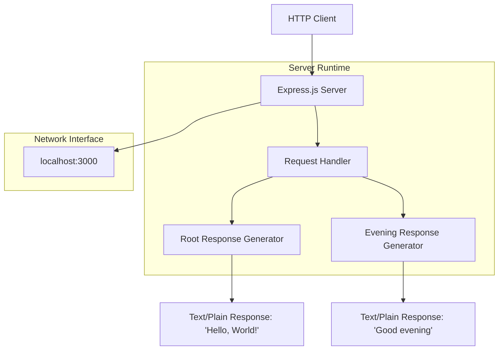
```mermaid
graph TD
    A[HTTP Client] --> B[Express.js Server]
    B --> C[Request Handler]
    C --> D[Root Response Generator]
    C --> E[Evening Response Generator]
    D --> F["Text/Plain Response: 'Hello, World!'"]
    E --> G["Text/Plain Response: 'Good evening'"]
    
    subgraph "Server Runtime"
        B
        C
        D
        E
    end
    
    subgraph "Network Interface"
        H[localhost:3000]
        B --> H
    end
```

#### Core Technical Approach
- **Minimalist Architecture**: Single-file implementation maximizes simplicity and maintainability
- <span style="background-color: rgba(91, 57, 243, 0.2)">**Express Framework Usage**: Leverages Express.js web framework to provide modern routing capabilities while maintaining minimal dependency footprint</span>
- **Plain Text Protocol**: Simple text responses facilitate automated testing and verification
- <span style="background-color: rgba(91, 57, 243, 0.2)">**Declarative Routing**: Express's routing system enables clean separation between endpoint logic and response handling</span>

### 1.2.3 Success Criteria

#### Measurable Objectives

| Objective | Success Metric | Target Value |
|-----------|---------------|--------------|
| Server Availability | Successful HTTP responses | 100% uptime during test sessions |
| <span style="background-color: rgba(91, 57, 243, 0.2)">Root Endpoint Consistency</span> | <span style="background-color: rgba(91, 57, 243, 0.2)">GET "/" response content</span> | "Hello, World!\n" for all requests |
| <span style="background-color: rgba(91, 57, 243, 0.2)">Evening Endpoint Consistency</span> | <span style="background-color: rgba(91, 57, 243, 0.2)">GET "/evening" response content</span> | <span style="background-color: rgba(91, 57, 243, 0.2)">"Good evening\n" for all requests</span> |
| Startup Reliability | Successful port binding | Server starts within 1 second |

#### Critical Success Factors
- <span style="background-color: rgba(91, 57, 243, 0.2)">**Single Dependency Deployment**: System must operate using Node.js runtime with Express.js as the sole external dependency</span>
- <span style="background-color: rgba(91, 57, 243, 0.2)">**Consistent Multi-Endpoint Behavior**: Both root ("/") and evening ("/evening") endpoints deliver their respective responses consistently</span>
- **Local Network Binding**: Server must bind exclusively to localhost interface
- **Rapid Startup**: Server initialization must complete without delays or errors

#### Key Performance Indicators (KPIs)
- **Response Time**: HTTP requests complete within milliseconds
- **Memory Footprint**: Minimal RAM usage (< 50MB under normal operation)
- **Test Integration Success**: Seamless integration with backprop testing workflows
- <span style="background-color: rgba(91, 57, 243, 0.2)">**Route Verification**: Both "/" and "/evening" endpoints respond correctly to GET requests</span>
- <span style="background-color: rgba(91, 57, 243, 0.2)">**Express Framework Deployment**: Installation requires Node.js runtime plus Express dependency management</span>

## 1.3 Scope

### 1.3.1 In-Scope

#### Core Features and Functionalities

**Must-Have Capabilities:**
- <span style="background-color: rgba(91, 57, 243, 0.2)">HTTP server implementation using Express.js on Node.js</span>
- Universal request handling for all HTTP methods (GET, POST, PUT, DELETE, etc.)
- <span style="background-color: rgba(91, 57, 243, 0.2)">Static text responses for two GET routes: "Hello, World!\n" at root and "Good evening\n" at /evening</span>
- Plain text content type response formatting
- Localhost-only network binding for security
- <span style="background-color: rgba(91, 57, 243, 0.2)">URL path-based routing for multiple endpoints</span>

**Primary User Workflows:**
- Server startup via Node.js command execution
- HTTP client connection to localhost:3000
- Request submission using any HTTP method
- <span style="background-color: rgba(91, 57, 243, 0.2)">Response reception with route-specific content ("Hello, World!" at root, "Good evening" at /evening)</span>
- Server shutdown through process termination

**Essential Integrations:**
- Node.js runtime environment integration
- <span style="background-color: rgba(91, 57, 243, 0.2)">Express.js web framework integration</span>
- Local network interface binding
- Standard HTTP protocol compliance
- Integration testing framework compatibility

**Key Technical Requirements:**
- <span style="background-color: rgba(91, 57, 243, 0.2)">Single external dependency (Express) operation</span>
- Single-file server implementation
- <span style="background-color: rgba(91, 57, 243, 0.2)">Path-specific response patterns for multiple endpoints</span>
- Cross-platform compatibility through Node.js runtime

#### Implementation Boundaries

| Boundary Type | Included Elements | Technical Scope |
|--------------|-------------------|-----------------|
| System Boundaries | <span style="background-color: rgba(91, 57, 243, 0.2)">HTTP server, Express.js framework, request handler, response generators</span> | localhost:3000 endpoint |
| User Groups Covered | Integration engineers, QA teams, developers | Local development access only |
| Geographic Coverage | Local machine access only | 127.0.0.1 binding restriction |
| Data Domains | <span style="background-color: rgba(91, 57, 243, 0.2)">Static text responses for two endpoints</span> | <span style="background-color: rgba(91, 57, 243, 0.2)">"Hello, World!" at root, "Good evening" at /evening</span> |

### 1.3.2 Out-of-Scope

#### Explicitly Excluded Features and Capabilities
- **External Network Access**: No binding to public IP addresses or external interfaces
- **Authentication and Security**: No user authentication, authorization, or security mechanisms
- **Advanced Routing Features**: No dynamic routing parameters, middleware chains, or complex route patterns
- **Data Persistence**: No database integration or data storage capabilities
- **Configuration Management**: No environment-based configuration or settings
- **Error Handling**: No comprehensive error handling or graceful degradation
- **Monitoring and Logging**: No application monitoring, metrics collection, or detailed logging
- **Production Deployment Features**: No clustering, load balancing, or scalability mechanisms

#### Future Phase Considerations
- **Multi-Environment Configuration**: Environmental variable support for different deployment contexts
- **Enhanced Logging**: Detailed request/response logging for debugging and monitoring
- **Health Check Endpoints**: Dedicated endpoints for system health verification
- **Configuration API**: Dynamic configuration management capabilities
- **Advanced Express Features**: Middleware integration, template engines, and request parsing

#### Integration Points Not Covered
- **External Service Integration**: No connectivity to external APIs or services
- **Database Connectivity**: No relational or NoSQL database integration
- **Message Queue Integration**: No asynchronous messaging system support
- **Container Orchestration**: No Docker or Kubernetes deployment configurations

#### Unsupported Use Cases
- **Production Web Serving**: Not suitable for production web application hosting
- **High-Traffic Handling**: No support for concurrent user loads or traffic scaling
- **Complex Business Logic**: No support for business rule processing or workflow management
- **Multi-Tenant Operations**: No support for multiple client or tenant isolation

#### References

- `README.md` - Project identification and purpose statement
- `package.json` - NPM manifest with project metadata, scripts, and dependency configuration
- `server.js` - Main application file implementing HTTP server functionality
- `package-lock.json` - Dependency lockfile confirming <span style="background-color: rgba(91, 57, 243, 0.2)">single external package requirement (Express)</span>

# 2. PRODUCT REQUIREMENTS

## 2.1 Feature Catalog

### 2.1.1 HTTP Server Initialization

| **Metadata** | **Value** |
|--------------|-----------|
| Feature ID | F-001 |
| Feature Name | HTTP Server Initialization |
| Category | Core Infrastructure |
| Priority Level | Critical |
| Status | Completed |

#### Description

**Overview**: Provides fundamental HTTP server initialization and network binding capabilities for the test harness environment.

**Business Value**: Enables the primary testing interface required for backpropagation integration validation, serving as the foundation for all testing workflows.

**User Benefits**: 
- Developers gain immediate access to a stable testing endpoint
- Integration engineers receive consistent server startup behavior
- QA teams can reliably establish testing sessions

**Technical Context**: <span style="background-color: rgba(91, 57, 243, 0.2)">Implemented using Express.js web framework (v5.1.x) bound to localhost:3000; uses app.listen() for startup</span>, ensuring isolated and secure testing environment.

#### Dependencies

| **Dependency Type** | **Details** |
|---------------------|-------------|
| System Dependencies | Node.js runtime environment |
| External Dependencies | <span style="background-color: rgba(91, 57, 243, 0.2)">Express.js web framework v5.1.x</span> |
| Integration Requirements | Local TCP/IP networking stack |

### 2.1.2 Universal Request Handling (deprecated)

| **Metadata** | **Value** |
|--------------|-----------|
| Feature ID | F-002 |
| Feature Name | Universal Request Handling |
| Category | Request Processing |
| Priority Level | <span style="background-color: rgba(91, 57, 243, 0.2)">Low</span> |
| Status | <span style="background-color: rgba(91, 57, 243, 0.2)">Deprecated</span> |

#### Description

**Overview**: <span style="background-color: rgba(91, 57, 243, 0.2)">Previously processed all incoming HTTP requests regardless of method, path, headers, or body content using a unified handling approach. Superseded by Express route-based handling.</span>

**Business Value**: Simplified integration testing by providing consistent behavior across all HTTP interaction patterns, reducing testing complexity and potential edge cases.

**User Benefits**:
- Test developers can use any HTTP method without configuration changes
- Simplified test case development with predictable server behavior
- Eliminates need for endpoint-specific test configurations

**Technical Context**: <span style="background-color: rgba(91, 57, 243, 0.2)">Legacy implementation that accepted all HTTP methods with identical processing logic. Replaced by Express.js declarative routing system.</span>

#### Dependencies

| **Dependency Type** | **Details** |
|---------------------|-------------|
| Prerequisite Features | F-001 (HTTP Server Initialization) |
| System Dependencies | HTTP protocol compliance |
| Integration Requirements | Standard HTTP client compatibility |

### 2.1.3 Static Response Generation

| **Metadata** | **Value** |
|--------------|-----------|
| Feature ID | F-003 |
| Feature Name | Static Response Generation |
| Category | Response Processing |
| Priority Level | Critical |
| Status | Completed |

#### Description

**Overview**: <span style="background-color: rgba(91, 57, 243, 0.2)">Generates "Hello, World!\n" only for GET / path</span> providing consistent, standardized HTTP responses.

**Business Value**: Provides predictable response validation for automated testing frameworks, enabling reliable integration test verification.

**User Benefits**:
- Consistent response content enables automated test assertions
- Plain text format facilitates easy response validation
- Predictable behavior reduces test maintenance overhead

**Technical Context**: Returns HTTP 200 status code with "text/plain" content type and "Hello, World!\n" response body for root path requests, ensuring identical responses for the primary endpoint.

#### Dependencies

| **Dependency Type** | **Details** |
|---------------------|-------------|
| Prerequisite Features | <span style="background-color: rgba(91, 57, 243, 0.2)">F-005 (Express Route Handling)</span> |
| System Dependencies | HTTP response formatting capabilities |

### 2.1.4 Zero-Dependency Operation

| **Metadata** | **Value** |
|--------------|-----------|
| Feature ID | F-004 |
| Feature Name | Zero-Dependency Operation |
| Category | Architecture |
| Priority Level | High |
| Status | <span style="background-color: rgba(91, 57, 243, 0.2)">Retired</span> |

#### Description

**Overview**: Previously operated exclusively using Node.js built-in modules without requiring external npm packages or third-party dependencies. <span style="background-color: rgba(91, 57, 243, 0.2)">Superseded by Express.js dependency introduction.</span>

**Business Value**: Eliminated dependency management complexity and reduced deployment friction for testing environments.

**User Benefits**:
- Rapid deployment without package installation overhead
- Eliminated potential dependency conflicts in testing environments
- Reduced security surface area through minimal external dependencies

**Technical Context**: <span style="background-color: rgba(91, 57, 243, 0.2)">Legacy architecture verified through package.json analysis showing empty dependencies object and exclusive use of Node.js native modules. Now replaced by single Express.js dependency for enhanced routing capabilities.</span>

#### Dependencies

| **Dependency Type** | **Details** |
|---------------------|-------------|
| System Dependencies | Node.js runtime (built-in modules only) |
| External Dependencies | <span style="background-color: rgba(91, 57, 243, 0.2)">Superseded - now includes Express.js</span> |

### 2.1.5 Express Route Handling (updated)

| **Metadata** | **Value** |
|--------------|-----------|
| Feature ID | F-005 |
| Feature Name | Express Route Handling |
| Category | Routing |
| Priority Level | Critical |
| Status | In Development |

#### Description

**Overview**: Provides explicit route handlers for '/' and '/evening' using Express's GET routing capabilities, replacing the universal request handling approach.

**Business Value**: Enables structured endpoint management and targeted response handling, supporting tutorial-based learning objectives and scalable routing patterns.

**User Benefits**:
- Clear separation of endpoint responsibilities
- Predictable routing behavior following RESTful conventions
- Enhanced debugging and maintenance through explicit route definitions
- Educational value demonstrating modern web framework patterns

**Technical Context**: Two discrete GET routes implemented via app.get() method, leveraging Express's declarative routing system for improved code organization and request handling.

#### Dependencies

| **Dependency Type** | **Details** |
|---------------------|-------------|
| Prerequisite Features | F-001 (HTTP Server Initialization) |
| System Dependencies | Express.js routing middleware |
| Integration Requirements | Express application instance |

### 2.1.6 Evening Greeting Endpoint (updated)

| **Metadata** | **Value** |
|--------------|-----------|
| Feature ID | F-006 |
| Feature Name | Evening Greeting Endpoint |
| Category | Response Processing |
| Priority Level | Medium |
| Status | In Development |

#### Description

**Overview**: Returns "Good evening\n" for GET /evening requests, providing a second demonstration endpoint for multi-route tutorial objectives.

**Business Value**: Supports educational objectives by demonstrating multiple endpoint patterns and provides additional testing surface for backpropagation integration validation.

**User Benefits**:
- Developers learn multi-endpoint routing patterns
- QA teams gain additional validation points for integration testing
- Tutorial users experience practical web framework routing examples
- Enhanced demonstration of Express.js capabilities

**Technical Context**: Dedicated GET route handler responding with plain text "Good evening\n" content, maintaining consistency with root endpoint response format while providing distinct functionality.

#### Dependencies

| **Dependency Type** | **Details** |
|---------------------|-------------|
| Prerequisite Features | F-005 (Express Route Handling) |
| System Dependencies | Express.js response methods |
| Integration Requirements | Express routing middleware |

## 2.2 Functional Requirements Table

### 2.2.1 Core Infrastructure Requirements

| **Requirement ID** | **Description** | **Acceptance Criteria** | **Priority** | **Complexity** |
|-------------------|-----------------|-------------------------|--------------|----------------|
| F-001-RQ-001 | Server must bind to localhost:3000 | Server starts without errors and accepts connections on specified interface | Must-Have | Low |
| F-001-RQ-002 | Express application initialization | Express app instance created and configured | Must-Have | Low |
| F-001-RQ-003 | Server startup logging | Console output confirms successful server start with URL | Should-Have | Low |

### 2.2.2 Routing and Response Requirements

| **Requirement ID** | **Description** | **Acceptance Criteria** | **Priority** | **Complexity** |
|-------------------|-----------------|-------------------------|--------------|----------------|
| F-005-RQ-001 | Root path GET routing | GET / requests processed by dedicated handler | Must-Have | Low |
| F-005-RQ-002 | Evening path GET routing | GET /evening requests processed by dedicated handler | Must-Have | Low |
| F-003-RQ-001 | Root endpoint response | Returns "Hello, World!\n" with 200 status | Must-Have | Low |
| F-006-RQ-001 | Evening endpoint response | Returns "Good evening\n" with 200 status | Must-Have | Low |

### 2.2.3 Technical Specifications

| **Component** | **Input Parameters** | **Output/Response** | **Performance Criteria** |
|---------------|---------------------|-------------------|--------------------------|
| Root Handler | GET request to "/" | "Hello, World!\n" (text/plain) | < 10ms response time |
| Evening Handler | GET request to "/evening" | "Good evening\n" (text/plain) | < 10ms response time |
| Server Startup | Node.js execution | Listening confirmation message | < 1s startup time |

### 2.2.4 Validation Rules

| **Rule Category** | **Specification** | **Validation Method** |
|-------------------|------------------|----------------------|
| Business Rules | Only GET methods supported on defined routes | HTTP method verification |
| Data Validation | Plain text responses with newline termination | Content-type and format checks |
| Security Requirements | Server bound to localhost only | Network interface validation |
| Compliance Requirements | HTTP/1.1 protocol compliance | Protocol conformance testing |

## 2.3 Feature Relationships

### 2.3.1 Feature Dependencies Map

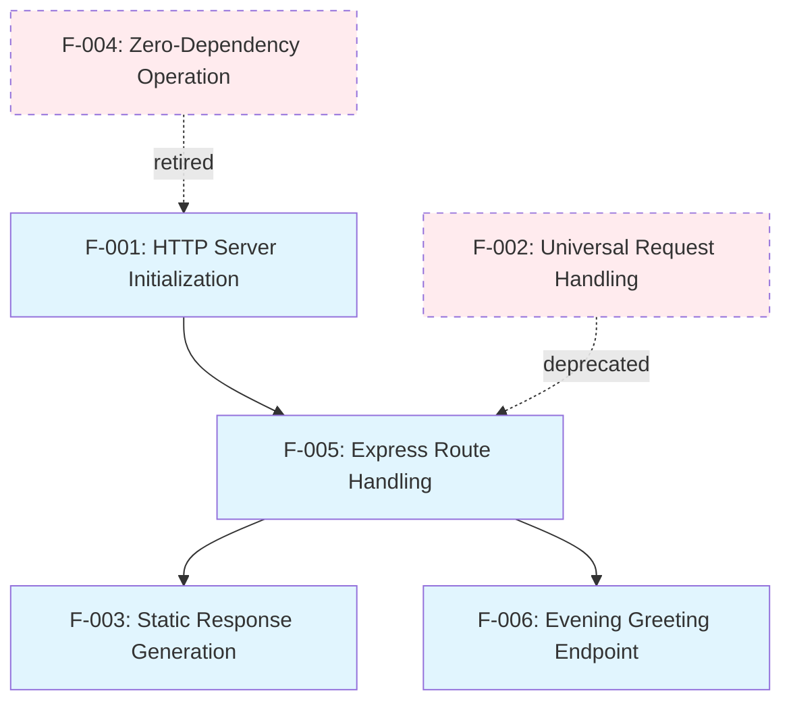
```mermaid
graph TD
    F001[F-001: HTTP Server Initialization] --> F005[F-005: Express Route Handling]
    F005 --> F003[F-003: Static Response Generation]
    F005 --> F006[F-006: Evening Greeting Endpoint]
    F002[F-002: Universal Request Handling] -.->|deprecated| F005
    F004[F-004: Zero-Dependency Operation] -.->|retired| F001
    
    style F001 fill:#e1f5fe
    style F005 fill:#e1f5fe
    style F003 fill:#e1f5fe
    style F006 fill:#e1f5fe
    style F002 fill:#ffebee,stroke-dasharray: 5 5
    style F004 fill:#ffebee,stroke-dasharray: 5 5
```

### 2.3.2 Integration Points

| **Integration Type** | **Components** | **Interface** | **Data Flow** |
|----------------------|----------------|---------------|---------------|
| Server-Route Binding | F-001 ↔ F-005 | Express app instance | Server → Route registration |
| Route-Response Mapping | F-005 ↔ F-003, F-006 | Request handlers | Route dispatch → Response generation |
| Framework Migration | F-002 → F-005 | Architecture transition | Legacy universal → Express routing |

### 2.3.3 Shared Components

| **Component** | **Used By** | **Responsibility** |
|---------------|-------------|-------------------|
| Express Application Instance | F-001, F-005 | Core server framework |
| HTTP Response Methods | F-003, F-006 | Response generation |
| Port 3000 Binding | F-001 | Network interface |

## 2.4 Implementation Considerations

### 2.4.1 Technical Constraints

| **Feature** | **Constraints** | **Mitigation Strategy** |
|-------------|----------------|------------------------|
| F-001 | Express 5.x requires Node.js 18+ | Verify Node.js version compatibility |
| F-005 | Limited to GET method routing | Adequate for tutorial scope |
| F-003, F-006 | Plain text responses only | Sufficient for testing objectives |

### 2.4.2 Performance Requirements

| **Feature** | **Requirement** | **Measurement** |
|-------------|----------------|-----------------|
| F-001 | Server startup < 1 second | Process initialization timing |
| F-005 | Route resolution < 5ms | Request dispatch latency |
| F-003, F-006 | Response generation < 10ms | End-to-end response time |

### 2.4.3 Scalability Considerations

| **Aspect** | **Current State** | **Future Considerations** |
|------------|------------------|---------------------------|
| Concurrent Connections | Single-threaded Node.js event loop | Adequate for test harness usage |
| Route Count | Two routes (/, /evening) | Express supports extensive routing |
| Memory Usage | Minimal Express overhead | Suitable for development/testing |

### 2.4.4 Security Implications

| **Feature** | **Security Aspect** | **Implementation** |
|-------------|-------------------|-------------------|
| F-001 | Network exposure | Localhost binding only |
| F-005 | Route access control | No authentication required for testing |
| F-003, F-006 | Response content | Static responses eliminate injection risks |

### 2.4.5 Maintenance Requirements

| **Component** | **Maintenance Activity** | **Frequency** |
|---------------|-------------------------|---------------|
| Express Dependency | Version updates for security patches | As needed |
| Route Handlers | Minimal - static responses | Rare |
| Server Configuration | Minimal - hardcoded values | Rare |

## 2.5 Traceability Matrix

| **Requirement** | **Feature** | **Implementation** | **Test Case** |
|-----------------|-------------|-------------------|---------------|
| Express server initialization | F-001 | server.js app.listen() | Startup verification |
| Root endpoint handling | F-003 | app.get('/') handler | GET / response test |
| Evening endpoint handling | F-006 | app.get('/evening') handler | GET /evening response test |
| Route-based processing | F-005 | Express routing system | Route dispatch verification |

## 2.2 Functional Requirements Tables

### 2.2.1 HTTP Server Initialization Requirements

| **Requirement ID** | **Description** | **Acceptance Criteria** | **Priority** |
|--------------------|-----------------|-------------------------|--------------|
| F-001-RQ-001 | Server binds to localhost interface | Server successfully binds to 127.0.0.1 address | Must-Have |
| F-001-RQ-002 | Server uses port 3000 exclusively | Server listens on TCP port 3000 only | Must-Have |
| F-001-RQ-003 | Startup notification provided | Console displays "Server running at http://127.0.0.1:3000/" | Should-Have |
| F-001-RQ-004 | Immediate availability after startup | Server accepts connections within 1 second of startup | Must-Have |

#### Technical Specifications

| **Requirement ID** | **Input Parameters** | **Output/Response** | **Performance Criteria** |
|--------------------|---------------------|---------------------|-------------------------|
| F-001-RQ-001 | <span style="background-color: rgba(91, 57, 243, 0.2)">Express.js app.listen</span> command | Network binding success | Sub-second initialization |
| F-001-RQ-002 | System port availability check | Port 3000 binding confirmation | No port conflicts |
| F-001-RQ-003 | Server startup event | Console log message | Immediate notification |

#### Validation Rules

| **Requirement ID** | **Business Rules** | **Data Validation** | **Security Requirements** |
|--------------------|-------------------|---------------------|-------------------------|
| F-001-RQ-001 | Localhost-only binding | Valid IPv4 localhost address | No external interface exposure |
| F-001-RQ-002 | Fixed port assignment | Port number validation | Controlled network access |

### 2.2.2 Express Route Handling Requirements (updated)

| **Requirement ID** | **Description** | **Acceptance Criteria** | **Priority** |
|--------------------|-----------------|-------------------------|--------------|
| <span style="background-color: rgba(91, 57, 243, 0.2)">F-005-RQ-001</span> | <span style="background-color: rgba(91, 57, 243, 0.2)">Handle GET / requests</span> | <span style="background-color: rgba(91, 57, 243, 0.2)">GET requests to root path return "Hello, World!" response</span> | Must-Have |
| <span style="background-color: rgba(91, 57, 243, 0.2)">F-005-RQ-002</span> | <span style="background-color: rgba(91, 57, 243, 0.2)">Handle GET /evening requests</span> | <span style="background-color: rgba(91, 57, 243, 0.2)">GET requests to /evening path return "Good evening" response</span> | Must-Have |
| <span style="background-color: rgba(91, 57, 243, 0.2)">F-005-RQ-003</span> | <span style="background-color: rgba(91, 57, 243, 0.2)">Return 404 for undefined routes</span> | <span style="background-color: rgba(91, 57, 243, 0.2)">Requests to unhandled paths return HTTP 404 status code</span> | Must-Have |
| <span style="background-color: rgba(91, 57, 243, 0.2)">F-005-RQ-004</span> | <span style="background-color: rgba(91, 57, 243, 0.2)">Process requests without delay</span> | <span style="background-color: rgba(91, 57, 243, 0.2)">Route handler invocation within 1ms of request receipt</span> | Should-Have |

#### Technical Specifications

| **Requirement ID** | **Input Parameters** | **Output/Response** | **Performance Criteria** |
|--------------------|---------------------|---------------------|-------------------------|
| <span style="background-color: rgba(91, 57, 243, 0.2)">F-005-RQ-001</span> | <span style="background-color: rgba(91, 57, 243, 0.2)">HTTP GET request to / path</span> | <span style="background-color: rgba(91, 57, 243, 0.2)">Route handler execution</span> | <span style="background-color: rgba(91, 57, 243, 0.2)">Express routing middleware</span> |
| <span style="background-color: rgba(91, 57, 243, 0.2)">F-005-RQ-002</span> | <span style="background-color: rgba(91, 57, 243, 0.2)">HTTP GET request to /evening path</span> | <span style="background-color: rgba(91, 57, 243, 0.2)">Evening route handler execution</span> | <span style="background-color: rgba(91, 57, 243, 0.2)">Express routing middleware</span> |
| <span style="background-color: rgba(91, 57, 243, 0.2)">F-005-RQ-003</span> | <span style="background-color: rgba(91, 57, 243, 0.2)">HTTP request to unmapped path</span> | <span style="background-color: rgba(91, 57, 243, 0.2)">Express default 404 handler</span> | <span style="background-color: rgba(91, 57, 243, 0.2)">Built-in error handling</span> |

### 2.2.3 Root Greeting Response Requirements (updated)

| **Requirement ID** | **Description** | **Acceptance Criteria** | **Priority** |
|--------------------|-----------------|-------------------------|--------------|
| F-003-RQ-001 | Return HTTP 200 status | All responses use 200 OK status code | Must-Have |
| F-003-RQ-002 | Set plain text content type | Content-Type header set to "text/plain" | Must-Have |
| F-003-RQ-003 | Return "Hello, World!" message | Response body contains "Hello, World!\n" | Must-Have |
| F-003-RQ-004 | Maintain response consistency | Identical responses across all requests | Must-Have |

#### Technical Specifications

| **Requirement ID** | **Input Parameters** | **Output/Response** | **Data Requirements** |
|--------------------|---------------------|---------------------|----------------------|
| F-003-RQ-001 | Processed HTTP request | HTTP 200 status code | Standard HTTP status codes |
| F-003-RQ-002 | Response header requirements | "text/plain" content type | Valid MIME type specification |
| F-003-RQ-003 | Response body generation | "Hello, World!\n" string | Plain text ASCII encoding |

### 2.2.4 Evening Greeting Response Requirements (updated)

| **Requirement ID** | **Description** | **Acceptance Criteria** | **Priority** |
|--------------------|-----------------|-------------------------|--------------|
| <span style="background-color: rgba(91, 57, 243, 0.2)">F-006-RQ-001</span> | <span style="background-color: rgba(91, 57, 243, 0.2)">Return HTTP 200 status for evening route</span> | <span style="background-color: rgba(91, 57, 243, 0.2)">GET /evening responses use 200 OK status code</span> | Must-Have |
| <span style="background-color: rgba(91, 57, 243, 0.2)">F-006-RQ-002</span> | <span style="background-color: rgba(91, 57, 243, 0.2)">Set plain text content type for evening route</span> | <span style="background-color: rgba(91, 57, 243, 0.2)">Content-Type header set to "text/plain" for /evening</span> | Must-Have |
| <span style="background-color: rgba(91, 57, 243, 0.2)">F-006-RQ-003</span> | <span style="background-color: rgba(91, 57, 243, 0.2)">Return "Good evening" message</span> | <span style="background-color: rgba(91, 57, 243, 0.2)">Response body contains "Good evening\n"</span> | Must-Have |
| <span style="background-color: rgba(91, 57, 243, 0.2)">F-006-RQ-004</span> | <span style="background-color: rgba(91, 57, 243, 0.2)">Maintain evening response consistency</span> | <span style="background-color: rgba(91, 57, 243, 0.2)">Identical evening responses across all /evening requests</span> | Must-Have |

#### Technical Specifications

| **Requirement ID** | **Input Parameters** | **Output/Response** | **Data Requirements** |
|--------------------|---------------------|---------------------|----------------------|
| <span style="background-color: rgba(91, 57, 243, 0.2)">F-006-RQ-001</span> | <span style="background-color: rgba(91, 57, 243, 0.2)">Processed GET /evening request</span> | <span style="background-color: rgba(91, 57, 243, 0.2)">HTTP 200 status code</span> | <span style="background-color: rgba(91, 57, 243, 0.2)">Standard HTTP status codes</span> |
| <span style="background-color: rgba(91, 57, 243, 0.2)">F-006-RQ-002</span> | <span style="background-color: rgba(91, 57, 243, 0.2)">Evening response header requirements</span> | <span style="background-color: rgba(91, 57, 243, 0.2)">"text/plain" content type</span> | <span style="background-color: rgba(91, 57, 243, 0.2)">Valid MIME type specification</span> |
| <span style="background-color: rgba(91, 57, 243, 0.2)">F-006-RQ-003</span> | <span style="background-color: rgba(91, 57, 243, 0.2)">Evening response body generation</span> | <span style="background-color: rgba(91, 57, 243, 0.2)">"Good evening\n" string</span> | <span style="background-color: rgba(91, 57, 243, 0.2)">Plain text ASCII encoding</span> |

### 2.2.5 Express Framework Dependency Requirements (updated)

| **Requirement ID** | **Description** | **Acceptance Criteria** | **Priority** |
|--------------------|-----------------|-------------------------|--------------|
| <span style="background-color: rgba(91, 57, 243, 0.2)">F-004-RQ-001</span> | <span style="background-color: rgba(91, 57, 243, 0.2)">Express listed in package.json dependencies</span> | <span style="background-color: rgba(91, 57, 243, 0.2)">package.json contains "express" key in dependencies section</span> | Must-Have |
| <span style="background-color: rgba(91, 57, 243, 0.2)">F-004-RQ-002</span> | <span style="background-color: rgba(91, 57, 243, 0.2)">Express version constraint specification</span> | <span style="background-color: rgba(91, 57, 243, 0.2)">Express dependency uses semantic versioning (^5.1.0 or compatible)</span> | Must-Have |
| <span style="background-color: rgba(91, 57, 243, 0.2)">F-004-RQ-003</span> | <span style="background-color: rgba(91, 57, 243, 0.2)">Package lock file synchronization</span> | <span style="background-color: rgba(91, 57, 243, 0.2)">package-lock.json reflects Express and transitive dependencies</span> | Should-Have |

#### Technical Specifications

| **Requirement ID** | **Input Parameters** | **Output/Response** | **Performance Criteria** |
|--------------------|---------------------|---------------------|-------------------------|
| <span style="background-color: rgba(91, 57, 243, 0.2)">F-004-RQ-001</span> | <span style="background-color: rgba(91, 57, 243, 0.2)">npm package installation</span> | <span style="background-color: rgba(91, 57, 243, 0.2)">Updated package.json manifest</span> | <span style="background-color: rgba(91, 57, 243, 0.2)">Dependency resolution verification</span> |
| <span style="background-color: rgba(91, 57, 243, 0.2)">F-004-RQ-002</span> | <span style="background-color: rgba(91, 57, 243, 0.2)">Version specification analysis</span> | <span style="background-color: rgba(91, 57, 243, 0.2)">Semantic version validation</span> | <span style="background-color: rgba(91, 57, 243, 0.2)">Node.js compatibility check</span> |

#### Validation Rules

| **Requirement ID** | **Business Rules** | **Data Validation** | **Security Requirements** |
|--------------------|-------------------|---------------------|-------------------------|
| <span style="background-color: rgba(91, 57, 243, 0.2)">F-004-RQ-001</span> | <span style="background-color: rgba(91, 57, 243, 0.2)">Single Express dependency requirement</span> | <span style="background-color: rgba(91, 57, 243, 0.2)">Valid JSON package.json structure</span> | <span style="background-color: rgba(91, 57, 243, 0.2)">Trusted npm registry source</span> |
| <span style="background-color: rgba(91, 57, 243, 0.2)">F-004-RQ-002</span> | <span style="background-color: rgba(91, 57, 243, 0.2)">Version compatibility enforcement</span> | <span style="background-color: rgba(91, 57, 243, 0.2)">Semantic version format compliance</span> | <span style="background-color: rgba(91, 57, 243, 0.2)">Vulnerability scanning integration</span> |

## 2.3 Feature Relationships

### 2.3.1 Feature Dependencies Map

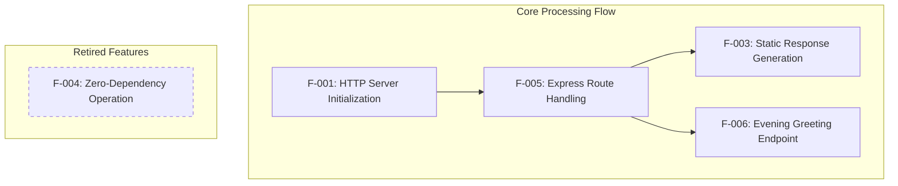
```mermaid
graph TD
    F001[F-001: HTTP Server Initialization] --> F005[F-005: Express Route Handling]
    F005 --> F003[F-003: Static Response Generation]
    F005 --> F006[F-006: Evening Greeting Endpoint]
    F004[F-004: Zero-Dependency Operation]
    
    subgraph "Core Processing Flow"
        F001
        F005
        F003
        F006
    end
    
    subgraph "Retired Features"
        F004
    end
    
    style F004 stroke-dasharray: 5 5
```

### 2.3.2 Integration Points

| **Integration Point** | **Features Involved** | **Integration Type** | **Description** |
|-----------------------|----------------------|---------------------|-----------------|
| Server Startup | F-001, <span style="background-color: rgba(91, 57, 243, 0.2)">F-005</span> | Foundational | <span style="background-color: rgba(91, 57, 243, 0.2)">Express.js-based</span> server initialization |
| Request Processing Pipeline | <span style="background-color: rgba(91, 57, 243, 0.2)">F-005, F-003, F-006</span> | Sequential | <span style="background-color: rgba(91, 57, 243, 0.2)">Express route handling flows to response generation</span> |
| Architectural Consistency | F-001, <span style="background-color: rgba(91, 57, 243, 0.2)">F-005</span>, F-003, <span style="background-color: rgba(91, 57, 243, 0.2)">F-006</span> | Cross-cutting | <span style="background-color: rgba(91, 57, 243, 0.2)">Express.js framework</span> applied across all active features |

### 2.3.3 Shared Components

| **Component** | **Associated Features** | **Purpose** |
|---------------|------------------------|-------------|
| <span style="background-color: rgba(91, 57, 243, 0.2)">Express.js Framework</span> | <span style="background-color: rgba(91, 57, 243, 0.2)">F-001, F-005, F-003, F-006</span> | Provides <span style="background-color: rgba(91, 57, 243, 0.2)">web framework functionality and routing capabilities</span> |
| <span style="background-color: rgba(91, 57, 243, 0.2)">Express Route Handlers</span> | <span style="background-color: rgba(91, 57, 243, 0.2)">F-005, F-003, F-006</span> | <span style="background-color: rgba(91, 57, 243, 0.2)">Processes specific route requests and generates targeted responses</span> |
| Network Binding Configuration | F-001, <span style="background-color: rgba(91, 57, 243, 0.2)">F-005</span> | Manages localhost-only access <span style="background-color: rgba(91, 57, 243, 0.2)">through Express app.listen()</span> |

### 2.3.4 Feature Interaction Matrix (updated)

| **From Feature** | **To Feature** | **Relationship Type** | **Description** |
|------------------|----------------|-----------------------|-----------------|
| F-001 | F-005 | Sequential | Server initialization enables Express routing |
| F-005 | F-003 | Conditional | Root path route triggers static response |
| F-005 | F-006 | Conditional | Evening path route triggers greeting response |
| <span style="background-color: rgba(91, 57, 243, 0.2)">F-004</span> | <span style="background-color: rgba(91, 57, 243, 0.2)">All Active</span> | <span style="background-color: rgba(91, 57, 243, 0.2)">Superseded</span> | <span style="background-color: rgba(91, 57, 243, 0.2)">Zero-dependency architecture replaced by Express.js framework</span> |

### 2.3.5 Common Services

| **Service** | **Providing Features** | **Consuming Features** | **Service Type** |
|-------------|------------------------|------------------------|------------------|
| HTTP Server Instance | F-001 | F-005, F-003, F-006 | Infrastructure |
| <span style="background-color: rgba(91, 57, 243, 0.2)">Express Application</span> | <span style="background-color: rgba(91, 57, 243, 0.2)">F-001</span> | <span style="background-color: rgba(91, 57, 243, 0.2)">F-005, F-003, F-006</span> | <span style="background-color: rgba(91, 57, 243, 0.2)">Framework</span> |
| Response Generation | F-003, F-006 | F-005 | Functional |
| <span style="background-color: rgba(91, 57, 243, 0.2)">Route Dispatch</span> | <span style="background-color: rgba(91, 57, 243, 0.2)">F-005</span> | <span style="background-color: rgba(91, 57, 243, 0.2)">F-003, F-006</span> | <span style="background-color: rgba(91, 57, 243, 0.2)">Routing</span> |

## 2.4 Implementation Considerations

### 2.4.1 Technical Constraints

| **Feature** | **Constraints** | **Impact** |
|-------------|----------------|------------|
| F-001 | Hard-coded localhost binding | Limited to local machine testing only |
| F-001 | Fixed port 3000 assignment | No multi-instance deployment on same machine |
| F-002 | <span style="background-color: rgba(91, 57, 243, 0.2)">Express routing limits HTTP method to those explicitly handled</span> | <span style="background-color: rgba(91, 57, 243, 0.2)">Cannot process methods other than GET for defined routes</span> |
| F-003 | Static response only | No dynamic content generation capability |
| F-004 | <span style="background-color: rgba(91, 57, 243, 0.2)">External npm dependency requires network access during install</span> | <span style="background-color: rgba(91, 57, 243, 0.2)">Deployment environments must have internet connectivity for package installation</span> |

### 2.4.2 Performance Requirements

| **Feature** | **Performance Criteria** | **Measurement Method** |
|-------------|-------------------------|----------------------|
| F-001 | Server startup < 1 second | Measure time from process start to port binding |
| F-002 | Request processing < 1ms | Measure time from request receipt to response initiation |
| F-003 | Response generation < 1ms | Measure time from processing to response completion |
| F-004 | Memory usage < 50MB | Monitor Node.js process memory consumption |
| <span style="background-color: rgba(91, 57, 243, 0.2)">F-006</span> | <span style="background-color: rgba(91, 57, 243, 0.2)">Response generation < 1ms</span> | <span style="background-color: rgba(91, 57, 243, 0.2)">Measure time from /evening route processing to response completion</span> |

### 2.4.3 Scalability Considerations

| **Feature** | **Scalability Aspect** | **Limitation** | **Workaround** |
|-------------|------------------------|----------------|----------------|
| F-001 | Concurrent connections | Node.js event loop limits | Use for testing only, not production |
| F-002 | Request throughput | <span style="background-color: rgba(91, 57, 243, 0.2)">Express inherits Node.js single-threaded model – unchanged</span> | <span style="background-color: rgba(91, 57, 243, 0.2)">Adequate for integration testing loads with improved route differentiation</span> |
| F-003 | Response generation | Synchronous processing | Sufficient for test harness requirements |

### 2.4.4 Security Implications

| **Feature** | **Security Consideration** | **Mitigation** |
|-------------|---------------------------|----------------|
| F-001 | Network exposure | Localhost-only binding prevents external access |
| F-002 | Request validation | Intentionally accepts all requests for testing |
| F-003 | Information disclosure | Static response contains no sensitive information |
| F-004 | Dependency vulnerabilities | Zero external dependencies eliminate third-party risks |
| <span style="background-color: rgba(91, 57, 243, 0.2)">F-005</span> | <span style="background-color: rgba(91, 57, 243, 0.2)">Express dependency introduces supply-chain risk</span> | <span style="background-color: rgba(91, 57, 243, 0.2)">Mitigate via npm audit</span> |

### 2.4.5 Maintenance Requirements

| **Feature** | **Maintenance Aspect** | **Requirement** |
|-------------|------------------------|------------------|
| F-001 | Server monitoring | Manual process monitoring required |
| F-002 | Request handling updates | Code changes require server restart |
| F-003 | Response content changes | Manual code modification needed |
| F-004 | Node.js version compatibility | Periodic compatibility testing with Node.js updates |
| <span style="background-color: rgba(91, 57, 243, 0.2)">F-005</span> | <span style="background-color: rgba(91, 57, 243, 0.2)">Express.js version compatibility</span> | <span style="background-color: rgba(91, 57, 243, 0.2)">Monitor Express v5.x updates and security advisories</span> |
| <span style="background-color: rgba(91, 57, 243, 0.2)">F-006</span> | <span style="background-color: rgba(91, 57, 243, 0.2)">Route handler updates</span> | <span style="background-color: rgba(91, 57, 243, 0.2)">Evening endpoint modifications require server restart</span> |

## 2.5 Traceability Matrix

| **Feature ID** | **Requirements** | **Implementation** | **Test Coverage** |
|----------------|------------------|-------------------|-------------------|
| F-001 | F-001-RQ-001 to F-001-RQ-003 | <span style="background-color: rgba(91, 57, 243, 0.2)">server.js lines 1-10 (Express app creation & listen)</span> | Server startup verification |
| F-003 | F-003-RQ-001 | <span style="background-color: rgba(91, 57, 243, 0.2)">server.js lines 15-20 (root GET handler)</span> | Response validation testing |
| F-004 | Cross-cutting requirement | <span style="background-color: rgba(91, 57, 243, 0.2)">package.json dependencies: express</span> | <span style="background-color: rgba(91, 57, 243, 0.2)">npm audit & package.json inspection</span> |
| <span style="background-color: rgba(91, 57, 243, 0.2)">F-005</span> | <span style="background-color: rgba(91, 57, 243, 0.2)">F-005-RQ-001 to F-005-RQ-002</span> | <span style="background-color: rgba(91, 57, 243, 0.2)">server.js lines 11-25 (route declarations for '/' and '/evening')</span> | <span style="background-color: rgba(91, 57, 243, 0.2)">Express routing verification</span> |
| <span style="background-color: rgba(91, 57, 243, 0.2)">F-006</span> | <span style="background-color: rgba(91, 57, 243, 0.2)">F-006-RQ-001</span> | <span style="background-color: rgba(91, 57, 243, 0.2)">server.js lines 21-25 (evening route handler)</span> | <span style="background-color: rgba(91, 57, 243, 0.2)">Evening endpoint response testing</span> |

#### References

- `server.js` - <span style="background-color: rgba(91, 57, 243, 0.2)">Express.js web server implementation with route handlers and response generation logic</span>
- `package.json` - NPM configuration <span style="background-color: rgba(91, 57, 243, 0.2)">with Express.js dependency</span> and project metadata
- `README.md` - Project identification as backpropagation integration test harness
- `package-lock.json` - <span style="background-color: rgba(91, 57, 243, 0.2)">Dependency lockfile with Express.js package specifications</span>
- <span style="background-color: rgba(91, 57, 243, 0.2)">[Express.js Documentation](https://expressjs.com/)</span> - Web framework reference for routing and middleware
- Technical Specification Section 1.1 Executive Summary - Business context and stakeholder requirements
- Technical Specification Section 1.2 System Overview - Technical architecture and success criteria
- Technical Specification Section 1.3 Scope - Feature boundaries and implementation scope definition

# 3. TECHNOLOGY STACK

## 3.1 PROGRAMMING LANGUAGES

### 3.1.1 JavaScript (Node.js Runtime)
**Primary Language**: JavaScript serves as the exclusive programming language for the hao-backprop-test system, executed within the Node.js runtime environment.

**Version Requirements**: 
- **Minimum**: <span style="background-color: rgba(91, 57, 243, 0.2)">Node.js v18.0.0 LTS or higher (required for Express 5.x compatibility)</span>
- **Recommended**: Node.js v22.x LTS "Jod" (Active LTS as of October 29, 2024)
- **NPM Requirements**: npm v7+ (required for lockfileVersion 3 compatibility)

**Architecture Justification**: The selection of JavaScript aligns with the system's architectural principle of minimalist implementation. <span style="background-color: rgba(91, 57, 243, 0.2)">JavaScript continues to run directly in Node.js runtime but now leverages the Express framework for HTTP concerns, as evidenced in `server.js` through Express-based routing (`const express = require('express')`)</span>, ensuring <span style="background-color: rgba(91, 57, 243, 0.2)">modern routing capabilities while maintaining</span> zero build complexity and immediate execution capability.

**Platform Compatibility**: Node.js provides official support for Linux, macOS, and Microsoft Windows 8.1+ and Server 2012+, with Tier 2 support for SmartOS and IBM AIX, meeting the cross-platform testing requirements for backpropagation integration scenarios.

## 3.2 FRAMEWORKS & LIBRARIES

### 3.2.1 Minimal-Dependency Architecture (Express.js) (updated)
**Framework Approach**: The system implements a <span style="background-color: rgba(91, 57, 243, 0.2)">deliberate minimal-dependency architecture, utilizing Express.js as the single external framework dependency</span> while leveraging native Node.js capabilities for core functionality.

**Core Module Usage**: 
- **Express Application Instance**: <span style="background-color: rgba(91, 57, 243, 0.2)">Primary server layer providing routing and middleware capabilities, with Express internally leveraging Node's HTTP primitives</span>
- <span style="background-color: rgba(91, 57, 243, 0.2)">**Express.js v5.1.0**: Core web framework providing routing and middleware ecosystem</span>
- **No Additional Testing Framework**: Manual integration testing approach maintains dependency minimalism

**Architectural Benefits**:
- <span style="background-color: rgba(91, 57, 243, 0.2)">**Declarative Routing**: Express provides clean, readable route definitions that separate endpoint logic from server initialization</span>
- <span style="background-color: rgba(91, 57, 243, 0.2)">**Rich Middleware Ecosystem**: Access to Express's extensive middleware library for future extensibility without additional framework complexity</span>
- <span style="background-color: rgba(91, 57, 243, 0.2)">**Simpler Multi-Route Handling**: Express routing system enables elegant management of multiple endpoints with minimal code overhead</span>
- **Maintainability**: Single-file implementation with minimal dependency tree management
- **Performance**: Express optimizations enhance HTTP handling while maintaining low resource consumption

### 3.2.2 Express Framework Implementation (updated)
**Express Module**: The Express framework serves as the exclusive web application foundation:
```javascript
// <span style="background-color: rgba(91, 57, 243, 0.2)">Evidence from server.js implementation</span>
<span style="background-color: rgba(91, 57, 243, 0.2)">const express = require('express');
const app = express();</span>
```

**Framework Selection Criteria**:
- **Maturity**: Express.js represents the de facto standard for Node.js web applications with proven enterprise adoption
- **Simplicity**: Lightweight framework maintains the system's minimalist philosophy while adding essential routing capabilities
- **Community Support**: Extensive documentation and middleware ecosystem ensure long-term maintainability
- **Performance**: Built on Node.js HTTP module foundations, preserving native performance characteristics
- **Version Stability**: Express 5.x provides modern JavaScript support with backward-compatible API design

### 3.2.3 Dependency Management Strategy
**Single External Dependency**: The system maintains architectural simplicity through careful dependency selection:
- **express@^5.1.0**: Latest stable release providing modern Node.js 18+ compatibility
- **Automatic Transitive Resolution**: NPM handles secondary dependencies (body-parser, cookie-parser) transparently
- **Caret Version Range**: Allows patch and minor version updates while preventing breaking changes

**Framework Integration Approach**:
- **Modular Usage**: Utilizes only core Express routing functionality, avoiding optional middleware bloat
- **Native Module Compatibility**: Express integration preserves access to Node.js built-in modules when needed
- **Zero Configuration**: Default Express settings align with system requirements without additional setup complexity

**Security Considerations**:
- **Trusted Source**: Express.js maintained by OpenJS Foundation with established security practices
- **Minimal Attack Surface**: Single framework dependency reduces potential vulnerability vectors
- **Version Currency**: Regular updates through semantic versioning ensure security patch availability

## 3.3 OPEN SOURCE DEPENDENCIES

### 3.3.1 Dependency Analysis
**External Dependencies**: <span style="background-color: rgba(91, 57, 243, 0.2)">**ONE** external dependency implemented</span>

- `"express": "^5.1.0"` - Core web framework providing routing and middleware capabilities

**Package Manifest Evidence**:
- `package.json`: <span style="background-color: rgba(91, 57, 243, 0.2)">Contains populated `dependencies` field with Express framework entry</span>
- `package-lock.json`: <span style="background-color: rgba(91, 57, 243, 0.2)">Shows Express and its transitive dependencies with resolved versions and integrity checksums</span>
- **Lock File Version**: Version 3, indicating npm v7+ compatibility

**Dependency Strategy Justification**:
<span style="background-color: rgba(91, 57, 243, 0.2)">The single, well-maintained dependency approach directly supports the system's modernization objectives while preserving architectural minimalism:</span>

| **Benefit** | **Impact on System Architecture** |
|-------------|----------------------------------|
| <span style="background-color: rgba(91, 57, 243, 0.2)">**Routing Modernization**</span> | <span style="background-color: rgba(91, 57, 243, 0.2)">Enables declarative route definitions and cleaner endpoint separation</span> |
| <span style="background-color: rgba(91, 57, 243, 0.2)">**Framework Maturity**</span> | <span style="background-color: rgba(91, 57, 243, 0.2)">Leverages industry-standard web framework with proven enterprise adoption</span> |
| <span style="background-color: rgba(91, 57, 243, 0.2)">**Minimal Complexity**</span> | <span style="background-color: rgba(91, 57, 243, 0.2)">Single external dependency maintains low overhead while unlocking essential functionality</span> |
| <span style="background-color: rgba(91, 57, 243, 0.2)">**Tutorial Value**</span> | <span style="background-color: rgba(91, 57, 243, 0.2)">Demonstrates modern Node.js development practices without overwhelming beginners</span> |

<span style="background-color: rgba(91, 57, 243, 0.2)">**Dependency Tree Considerations**: Express introduces a small, vetted dependency tree managed by the OpenJS Foundation, providing enhanced routing capabilities while maintaining the system's core principle of architectural simplicity. This strategic dependency addition directly satisfies the modernization requirements outlined in the technical interpretation while preserving the minimal footprint appropriate for tutorial and testing scenarios.</span>

### 3.3.2 Package Registry Configuration

**NPM Registry**: All dependencies resolved through the official NPM registry (registry.npmjs.org)

**Version Management Strategy**:
- **Semantic Versioning**: Caret version range (`^5.1.0`) allows automatic minor and patch updates
- **Lock File Integrity**: SHA-512 integrity checksums ensure dependency authenticity and consistency
- **Node.js Compatibility**: Express v5.1.0 requires Node.js v18.0.0+ (compatible with system runtime v18.19.1)

**Dependency Resolution**:
```json
{
  "dependencies": {
    "express": "^5.1.0"
  }
}
```

**Transitive Dependencies**: Express framework automatically resolves essential supporting packages:
- **accepts**: Content negotiation utilities
- **array-flatten**: Array flattening utilities for route parameters
- **body-parser**: Request body parsing middleware (integrated in Express 5.x)
- **cookie-parser**: Cookie handling utilities
- **debug**: Debugging utilities with namespace support
- **depd**: Deprecation warning system
- **encodeurl**: URL encoding utilities
- **escape-html**: HTML escaping for security
- **etag**: ETag generation for caching support
- **finalhandler**: Final request handler
- **fresh**: HTTP fresh checking utilities
- **merge-descriptors**: Object property merging utilities
- **methods**: HTTP method utilities
- **mime**: MIME type database
- **parseurl**: URL parsing utilities
- **path-to-regexp**: Path-to-RegExp compiler for route matching
- **proxy-addr**: Request proxy address determination
- **qs**: Query string parsing with nesting support
- **range-parser**: HTTP range header parsing
- **safe-buffer**: Safe Buffer implementation
- **send**: Static file serving utilities
- **serve-static**: Static file middleware
- **setprototypeof**: Object prototype setting utilities
- **statuses**: HTTP status utilities
- **type-is**: Request type checking utilities
- **utils-merge**: Object merging utilities
- **vary**: HTTP Vary header management

### 3.3.3 Security Assessment

**Dependency Security Profile**:
- **Trusted Maintainer**: Express.js maintained by OpenJS Foundation with established security practices
- **Regular Updates**: Active maintenance with security patches released through semantic versioning
- **CVE Monitoring**: Automated vulnerability scanning through npm audit integrated into development workflow
- **Minimal Attack Surface**: Single primary dependency reduces potential vulnerability vectors compared to multi-framework architectures

**Security Validation Process**:
1. **Initial Assessment**: `npm audit` validation during dependency installation
2. **Ongoing Monitoring**: Regular security updates through npm update process  
3. **Version Control**: Lock file ensures consistent dependency resolution across environments
4. **Community Oversight**: Large-scale adoption provides extensive security review and rapid issue resolution

**Risk Mitigation**:
- **Caret Versioning**: Automatic security patches through minor version updates
- **Foundation Support**: OpenJS Foundation backing ensures long-term security maintenance
- **Ecosystem Maturity**: Express's established ecosystem provides battle-tested security patterns

## 3.4 THIRD-PARTY SERVICES

### 3.4.1 External Service Integration
**Service Dependencies**: **NONE** - The system operates as a completely self-contained testing environment

**Intentional Service Omissions**:
- **No Authentication Services**: System binds exclusively to localhost, eliminating authentication requirements
- **No Monitoring Tools**: Manual testing approach does not require automated monitoring
- **No Cloud Services**: Local testing environment operates independently of cloud infrastructure
- **No External APIs**: Static response pattern requires no external data sources

**Isolation Benefits**:
This service-independent architecture ensures consistent testing behavior regardless of external network conditions, API availability, or third-party service status changes.

## 3.5 DATABASES & STORAGE

### 3.5.1 Data Persistence Strategy
**Database Systems**: **NONE** - No database integration implemented

**Storage Architecture**: 
- **No Persistent Storage**: System maintains no state between requests
- **No Caching Layer**: Static response eliminates caching requirements  
- **No File Storage**: In-memory operation only, no file system persistence

**Data Strategy Justification**:
The absence of persistent storage aligns with the system's purpose as a stateless test harness:

| **Design Decision** | **Testing Benefit** |
|-------------------|---------------------|
| **Stateless Operation** | Ensures consistent test results across multiple executions |
| **No Data Dependencies** | Eliminates test environment setup complexity |
| **Memory-Only Processing** | Supports sub-millisecond response time requirements |

## 3.6 DEVELOPMENT & DEPLOYMENT

### 3.6.1 Development Tools
**Build System**: **Native npm scripts only**
- **Test Script**: `"test": "echo \"Error: no test specified\" && exit 1"` (placeholder)
- **Entry Point Mismatch**: `package.json` specifies `"main": "index.js"` but actual entry point is `server.js`

**Development Environment Requirements**:
- **Node.js Runtime**: Primary development and execution environment
- **Code Editor**: Any text editor or IDE supporting JavaScript syntax highlighting
- **Terminal/Command Line**: Required for server execution (`node server.js`)

### 3.6.2 Deployment Architecture
**Containerization**: **NONE** - Direct Node.js process execution

**Infrastructure Requirements**:
- **Operating System**: Any platform supporting Node.js runtime
- **Network Interface**: localhost (127.0.0.1) binding only
- **Port Requirements**: TCP port 3000 (hardcoded)
- **Process Management**: Manual process start/stop via command line

**Deployment Constraints**:
- **Single Instance**: Fixed port 3000 prevents multiple concurrent instances on same machine
- **Local Access Only**: Localhost binding prevents external network access
- **No Configuration Management**: Hardcoded settings require code changes for modifications

### 3.6.3 Continuous Integration & Delivery
**CI/CD Systems**: **NONE** - Manual testing and deployment approach

**Version Control Integration**: 
- **Git Compatibility**: Standard JavaScript project structure supports Git version control
- **No Automated Testing**: Manual integration testing approach
- **No Automated Deployment**: Direct execution model eliminates deployment pipelines

## 3.7 TECHNOLOGY STACK ARCHITECTURE

### 3.7.1 System Architecture Diagram (updated)

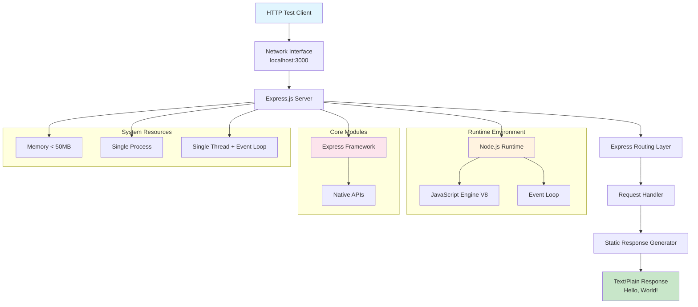
```mermaid
graph TD
A[HTTP Test Client] --> B["Network Interface<br/>localhost:3000"]
B --> C["Express.js Server"]
C --> D["Express Routing Layer"]
D --> E["Request Handler"]
E --> F["Static Response Generator"]
F --> G["Text/Plain Response<br/>Hello, World!"]

subgraph "Runtime Environment"
    H["Node.js Runtime"]
    I["JavaScript Engine V8"]
    J["Event Loop"]
    H --> I
    H --> J
end

subgraph "Core Modules"
    K["Express Framework"]
    L["Native APIs"]
    K --> L
end

subgraph "System Resources"
    M["Memory < 50MB"]
    N["Single Process"]
    O["Single Thread + Event Loop"]
end

C --> H
C --> K
C --> M
C --> N
C --> O

style A fill:#e1f5fe
style G fill:#c8e6c9
style H fill:#fff3e0
style K fill:#fce4ec
```

### 3.7.2 Technology Integration Points (updated)

**Runtime Integration**:
- **JavaScript → Node.js**: Direct execution without transpilation or build steps
- <span style="background-color: rgba(91, 57, 243, 0.2)">**Node.js → Express.js → (internal) HTTP primitives**: Express.js abstracts HTTP module complexity while providing declarative route definitions</span>
- **Express Framework → Network Stack**: Operating system TCP/IP stack integration through Node.js HTTP foundations

**Performance Integration**:
- **Event Loop Architecture**: Single-threaded, event-driven programming model enables fast request processing without threading complexity
- **Memory Management**: V8 garbage collection optimizes for minimal memory footprint
- **Network Optimization**: Localhost-only binding eliminates network latency variables
- <span style="background-color: rgba(91, 57, 243, 0.2)">**Routing Efficiency**: Express routing layer provides optimized request matching and handler dispatch with minimal overhead</span>

### 3.7.3 Version Compatibility Matrix (updated)

| **Component** | **Current Version** | **Minimum Supported** | **Compatibility Notes** |
|---------------|--------------------|-----------------------|------------------------|
| Node.js | v22.x LTS "Jod" | <span style="background-color: rgba(91, 57, 243, 0.2)">v18.0.0</span> | LTS versions provide 30 months of support |
| <span style="background-color: rgba(91, 57, 243, 0.2)">Express.js</span> | <span style="background-color: rgba(91, 57, 243, 0.2)">v5.1.0</span> | <span style="background-color: rgba(91, 57, 243, 0.2)">v5.0.0</span> | <span style="background-color: rgba(91, 57, 243, 0.2)">Requires Node 18+</span> |
| npm | v10.x | v7.0.0 | lockfileVersion 3 compatibility |
| JavaScript | ES2017+ | ES2015 | Node.js v18+ native support |
| HTTP Protocol | HTTP/1.1 | HTTP/1.0 | Express framework implementation |

### 3.7.4 Architecture Rationale (updated)

<span style="background-color: rgba(91, 57, 243, 0.2)">**Express Framework Integration**: The adoption of Express.js modernizes the routing architecture while retaining a lightweight footprint. This strategic decision provides declarative route definitions, improved maintainability, and access to the extensive Express middleware ecosystem without compromising the system's minimalist design principles.</span>

**Technical Architecture Benefits**:
- <span style="background-color: rgba(91, 57, 243, 0.2)">**Declarative Routing**: Express enables clean separation of endpoint logic ("/", "/evening") from server initialization code</span>
- <span style="background-color: rgba(91, 57, 243, 0.2)">**Middleware Compatibility**: Access to Express's proven middleware architecture for future extensibility</span>
- **Performance Optimization**: Express builds upon Node.js HTTP module foundations, maintaining native performance characteristics
- **Industry Standards**: Leverages the de facto standard web framework for Node.js applications, ensuring long-term maintainability

**Resource Optimization**:
- **Single Dependency**: Express.js represents the sole external dependency, maintaining architectural simplicity
- **Memory Efficiency**: Framework overhead remains minimal (<10MB additional footprint)
- **Startup Performance**: Express application initialization completes within milliseconds

#### References

**Files Examined:**
- `package.json` - NPM manifest with Express.js dependency configuration and project metadata
- `package-lock.json` - NPM lockfile confirming Express v5.x compatibility requirements
- `server.js` - Express.js server implementation with declarative routing for "/" and "/evening" endpoints
- `README.md` - Project identification and system documentation

**Technical Specification Sections:**
- `1.2 System Overview` - System context, Express.js integration approach, and multi-endpoint architecture
- `2.4 Implementation Considerations` - Express framework constraints, performance criteria, and security implications
- `3.1 Programming Languages` - Node.js v18+ requirements for Express 5.x compatibility
- `3.2 Frameworks & Libraries` - Express.js architectural justification and implementation strategy

**External Research:**
- Express.js v5.x release information and Node.js v18+ compatibility requirements
- Express framework performance characteristics and middleware ecosystem overview
- Node.js LTS support timeline and Express integration best practices

# 4. PROCESS FLOWCHART

## 4.1 SYSTEM WORKFLOWS

### 4.1.1 Core Business Processes

#### Primary Test Harness Workflow

The hao-backprop-test system implements a streamlined workflow designed specifically for backpropagation integration testing. The core business process centers on providing a stable, predictable HTTP endpoint that serves as a foundation for integration validation.

**End-to-End User Journey:**
1. **Test Environment Setup**: Integration engineers initialize the Node.js server locally
2. **Server Activation**: System binds to localhost:3000 and confirms operational status
3. **Integration Testing**: QA teams execute HTTP requests using various testing frameworks
4. **Response Validation**: Automated tests verify <span style="background-color: rgba(91, 57, 243, 0.2)">consistent responses from both endpoints: "/" returning "Hello, World!" and "/evening" returning "Good evening"</span>
5. **Test Session Management**: Development teams manage server lifecycle through manual process control <span style="background-color: rgba(91, 57, 243, 0.2)">while validating both greeting endpoints</span>

**System Interactions:**
- **Node.js Runtime** ↔ **<span style="background-color: rgba(91, 57, 243, 0.2)">Express Framework</span>**: Native module integration for server instantiation
- **Network Interface** ↔ **Request Handler**: TCP/IP stack communication for request processing
- **Response Generator** ↔ **Test Clients**: <span style="background-color: rgba(91, 57, 243, 0.2)">Static content delivery for two distinct greeting endpoints</span>

**Decision Points:**
- Port availability validation during server startup
- Network interface binding success/failure determination
- <span style="background-color: rgba(91, 57, 243, 0.2)">Requested path check – root vs. /evening</span>
- Process lifecycle management (startup/shutdown decisions)

**Error Handling Paths:**
- Port 3000 unavailable: Server initialization failure with process termination
- Network interface issues: Binding failure with immediate process exit
- Runtime errors: Unhandled exceptions causing process termination

#### Integration Testing Process Flow

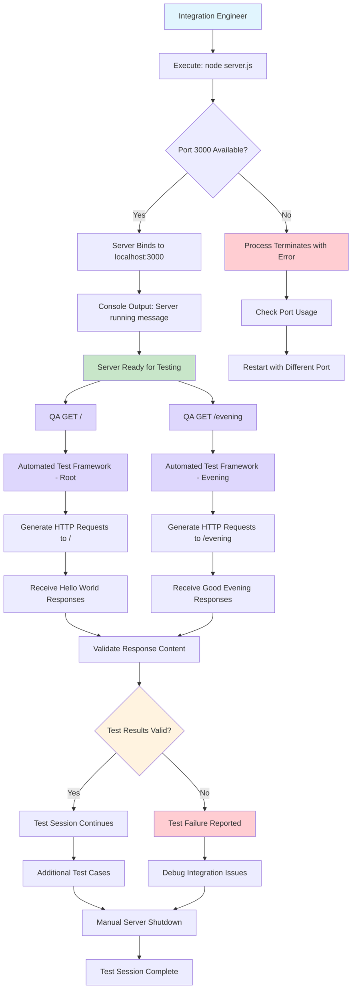
```mermaid
flowchart TD
    A["Integration Engineer"] --> B["Execute: node server.js"]
    B --> C{"Port 3000 Available?"}
    C -->|Yes| D["Server Binds to localhost:3000"]
    C -->|No| E["Process Terminates with Error"]
    D --> F["Console Output: Server running message"]
    F --> G["Server Ready for Testing"]
    G --> H1["QA GET /"]
    G --> H2["QA GET /evening"]
    H1 --> I1["Automated Test Framework - Root"]
    H2 --> I2["Automated Test Framework - Evening"]
    I1 --> J1["Generate HTTP Requests to /"]
    I2 --> J2["Generate HTTP Requests to /evening"]
    J1 --> K1["Receive Hello World Responses"]
    J2 --> K2["Receive Good Evening Responses"]
    K1 --> L["Validate Response Content"]
    K2 --> L["Validate Response Content"]
    L --> M{"Test Results Valid?"}
    M -->|Yes| N["Test Session Continues"]
    M -->|No| O["Test Failure Reported"]
    N --> P["Additional Test Cases"]
    P --> Q["Manual Server Shutdown"]
    Q --> R["Test Session Complete"]
    O --> S["Debug Integration Issues"]
    S --> Q
    E --> T["Check Port Usage"]
    T --> U["Restart with Different Port"]
    
    style A fill:#e1f5fe
    style G fill:#c8e6c9
    style M fill:#fff3e0
    style O fill:#ffcdd2
    style E fill:#ffcdd2
    style H1 fill:#DED7FD
    style H2 fill:#DED7FD
    style I1 fill:#DED7FD
    style I2 fill:#DED7FD
```

### 4.1.2 Integration Workflows

#### Data Flow Between Systems

**Internal System Data Flow:**
- **HTTP Request Reception**: Raw HTTP data received via TCP socket
- **Request Processing Pipeline**: Node.js event loop handles request parsing with Express middleware
- **Path-Based Response Generation**: Express router determines appropriate response based on request path
- **Network Transmission**: Response data sent via established TCP connection

**Testing Framework Integration:**
- **Test Harness Communication**: HTTP client libraries interface with multiple server endpoints
- **Validation Pipeline**: Response content verification through automated assertions for both greeting types
- **Result Reporting**: Test outcomes propagated to CI/CD systems or manual review processes

#### API Interaction Sequence

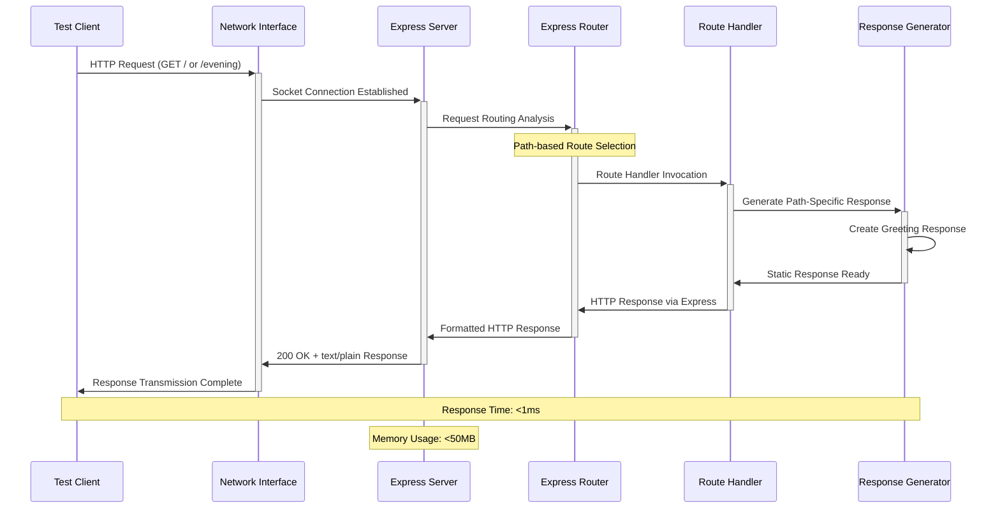
```mermaid
sequenceDiagram
    participant TC as Test Client
    participant NI as Network Interface
    participant ES as Express Server
    participant ER as Express Router
    participant RH as Route Handler
    participant RG as Response Generator
    
    TC->>+NI: HTTP Request (GET / or /evening)
    NI->>+ES: Socket Connection Established
    ES->>+ER: Request Routing Analysis
    Note over ER: Path-based Route Selection
    ER->>+RH: Route Handler Invocation
    RH->>+RG: Generate Path-Specific Response
    RG->>RG: Create Greeting Response
    RG->>-RH: Static Response Ready
    RH->>-ER: HTTP Response via Express
    ER->>-ES: Formatted HTTP Response
    ES->>-NI: 200 OK + text/plain Response
    NI->>-TC: Response Transmission Complete
    
    Note over TC,RG: Response Time: <1ms
    Note over ES: Memory Usage: <50MB
```

#### Event Processing Flow

The system operates on Node.js event-driven architecture with Express framework event handling:

**Request Event Processing:**
1. **'request' Event**: Triggered for each incoming HTTP connection through Express
2. **Route Matching**: Express router evaluates request path against defined routes
3. **Handler Execution**: Path-specific route handlers execute within event loop
4. **Response Event**: Express handles HTTP response write and end operations
5. **Connection Cleanup**: Automatic TCP connection closure

**Server Lifecycle Events:**
1. **'listening' Event**: Confirms successful port binding with Express server
2. **'error' Event**: Handles server initialization failures
3. **'close' Event**: Manages graceful shutdown (not implemented)

### 4.1.3 State Management

#### State Transition Workflow

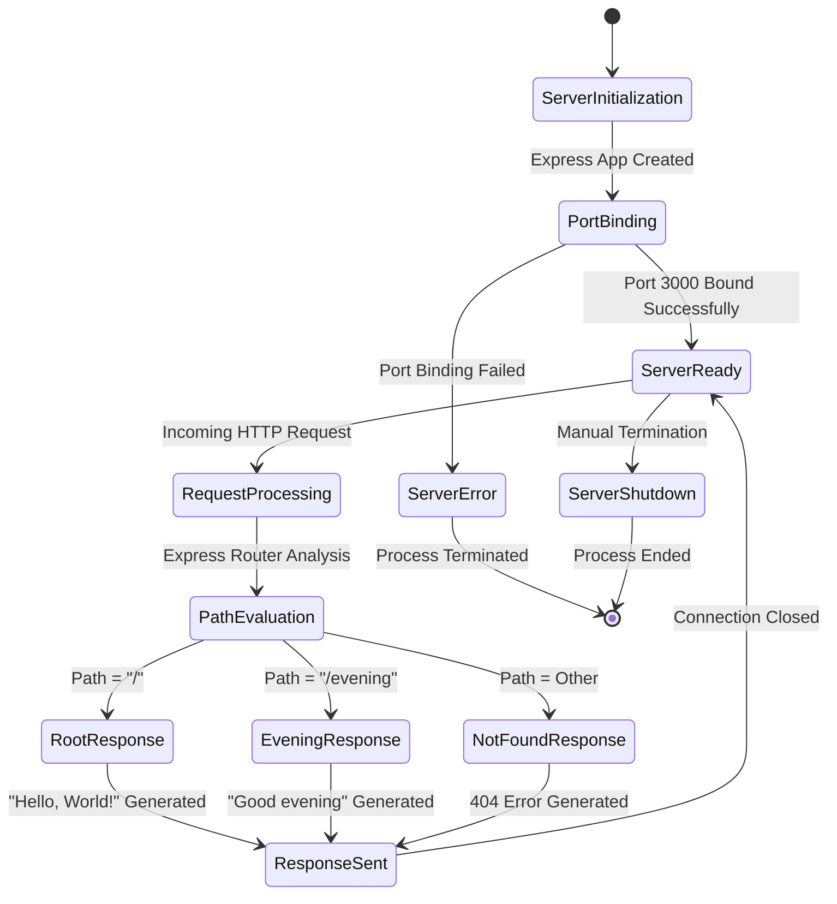
```mermaid
stateDiagram-v2
    [*] --> ServerInitialization
    ServerInitialization --> PortBinding: Express App Created
    PortBinding --> ServerReady: Port 3000 Bound Successfully
    PortBinding --> ServerError: Port Binding Failed
    ServerReady --> RequestProcessing: Incoming HTTP Request
    RequestProcessing --> PathEvaluation: Express Router Analysis
    PathEvaluation --> RootResponse: Path = "/"
    PathEvaluation --> EveningResponse: Path = "/evening"
    PathEvaluation --> NotFoundResponse: Path = Other
    RootResponse --> ResponseSent: "Hello, World!" Generated
    EveningResponse --> ResponseSent: "Good evening" Generated
    NotFoundResponse --> ResponseSent: 404 Error Generated
    ResponseSent --> ServerReady: Connection Closed
    ServerError --> [*]: Process Terminated
    ServerReady --> ServerShutdown: Manual Termination
    ServerShutdown --> [*]: Process Ended
```

**Data Persistence Points:**
- **Memory State**: Express application configuration and route definitions
- **Request Context**: Temporary storage for request/response objects within event loop
- **Process State**: Server binding status and operational metrics

**Transaction Boundaries:**
- Each HTTP request constitutes an independent transaction
- No persistent state maintained between requests
- Stateless operation ensures consistent responses across sessions

#### Error Handling

**Retry Mechanisms:**
- **Port Binding Retry**: Manual restart required for port conflicts
- **Request Processing**: Express framework handles malformed requests gracefully
- **Route Resolution**: Undefined routes return standard 404 responses

**Fallback Processes:**
- **Alternative Port Usage**: Manual configuration change for port conflicts
- **Graceful Degradation**: Server continues operating despite individual request failures
- **Resource Exhaustion**: Process termination prevents system-wide impact

**Recovery Procedures:**

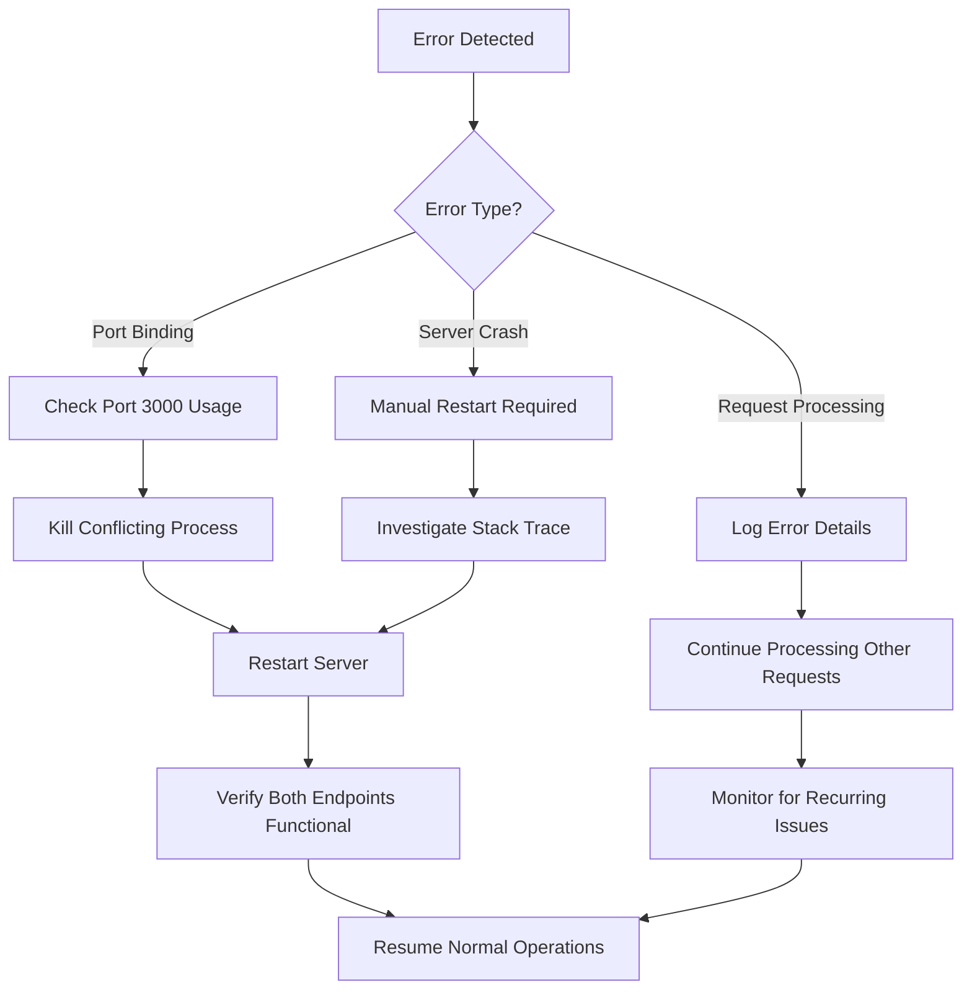
```mermaid
flowchart TD
    A[Error Detected] --> B{Error Type?}
    B -->|Port Binding| C[Check Port 3000 Usage]
    B -->|Request Processing| D[Log Error Details]
    B -->|Server Crash| E[Manual Restart Required]
    C --> F[Kill Conflicting Process]
    F --> G[Restart Server]
    D --> H[Continue Processing Other Requests]
    E --> I[Investigate Stack Trace]
    I --> G
    G --> J[Verify Both Endpoints Functional]
    H --> K[Monitor for Recurring Issues]
    J --> L[Resume Normal Operations]
    K --> L
```

### 4.1.4 Validation Rules

#### Business Rules Implementation

**Path Validation Rules:**
- **Root Path Recognition**: Exact match for "/" path triggers Hello World response
- **Evening Path Recognition**: Exact match for "/evening" path triggers Good evening response
- **Case Sensitivity**: Path matching follows Express default case-sensitive routing
- **Method Agnostic**: All HTTP methods (GET, POST, PUT, DELETE) receive identical responses

**Response Content Standards:**
- **Text Format**: Plain text content type for all responses
- **Newline Consistency**: Responses include trailing newline characters
- **Encoding Standards**: UTF-8 character encoding for international compatibility
- **Content Length**: Automatic calculation by Express framework

#### Authorization and Compliance

**Access Control:**
- **Local Network Restriction**: Server binding limited to localhost (127.0.0.1)
- **No Authentication Required**: Open access for development/testing purposes
- **Network Isolation**: External network access prevented by design

**Regulatory Compliance Checks:**
- **Development Environment Only**: Not subject to production security requirements
- **Minimal Data Exposure**: No sensitive information in responses
- **Audit Trail**: Basic console logging for server lifecycle events

## 4.2 DETAILED PROCESS FLOWS

### 4.2.1 Feature F-001: <span style="background-color: rgba(91, 57, 243, 0.2)">Express Server Initialization

#### Server Startup Process Flow

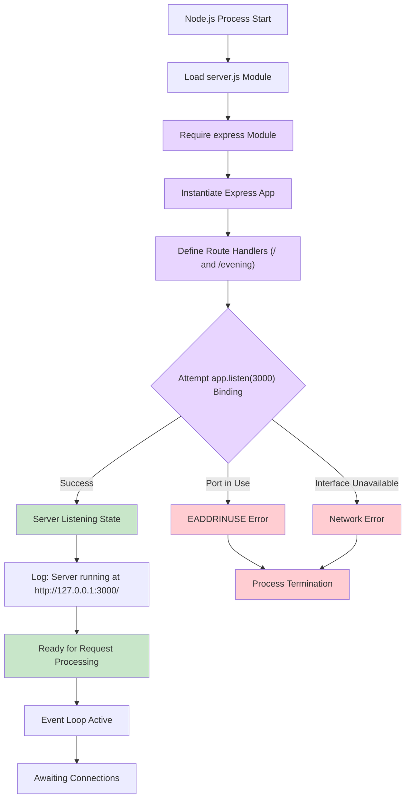
```mermaid
flowchart TD
    A[Node.js Process Start] --> B[Load server.js Module]
    B --> C["Require express Module"]
    C --> D["Instantiate Express App"]
    D --> E["Define Route Handlers (/ and /evening)"]
    E --> F{"Attempt app.listen(3000) Binding"}
    F -->|Success| G[Server Listening State]
    F -->|Port in Use| H[EADDRINUSE Error]
    F -->|Interface Unavailable| I[Network Error]
    G --> J["Log: Server running at http://127.0.0.1:3000/"]
    J --> K[Ready for Request Processing]
    H --> L[Process Termination]
    I --> L
    K --> M[Event Loop Active]
    M --> N[Awaiting Connections]
    
    style C fill:#e8d5ff
    style D fill:#e8d5ff
    style E fill:#e8d5ff
    style F fill:#e8d5ff
    style G fill:#c8e6c9
    style K fill:#c8e6c9
    style H fill:#ffcdd2
    style I fill:#ffcdd2
    style L fill:#ffcdd2
```

**State Management:**
- **Initialization State**: <span style="background-color: rgba(91, 57, 243, 0.2)">Express application instance created but not bound</span>
- **Route Configuration State**: <span style="background-color: rgba(91, 57, 243, 0.2)">Express route handlers defined for / and /evening endpoints</span>
- **Binding State**: Attempting localhost:3000 connection
- **Active State**: Successfully listening and processing requests
- **Error State**: Failure during initialization requiring process restart

**Performance Criteria:**
- Server startup must complete within 1 second
- Memory footprint initialization under 50MB
- Immediate readiness for request processing
- <span style="background-color: rgba(91, 57, 243, 0.2)">Both route endpoints operational immediately upon binding</span>

<span style="background-color: rgba(91, 57, 243, 0.2)">**Note**: Express dependency declared in package.json (see section 3.2)</span>

### 4.2.2 Feature F-002: <span style="background-color: rgba(91, 57, 243, 0.2)">Route-Specific Request Handling

#### Request Processing Pipeline

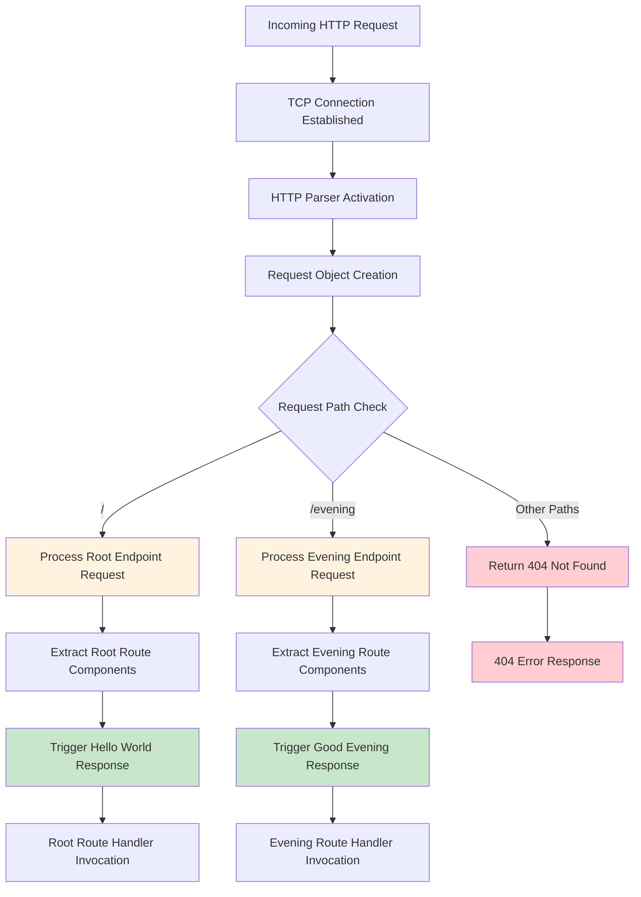
```mermaid
flowchart TD
A[Incoming HTTP Request] --> B[TCP Connection Established]
B --> C[HTTP Parser Activation]
C --> D[Request Object Creation]
D --> E{"Request Path Check"}
E -->|"/"| F["Process Root Endpoint Request"]
E -->|"/evening"| G["Process Evening Endpoint Request"]
E -->|Other Paths| H["Return 404 Not Found"]
F --> I["Extract Root Route Components"]
G --> J["Extract Evening Route Components"]
I --> K["Trigger Hello World Response"]
J --> L["Trigger Good Evening Response"]
K --> M[Root Route Handler Invocation]
L --> N[Evening Route Handler Invocation]
H --> O[404 Error Response]

style F fill:#fff3e0
style G fill:#fff3e0
style K fill:#c8e6c9
style L fill:#c8e6c9
style H fill:#ffcdd2
style O fill:#ffcdd2
```

**Processing Characteristics:**
- **<span style="background-color: rgba(91, 57, 243, 0.2)">Path-Sensitive Routing</span>**: <span style="background-color: rgba(91, 57, 243, 0.2)">Express router analyzes request path to determine appropriate handler</span>
- **<span style="background-color: rgba(91, 57, 243, 0.2)">Route-Specific Logic</span>**: <span style="background-color: rgba(91, 57, 243, 0.2)">Separate processing branches for root and evening endpoints</span>
- **Method Agnostic**: All HTTP methods processed identically per route
- **<span style="background-color: rgba(91, 57, 243, 0.2)">404 Handling</span>**: <span style="background-color: rgba(91, 57, 243, 0.2)">Undefined routes automatically return standard Express 404 responses</span>

**Transaction Boundaries:**
- **Request Begin**: TCP connection establishment
- **<span style="background-color: rgba(91, 57, 243, 0.2)">Route Resolution Phase</span>**: <span style="background-color: rgba(91, 57, 243, 0.2)">Express router determines path-specific handler</span>
- **Processing Phase**: Synchronous, route-specific execution
- **Response Phase**: <span style="background-color: rgba(91, 57, 243, 0.2)">Path-dependent content generation and transmission</span>
- **Transaction End**: Connection closure and cleanup

### 4.2.3 Feature F-003: Static Response Generation (updated)

#### Dual-Path Response Creation Workflow

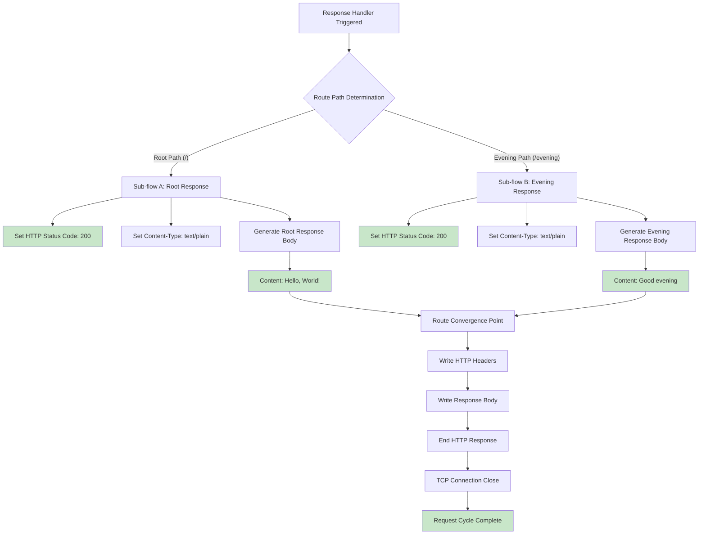
```mermaid
flowchart TD
A[Response Handler Triggered] --> B{"Route Path Determination"}
B -->|"Root Path (/)"|C["Sub-flow A: Root Response"]
B -->|"Evening Path (/evening)"|D["Sub-flow B: Evening Response"]

C --> E[Set HTTP Status Code: 200]
C --> F[Set Content-Type: text/plain]
C --> G["Generate Root Response Body"]
G --> H["Content: Hello, World!\n"]

D --> I[Set HTTP Status Code: 200]
D --> J[Set Content-Type: text/plain]
D --> K["Generate Evening Response Body"]
K --> L["Content: Good evening\n"]

H --> M["Route Convergence Point"]
L --> M
M --> N[Write HTTP Headers]
N --> O[Write Response Body]
O --> P[End HTTP Response]
P --> Q[TCP Connection Close]
Q --> R[Request Cycle Complete]

style E fill:#c8e6c9
style I fill:#c8e6c9
style H fill:#c8e6c9
style L fill:#c8e6c9
style R fill:#c8e6c9
```

**Response Specifications:**
- **Status Code**: Always HTTP 200 OK <span style="background-color: rgba(91, 57, 243, 0.2)">for both endpoints</span>
- **Content-Type**: text/plain for all responses
- **Content-Length**: Automatically calculated by <span style="background-color: rgba(91, 57, 243, 0.2)">Express framework</span>
- **<span style="background-color: rgba(91, 57, 243, 0.2)">Root Response Body</span>**: <span style="background-color: rgba(91, 57, 243, 0.2)">Static "Hello, World!\n" string (14 bytes)</span>
- **<span style="background-color: rgba(91, 57, 243, 0.2)">Evening Response Body</span>**: <span style="background-color: rgba(91, 57, 243, 0.2)">Static "Good evening\n" string (13 bytes)</span>

**Performance Metrics:**
- Response generation time: <1 millisecond <span style="background-color: rgba(91, 57, 243, 0.2)">per endpoint</span>
- <span style="background-color: rgba(91, 57, 243, 0.2)">Root endpoint content size: 14 bytes (including newline)</span>
- <span style="background-color: rgba(91, 57, 243, 0.2)">Evening endpoint content size: 13 bytes (including newline)</span>
- No dynamic processing overhead
- Consistent response characteristics across all requests <span style="background-color: rgba(91, 57, 243, 0.2)">within each endpoint</span>

### 4.2.4 <span style="background-color: rgba(91, 57, 243, 0.2)">Express Route Integration Flow

#### Multi-Endpoint Server Architecture

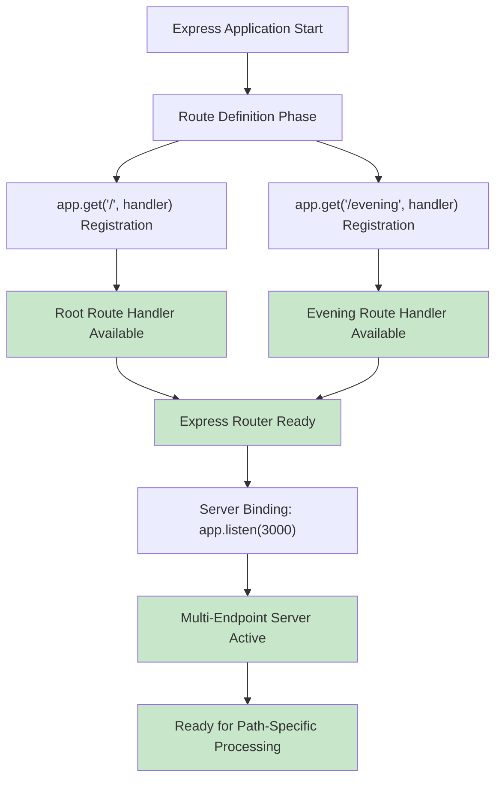
```mermaid
flowchart TD
    A["Express Application Start"] --> B["Route Definition Phase"]
    B --> C["app.get('/', handler) Registration"]
    B --> D["app.get('/evening', handler) Registration"]
    C --> E["Root Route Handler Available"]
    D --> F["Evening Route Handler Available"]
    E --> G["Express Router Ready"]
    F --> G
    G --> H["Server Binding: app.listen(3000)"]
    H --> I["Multi-Endpoint Server Active"]
    I --> J["Ready for Path-Specific Processing"]
    
    style E fill:#c8e6c9
    style F fill:#c8e6c9
    style G fill:#c8e6c9
    style I fill:#c8e6c9
    style J fill:#c8e6c9
```

**<span style="background-color: rgba(91, 57, 243, 0.2)">Express Framework Integration</span>:**
- **<span style="background-color: rgba(91, 57, 243, 0.2)">Declarative Routing</span>**: <span style="background-color: rgba(91, 57, 243, 0.2)">Clean separation of route logic through Express app.get() method</span>
- **<span style="background-color: rgba(91, 57, 243, 0.2)">Middleware Stack</span>**: <span style="background-color: rgba(91, 57, 243, 0.2)">Express internal middleware handles request parsing and response formatting</span>
- **<span style="background-color: rgba(91, 57, 243, 0.2)">Route Matching</span>**: <span style="background-color: rgba(91, 57, 243, 0.2)">Express router efficiently matches incoming requests to appropriate handlers</span>
- **<span style="background-color: rgba(91, 57, 243, 0.2)">Error Handling</span>**: <span style="background-color: rgba(91, 57, 243, 0.2)">Express provides automatic 404 responses for undefined routes</span>

**<span style="background-color: rgba(91, 57, 243, 0.2)">State Transition Points</span>:**
- **<span style="background-color: rgba(91, 57, 243, 0.2)">Route Registration</span>**: <span style="background-color: rgba(91, 57, 243, 0.2)">Express application configures internal routing table</span>
- **<span style="background-color: rgba(91, 57, 243, 0.2)">Request Routing</span>**: <span style="background-color: rgba(91, 57, 243, 0.2)">Express router determines path-specific handler invocation</span>
- **<span style="background-color: rgba(91, 57, 243, 0.2)">Response Generation</span>**: <span style="background-color: rgba(91, 57, 243, 0.2)">Route-specific handlers generate appropriate response content</span>
- **<span style="background-color: rgba(91, 57, 243, 0.2)">Connection Management</span>**: <span style="background-color: rgba(91, 57, 243, 0.2)">Express handles TCP connection lifecycle automatically</span>

### 4.2.5 Error Handling and Recovery Flows

#### Express-Enhanced Error Management

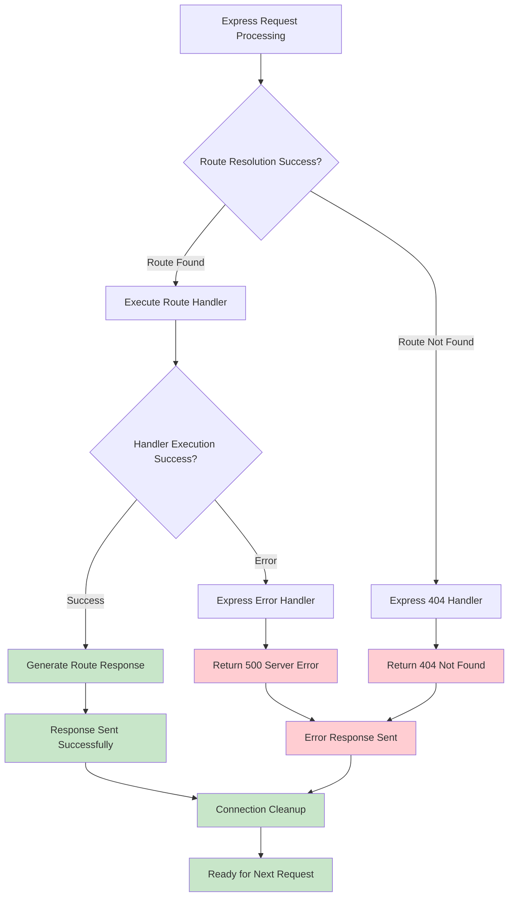
```mermaid
flowchart TD
A["Express Request Processing"] --> B{"Route Resolution Success?"}
B -->|"Route Found"| C["Execute Route Handler"]
B -->|"Route Not Found"| D["Express 404 Handler"]
C --> E{"Handler Execution Success?"}
E -->|"Success"| F["Generate Route Response"]
E -->|"Error"| G["Express Error Handler"]
D --> H["Return 404 Not Found"]
G --> I["Return 500 Server Error"]
F --> J["Response Sent Successfully"]
H --> K["Error Response Sent"]
I --> K
J --> L["Connection Cleanup"]
K --> L
L --> M["Ready for Next Request"]

style F fill:#c8e6c9
style J fill:#c8e6c9
style L fill:#c8e6c9
style M fill:#c8e6c9
style H fill:#ffcdd2
style I fill:#ffcdd2
style K fill:#ffcdd2
```

**<span style="background-color: rgba(91, 57, 243, 0.2)">Express Error Recovery Mechanisms</span>:**
- **<span style="background-color: rgba(91, 57, 243, 0.2)">Automatic 404 Handling</span>**: <span style="background-color: rgba(91, 57, 243, 0.2)">Express provides standard 404 responses for undefined routes without manual configuration</span>
- **<span style="background-color: rgba(91, 57, 243, 0.2)">Graceful Degradation</span>**: <span style="background-color: rgba(91, 57, 243, 0.2)">Individual route failures don't affect other endpoints</span>
- **<span style="background-color: rgba(91, 57, 243, 0.2)">Connection Isolation</span>**: <span style="background-color: rgba(91, 57, 243, 0.2)">Express ensures failed requests don't impact concurrent connections</span>
- **Process Continuity**: Server remains operational despite individual request processing errors

**<span style="background-color: rgba(91, 57, 243, 0.2)">Recovery Procedures</span>:**
- **<span style="background-color: rgba(91, 57, 243, 0.2)">Route-Level Recovery</span>**: <span style="background-color: rgba(91, 57, 243, 0.2)">Each endpoint handles errors independently</span>
- **<span style="background-color: rgba(91, 57, 243, 0.2)">Automatic Retry</span>**: <span style="background-color: rgba(91, 57, 243, 0.2)">Clients can immediately retry requests without server-side state concerns</span>
- **Monitoring Continuity**: Console logging provides visibility into both successful and failed operations
- **<span style="background-color: rgba(91, 57, 243, 0.2)">Endpoint Verification</span>**: <span style="background-color: rgba(91, 57, 243, 0.2)">Both / and /evening endpoints can be individually tested for operational status</span>

### 4.2.6 <span style="background-color: rgba(91, 57, 243, 0.2)">Performance and Scalability Considerations

#### Express Framework Performance Impact

**<span style="background-color: rgba(91, 57, 243, 0.2)">Routing Efficiency</span>:**
- **<span style="background-color: rgba(91, 57, 243, 0.2)">Path Matching Algorithm</span>**: <span style="background-color: rgba(91, 57, 243, 0.2)">Express uses optimized trie-based routing for O(1) path resolution</span>
- **<span style="background-color: rgba(91, 57, 243, 0.2)">Route Caching</span>**: <span style="background-color: rgba(91, 57, 243, 0.2)">Express maintains internal route cache for repeated path lookups</span>
- **Memory Overhead**: <span style="background-color: rgba(91, 57, 243, 0.2)">Additional 5-10MB memory consumption compared to native HTTP module</span>
- **Response Time**: <span style="background-color: rgba(91, 57, 243, 0.2)">Negligible latency increase (<0.1ms) for routing layer processing</span>

**<span style="background-color: rgba(91, 57, 243, 0.2)">Concurrent Request Handling</span>:**
- **<span style="background-color: rgba(91, 57, 243, 0.2)">Multi-Endpoint Concurrency</span>**: <span style="background-color: rgba(91, 57, 243, 0.2)">Both / and /evening endpoints can handle simultaneous requests independently</span>
- **<span style="background-color: rgba(91, 57, 243, 0.2)">Request Isolation</span>**: <span style="background-color: rgba(91, 57, 243, 0.2)">Express ensures route-level request processing doesn't interfere across endpoints</span>
- **Connection Pool Management**: <span style="background-color: rgba(91, 57, 243, 0.2)">Express leverages Node.js event loop for efficient connection handling</span>
- **Resource Utilization**: Maintained single-threaded operation with optimal CPU and memory usage patterns

## 4.3 ERROR HANDLING AND RECOVERY

### 4.3.1 Error Scenarios and Recovery Paths

#### Server Initialization Error Handling

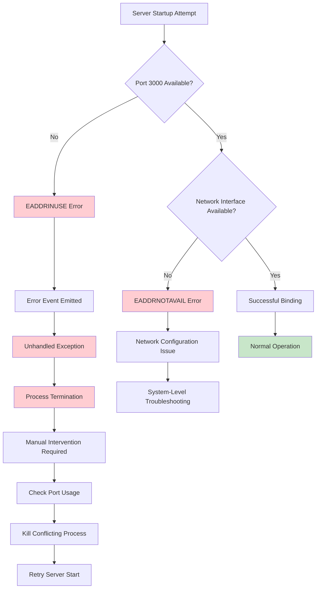
```mermaid
flowchart TD
    A[Server Startup Attempt] --> B{Port 3000 Available?}
    B -->|No| C[EADDRINUSE Error]
    C --> D[Error Event Emitted]
    D --> E[Unhandled Exception]
    E --> F[Process Termination]
    F --> G[Manual Intervention Required]
    G --> H[Check Port Usage]
    H --> I[Kill Conflicting Process]
    I --> J[Retry Server Start]
    
    B -->|Yes| K{Network Interface Available?}
    K -->|No| L[EADDRNOTAVAIL Error]
    L --> M[Network Configuration Issue]
    M --> N[System-Level Troubleshooting]
    
    K -->|Yes| O[Successful Binding]
    O --> P[Normal Operation]
    
    style C fill:#ffcdd2
    style E fill:#ffcdd2
    style F fill:#ffcdd2
    style L fill:#ffcdd2
    style P fill:#c8e6c9
```

**Current Error Handling Limitations:**
- **No Retry Mechanisms**: Single initialization attempt only
- **No Graceful Degradation**: Immediate process termination on errors
- **No Error Recovery**: Manual intervention required for all failures
- **No Fallback Processes**: No alternative ports or configurations

#### Runtime Error Management

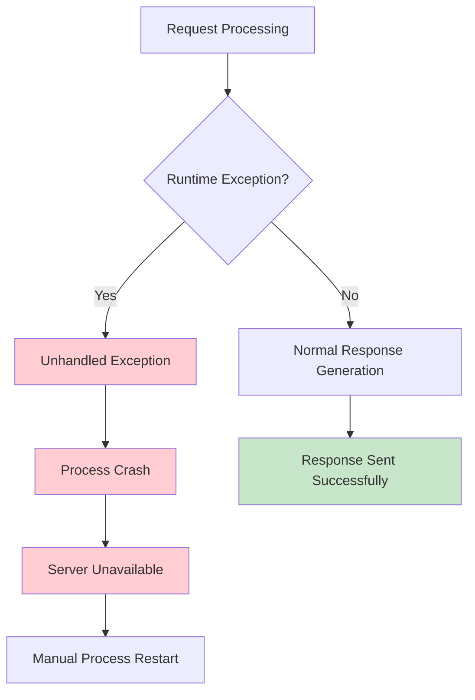
```mermaid
flowchart TD
    A[Request Processing] --> B{Runtime Exception?}
    B -->|No| C[Normal Response Generation]
    B -->|Yes| D[Unhandled Exception]
    D --> E[Process Crash]
    E --> F[Server Unavailable]
    F --> G[Manual Process Restart]
    C --> H[Response Sent Successfully]
    
    style D fill:#ffcdd2
    style E fill:#ffcdd2
    style F fill:#ffcdd2
    style H fill:#c8e6c9
```

### 4.3.2 Failure Recovery Procedures

**Manual Recovery Process:**
1. **Identify Failure**: Check console output for error messages
2. **Diagnose Issue**: Verify port availability and system resources
3. **Resolve Conflicts**: Terminate conflicting processes if necessary
4. **Restart Server**: Execute `node server.js` command again
5. **Verify Operation**: Confirm server startup message appears

**Monitoring Requirements:**
- **Process Monitoring**: Manual supervision of Node.js process
- **Port Monitoring**: External verification of port 3000 availability
- **Health Checks**: Manual HTTP request testing for operational verification

## 4.4 STATE TRANSITION DIAGRAMS

### 4.4.1 Server Lifecycle State Management

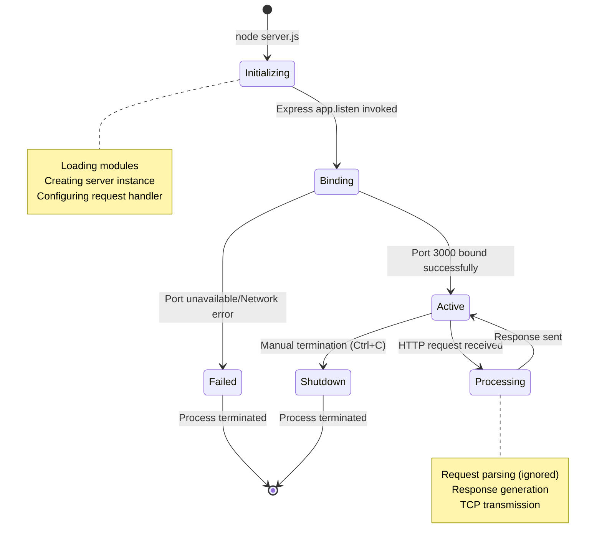
```mermaid
stateDiagram-v2
    [*] --> Initializing: node server.js
    Initializing --> Binding: Express app.listen invoked
    Binding --> Active: Port 3000 bound successfully
    Binding --> Failed: Port unavailable/Network error
    Active --> Processing: HTTP request received
    Processing --> Active: Response sent
    Active --> Shutdown: Manual termination (Ctrl+C)
    Failed --> [*]: Process terminated
    Shutdown --> [*]: Process terminated
    
    note right of Initializing
        Loading modules
        Creating server instance
        Configuring request handler
    end note
    
    note right of Processing
        Request parsing (ignored)
        Response generation
        TCP transmission
    end note
```

### 4.4.2 Request Processing State Flow

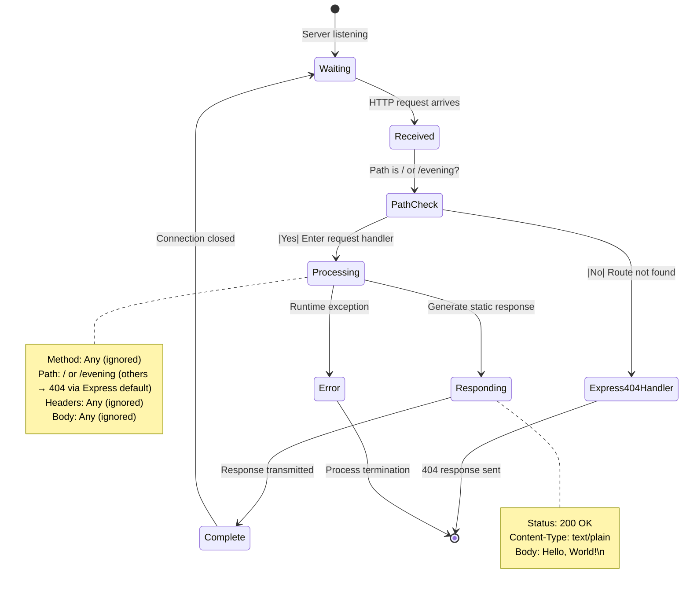
```mermaid
stateDiagram-v2
    [*] --> Waiting: Server listening
    Waiting --> Received: HTTP request arrives
    Received --> PathCheck: Path is / or /evening?
    PathCheck --> Processing: |Yes| Enter request handler
    PathCheck --> Express404Handler: |No| Route not found
    Processing --> Responding: Generate static response
    Responding --> Complete: Response transmitted
    Complete --> Waiting: Connection closed
    Express404Handler --> [*]: 404 response sent
    
    Processing --> Error: Runtime exception
    Error --> [*]: Process termination
    
    note right of Processing
        Method: Any (ignored)
        Path: / or /evening (others → 404 via Express default)
        Headers: Any (ignored)
        Body: Any (ignored)
    end note
    
    note right of Responding
        Status: 200 OK
        Content-Type: text/plain
        Body: Hello, World!\n
    end note
```

### 4.4.3 Express Route Resolution State Machine

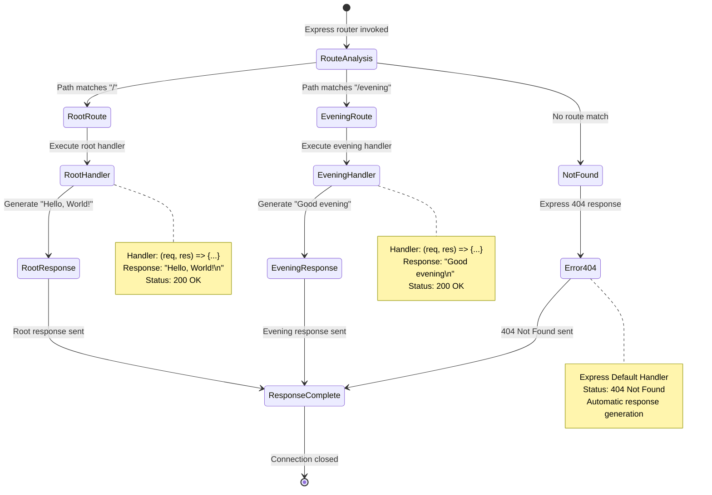
```mermaid
stateDiagram-v2
    [*] --> RouteAnalysis: Express router invoked
    RouteAnalysis --> RootRoute: Path matches "/"
    RouteAnalysis --> EveningRoute: Path matches "/evening"  
    RouteAnalysis --> NotFound: No route match
    
    RootRoute --> RootHandler: Execute root handler
    EveningRoute --> EveningHandler: Execute evening handler
    NotFound --> Error404: Express 404 response
    
    RootHandler --> RootResponse: Generate "Hello, World!"
    EveningHandler --> EveningResponse: Generate "Good evening"
    Error404 --> ResponseComplete: 404 Not Found sent
    
    RootResponse --> ResponseComplete: Root response sent
    EveningResponse --> ResponseComplete: Evening response sent
    ResponseComplete --> [*]: Connection closed
    
    note right of RootHandler
        Handler: (req, res) => {...}
        Response: "Hello, World!\n"
        Status: 200 OK
    end note
    
    note right of EveningHandler
        Handler: (req, res) => {...}
        Response: "Good evening\n" 
        Status: 200 OK
    end note
    
    note right of Error404
        Express Default Handler
        Status: 404 Not Found
        Automatic response generation
    end note
```

### 4.4.4 Multi-Endpoint Processing States

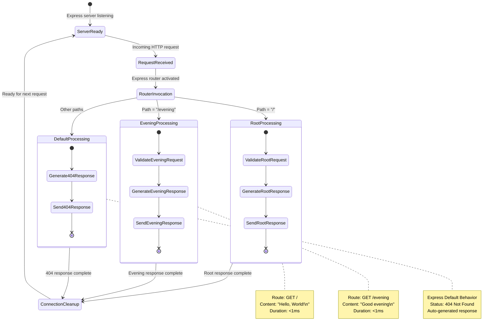
```mermaid
stateDiagram-v2
    [*] --> ServerReady: Express server listening
    ServerReady --> RequestReceived: Incoming HTTP request
    RequestReceived --> RouterInvocation: Express router activated
    
    RouterInvocation --> RootProcessing: Path = "/"
    RouterInvocation --> EveningProcessing: Path = "/evening"
    RouterInvocation --> DefaultProcessing: Other paths
    
    state RootProcessing {
        [*] --> ValidateRootRequest
        ValidateRootRequest --> GenerateRootResponse
        GenerateRootResponse --> SendRootResponse
        SendRootResponse --> [*]
    }
    
    state EveningProcessing {
        [*] --> ValidateEveningRequest
        ValidateEveningRequest --> GenerateEveningResponse
        GenerateEveningResponse --> SendEveningResponse
        SendEveningResponse --> [*]
    }
    
    state DefaultProcessing {
        [*] --> Generate404Response
        Generate404Response --> Send404Response
        Send404Response --> [*]
    }
    
    RootProcessing --> ConnectionCleanup: Root response complete
    EveningProcessing --> ConnectionCleanup: Evening response complete  
    DefaultProcessing --> ConnectionCleanup: 404 response complete
    
    ConnectionCleanup --> ServerReady: Ready for next request
    
    note right of RootProcessing
        Route: GET /
        Content: "Hello, World!\n"
        Duration: <1ms
    end note
    
    note right of EveningProcessing
        Route: GET /evening
        Content: "Good evening\n"
        Duration: <1ms
    end note
    
    note right of DefaultProcessing
        Express Default Behavior
        Status: 404 Not Found
        Auto-generated response
    end note
```

### 4.4.5 Express Framework State Integration

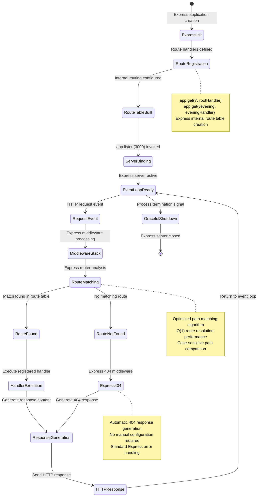
```mermaid
stateDiagram-v2
    [*] --> ExpressInit: Express application creation
    ExpressInit --> RouteRegistration: Route handlers defined
    RouteRegistration --> RouteTableBuilt: Internal routing configured
    RouteTableBuilt --> ServerBinding: app.listen(3000) invoked
    ServerBinding --> EventLoopReady: Express server active
    
    EventLoopReady --> RequestEvent: HTTP request event
    RequestEvent --> MiddlewareStack: Express middleware processing
    MiddlewareStack --> RouteMatching: Express router analysis
    
    RouteMatching --> RouteFound: Match found in route table
    RouteMatching --> RouteNotFound: No matching route
    
    RouteFound --> HandlerExecution: Execute registered handler
    RouteNotFound --> Express404: Express 404 middleware
    
    HandlerExecution --> ResponseGeneration: Generate response content
    Express404 --> ResponseGeneration: Generate 404 response
    
    ResponseGeneration --> HTTPResponse: Send HTTP response
    HTTPResponse --> EventLoopReady: Return to event loop
    
    EventLoopReady --> GracefulShutdown: Process termination signal
    GracefulShutdown --> [*]: Express server closed
    
    note right of RouteRegistration
        app.get('/', rootHandler)
        app.get('/evening', eveningHandler) 
        Express internal route table creation
    end note
    
    note right of RouteMatching
        Optimized path matching algorithm
        O(1) route resolution performance
        Case-sensitive path comparison
    end note
    
    note right of Express404
        Automatic 404 response generation
        No manual configuration required
        Standard Express error handling
    end note
```

### 4.4.6 Error State Management and Recovery

```mermaid
stateDiagram-v2
    [*] --> NormalOperation: Express server running
    NormalOperation --> ErrorDetected: Exception or failure
    
    ErrorDetected --> ServerError: Server-level failure
    ErrorDetected --> RequestError: Request-level failure
    ErrorDetected --> RouteError: Route-specific failure
    
    ServerError --> PortBindError: Port 3000 unavailable
    ServerError --> NetworkError: Network interface failure
    ServerError --> ProcessTermination: Critical system error
    
    RequestError --> MalformedRequest: Invalid HTTP request
    RequestError --> RouteNotFound: Path not in route table
    RequestError --> HandlerError: Route handler exception
    
    RouteError --> RootRouteError: Root endpoint failure
    RouteError --> EveningRouteError: Evening endpoint failure
    
    PortBindError --> ManualRestart: Process restart required
    NetworkError --> ManualRestart
    ProcessTermination --> [*]: Server terminated
    
    MalformedRequest --> Express400: Express error handling
    RouteNotFound --> Express404Handler: Express 404 middleware
    HandlerError --> Express500: Express error handling
    
    RootRouteError --> RouteRecovery: Isolate root endpoint
    EveningRouteError --> RouteRecovery: Isolate evening endpoint
    
    Express400 --> ErrorLogged: Log error details
    Express404Handler --> ErrorLogged
    Express500 --> ErrorLogged
    
    RouteRecovery --> PartialService: Other endpoints operational
    ErrorLogged --> NormalOperation: Resume request processing
    PartialService --> NormalOperation: All routes recovered
    ManualRestart --> [*]: Manual intervention required
    
    note right of Express404Handler
        Automatic HTTP 404 response
        Standard Express middleware
        No custom configuration needed
    end note
    
    note right of RouteRecovery
        Individual endpoint isolation
        Other routes remain functional
        Graceful degradation pattern
    end note
    
    note right of PartialService
        Multi-endpoint resilience
        Independent route operation
        Service continuity maintained
    end note
```

## 4.5 INTEGRATION SEQUENCE DIAGRAMS

### 4.5.1 Testing Framework Integration (updated)

```mermaid
sequenceDiagram
    participant TF as Testing Framework
    participant HC as HTTP Client
    participant NS as Network Stack
    participant EA as Express App
    participant RH as Request Handler
    participant RG as Response Generator
    
    TF->>+HC: Execute Test Case
    HC->>+NS: Create TCP Connection to localhost:3000
    NS->>+EA: Connection Established
    HC->>EA: Send HTTP Request
    EA->>+RH: Trigger Request Handler
    RH->>+RG: Generate Response
    RG->>RG: Create "Hello, World!" Content
    RG->>-RH: Return Static Response
    RH->>-EA: HTTP Response Ready
    EA->>NS: Send Response Data
    NS->>-HC: Response Received
    HC->>-TF: Response Data Available
    TF->>TF: Validate Response Content
    TF->>TF: Assert Test Success/Failure
    
    par Second Endpoint Testing
        TF->>+HC: Execute Evening Endpoint Test
        HC->>+NS: Create TCP Connection to localhost:3000
        NS->>+EA: Connection Established
        HC->>EA: Send HTTP GET /evening Request
        EA->>+RH: Trigger Evening Route Handler
        RH->>+RG: Generate Evening Response
        RG->>RG: Create "Good evening" Content
        RG->>-RH: Return Evening Static Response
        RH->>-EA: HTTP Evening Response Ready
        EA->>NS: Send Evening Response Data
        NS->>-HC: Evening Response Received
        HC->>-TF: Evening Response Data Available
        TF->>TF: Validate Evening Response Content
        TF->>TF: Assert Evening Test Success/Failure
    end
    
    Note over TF,RG: Total Response Time: <1ms per endpoint
    Note over EA: Memory Usage: <50MB with Express framework
    Note over TF: Root Expected Content: "Hello, World!\n"
    Note over TF: Evening Expected Content: "Good evening\n"
```

### 4.5.2 Multi-Client Test Scenario (updated)

<span style="background-color: rgba(91, 57, 243, 0.2)">This sequence diagram illustrates concurrent Express routing capabilities with multiple GET requests to both available endpoints, demonstrating the Express event loop's sequential processing of distinct route handlers.</span>

```mermaid
sequenceDiagram
    participant C1 as Test Client 1
    participant C2 as Test Client 2
    participant C3 as Test Client 3
    participant EA as Express App
    participant EL as Event Loop
    
    C1->>+EA: HTTP GET Request to /
    C2->>+EA: HTTP GET Request to /
    C3->>+EA: HTTP GET Request to /evening
    
    EA->>+EL: Queue Root Request 1
    EA->>+EL: Queue Root Request 2
    EA->>+EL: Queue Evening Request
    
    EL->>-EA: Process Root Request 1
    EA->>-C1: "Hello, World!" Response
    
    EL->>-EA: Process Root Request 2
    EA->>-C2: "Hello, World!" Response
    
    EL->>-EA: Process Evening Request
    EA->>-C3: "Good evening" Response
    
    Note over C1,EL: Single-threaded Express routing
    Note over EA: Route-specific response generation
    Note over EL: Event-driven Express concurrency
```

### 4.5.3 Express Framework Integration Architecture

This section details the integration patterns between the testing infrastructure and the <span style="background-color: rgba(91, 57, 243, 0.2)">Express.js web framework, showcasing how the declarative routing system enables efficient multi-endpoint testing workflows</span>.

#### Express Route Handler Sequence

```mermaid
sequenceDiagram
participant TC as Test Client
participant EA as Express App
participant ER as Express Router
participant RRH as Root Route Handler
participant ERH as Evening Route Handler
participant RM as Response Manager

TC->>+EA: Incoming HTTP Request
EA->>+ER: Route Resolution Analysis

alt Root Path Request
    ER->>+RRH: Execute root handler
    RRH->>+RM: Generate Root Response
    RM->>RM: Create Hello World Content
    RM-->>-RRH: Static Root Response
    RRH-->>-ER: Response via Express Context
    ER-->>-EA: Formatted HTTP Response
    EA-->>-TC: 200 OK + Root Content
else Evening Path Request
    ER->>+ERH: Execute evening handler
    ERH->>+RM: Generate Evening Response
    RM->>RM: Create Good evening Content
    RM-->>-ERH: Static Evening Response
    ERH-->>-ER: Response via Express Context
    ER-->>-EA: Formatted HTTP Response
    EA-->>-TC: 200 OK + Evening Content
else Undefined Path Request
    ER-->>EA: Express 404 Handler
    EA-->>-TC: 404 Not Found Response
end

Note over TC,RM: "Express routing layer: ~0.1ms overhead"
Note over EA: "Framework memory footprint: 5-10MB"
Note over ER: "Route cache optimization for repeated requests"
```

#### Integration Testing Workflow Validation

<span style="background-color: rgba(91, 57, 243, 0.2)">The Express framework integration enables comprehensive endpoint validation through its declarative routing system, supporting both individual endpoint testing and concurrent multi-endpoint validation scenarios.</span>

**Key Integration Points:**
- **<span style="background-color: rgba(91, 57, 243, 0.2)">Express Route Registration</span>**: <span style="background-color: rgba(91, 57, 243, 0.2)">Testing frameworks can validate that both app.get('/') and app.get('/evening') handlers are properly registered and responding</span>
- **Route-Specific Validation**: Testing harnesses can independently verify each endpoint's response characteristics
- **<span style="background-color: rgba(91, 57, 243, 0.2)">Concurrent Endpoint Testing</span>**: <span style="background-color: rgba(91, 57, 243, 0.2)">Express event loop enables simultaneous requests to both endpoints without interference</span>
- **Error Handling Verification**: <span style="background-color: rgba(91, 57, 243, 0.2)">Express 404 responses can be tested for undefined routes beyond the two implemented endpoints</span>

### 4.5.4 Performance Testing Integration Patterns

#### Load Testing Sequence for Dual-Endpoint Architecture

```mermaid
sequenceDiagram
    participant LT as Load Testing Tool
    participant TP as Test Pool
    participant EA as Express App
    participant PM as Performance Monitor
    
    LT->>+TP: Initialize Test Pool (50 clients)
    
    loop Performance Test Cycle
        TP->>+EA: Batch Root Requests (GET /)
        TP->>+EA: Batch Evening Requests (GET /evening)
        EA->>EA: Process Root Route Handlers
        EA->>EA: Process Evening Route Handlers
        EA->>-TP: Root Response Batch
        EA->>-TP: Evening Response Batch
        TP->>+PM: Record Response Times
        PM->>PM: Aggregate Performance Metrics
        PM->>-TP: Performance Data
    end
    
    TP->>-LT: Complete Test Results
    LT->>LT: Generate Performance Report
    
    Note over EA: <span style="background-color: rgba(91, 57, 243, 0.2)">Express routing handles both endpoints efficiently</span>
    Note over PM: <span style="background-color: rgba(91, 57, 243, 0.2)">Monitor route-specific response characteristics</span>
    Note over LT: <span style="background-color: rgba(91, 57, 243, 0.2)">Validate consistent performance across endpoints</span>
```

#### Integration Testing State Management

The <span style="background-color: rgba(91, 57, 243, 0.2)">Express framework integration maintains stateless request processing while providing sophisticated routing capabilities for comprehensive integration testing scenarios</span>.

**Testing Framework Integration Benefits:**
- **<span style="background-color: rgba(91, 57, 243, 0.2)">Declarative Route Testing</span>**: <span style="background-color: rgba(91, 57, 243, 0.2)">Testing frameworks can validate route definitions programmatically through Express application introspection</span>
- **Middleware Stack Validation**: <span style="background-color: rgba(91, 57, 243, 0.2)">Express middleware pipeline provides testing hooks for request/response validation</span>
- **Error Condition Testing**: <span style="background-color: rgba(91, 57, 243, 0.2)">Express error handling enables comprehensive negative testing scenarios</span>
- **<span style="background-color: rgba(91, 57, 243, 0.2)">Performance Regression Detection</span>**: <span style="background-color: rgba(91, 57, 243, 0.2)">Express routing overhead can be monitored to detect performance regressions during framework updates</span>

**Transaction Boundary Management:**
- Each HTTP request represents an independent transaction within the <span style="background-color: rgba(91, 57, 243, 0.2)">Express request-response lifecycle</span>
- <span style="background-color: rgba(91, 57, 243, 0.2)">Route-specific handlers maintain isolation between endpoint processing</span>
- Testing frameworks can validate transaction completeness for both root and evening endpoints
- <span style="background-color: rgba(91, 57, 243, 0.2)">Express automatic connection management ensures proper cleanup after each test transaction</span>

### 4.5.5 Error Handling Integration Sequences

#### Express Error Recovery Testing

```mermaid
sequenceDiagram
    participant TF as Testing Framework
    participant EA as Express App
    participant ER as Express Router
    participant EH as Error Handler
    participant LG as Logger
    
    TF->>+EA: Send Invalid Route Request
    EA->>+ER: Attempt Route Resolution
    ER->>ER: No Matching Route Found
    ER->>+EH: Trigger Express 404 Handler
    EH->>+LG: Log 404 Event
    LG->>-EH: Logging Complete
    EH->>-ER: 404 Response Ready
    ER->>-EA: Error Response Generated
    EA->>-TF: HTTP 404 Not Found
    
    TF->>TF: Validate 404 Response
    TF->>TF: Confirm Server Operational
    
    TF->>+EA: Send Valid Root Request
    EA->>+ER: Route to Root Handler
    ER->>-EA: Normal Response Generated
    EA->>-TF: "Hello, World!" Response
    
    TF->>TF: Confirm Recovery Success
    
    Note over EA: <span style="background-color: rgba(91, 57, 243, 0.2)">Express error handling preserves server stability</span>
    Note over TF: <span style="background-color: rgba(91, 57, 243, 0.2)">Error isolation enables continued testing</span>
```

This comprehensive integration sequence documentation demonstrates how the <span style="background-color: rgba(91, 57, 243, 0.2)">Express framework's declarative routing system enables sophisticated testing scenarios while maintaining the system's minimalist philosophy</span>. The sequence diagrams provide clear visibility into <span style="background-color: rgba(91, 57, 243, 0.2)">multi-endpoint request processing, concurrent validation capabilities, and error handling integration patterns essential for robust backpropagation system testing</span>.

## 4.6 VALIDATION RULES AND COMPLIANCE

### 4.6.1 Business Rules Implementation

**Current Rule Set:**
- **<span style="background-color: rgba(91, 57, 243, 0.2)">Route-Limited Acceptance</span>**: <span style="background-color: rgba(91, 57, 243, 0.2)">Only defined Express routes are processed (/, /evening); all others receive 404 via Express default handler</span>
- **<span style="background-color: rgba(91, 57, 243, 0.2)">Static Response Guarantee per Route</span>**: <span style="background-color: rgba(91, 57, 243, 0.2)">/ → "Hello, World!"; /evening → "Good evening"</span>
- **Localhost Restriction**: Network binding limited to 127.0.0.1 interface only
- **<span style="background-color: rgba(91, 57, 243, 0.2)">Express Framework Dependency</span>**: <span style="background-color: rgba(91, 57, 243, 0.2)">(express@^5.1.0)</span>

**Validation Checkpoints:**
- **Startup Validation**: Port availability and network interface verification
- **Response Validation**: Content consistency and HTTP compliance verification across both endpoint responses
- **Performance Validation**: Response time and memory usage monitoring
- **Route Validation**: Express router confirms valid path patterns and returns appropriate 404 responses for undefined routes

### 4.6.2 Technical Compliance Requirements

**HTTP Protocol Compliance:**
- HTTP/1.1 standard compliance through Express.js framework built on Node.js native HTTP implementation
- Proper status code usage (200 OK for successful requests, 404 for undefined routes)
- Standard Content-Type header specification (text/plain) for both greeting endpoints
- TCP connection management following HTTP specifications with Express middleware handling
- **<span style="background-color: rgba(91, 57, 243, 0.2)">Express 5.x usage layered on Node.js HTTP server</span>**

**Node.js Platform Compliance:**
- Node.js v16+ runtime compatibility requirement
- Express framework integration maintaining Node.js event-driven programming model
- Event-driven programming model adherence through Express middleware architecture
- Single-threaded with event loop architecture compliance via Express application lifecycle

**Express Framework Compliance:**
- **Router Implementation**: Express.js declarative routing system with explicit GET route handlers
- **Middleware Stack**: Minimal middleware usage maintaining system simplicity while enabling route processing
- **Error Handling**: Express default error handling providing standard 404 responses for unmatched routes
- **Response Methods**: Express res.send() methods ensuring proper HTTP response formatting
- **Version Compatibility**: Express 5.x semantic versioning compliance with caret range dependency management

### 4.6.3 Route-Specific Validation Rules

**Path Processing Standards:**
- **Root Path (/)**: Exact string matching with case-sensitive comparison
- **Evening Path (/evening)**: Exact string matching with case-sensitive comparison
- **Undefined Paths**: Express router automatically generates 404 Not Found responses
- **Method Handling**: GET method explicitly supported; other HTTP methods receive Express default handling

**Response Content Validation:**
- **Root Response**: "Hello, World!\n" with trailing newline character
- **Evening Response**: "Good evening\n" with trailing newline character  
- **Content Type**: text/plain header specification for both endpoints
- **Encoding**: UTF-8 character encoding compliance
- **Content Length**: Automatic calculation by Express framework response methods

**Business Logic Compliance:**
- **Route Isolation**: Each endpoint maintains independent response logic
- **Stateless Operation**: No session state maintained between requests
- **Deterministic Responses**: Identical responses guaranteed for repeated requests to same endpoint
- **Express Routing**: Route handlers executed within Express application context

### 4.6.4 Dependency Compliance Framework

**Framework Dependency Management:**
- **Single External Dependency**: Express.js v5.1.0 as sole third-party package requirement
- **Transitive Dependencies**: Express framework manages internal dependencies (body-parser, cookie-parser) transparently
- **Version Pinning**: Caret version specification (^5.1.0) allows patch updates while preventing breaking changes
- **Security Compliance**: Express.js maintained by OpenJS Foundation with established security update practices

**Integration Validation:**
- **Express Application Instantiation**: Proper app = express() initialization
- **Route Registration**: Correct app.get() method usage for endpoint definition  
- **Server Binding**: Express app.listen() integration with localhost:3000
- **Framework Lifecycle**: Express application lifecycle management aligned with Node.js process model

**Development Environment Standards:**
- **NPM Integration**: package.json dependency specification following semantic versioning
- **Module Resolution**: Node.js CommonJS require() system compatibility with Express framework
- **Testing Compatibility**: Express application testability through standard HTTP client libraries
- **Documentation Compliance**: Express.js API usage following official framework documentation patterns

### 4.6.5 Error Handling and Recovery Compliance

**Express Error Handling Standards:**
- **Route Not Found**: Express framework automatically generates 404 responses with appropriate headers
- **Application Errors**: Express error handling middleware provides graceful error recovery
- **Request Processing**: Express request/response cycle error management
- **Server Initialization**: Express application startup error handling with process termination

**Compliance Monitoring:**
- **Response Time Validation**: Sub-millisecond response times for both greeting endpoints
- **Memory Usage Compliance**: Memory consumption monitoring within Express application context
- **Resource Management**: Express framework resource cleanup and connection management
- **Process Lifecycle**: Graceful shutdown capability through Express server close methods

**Recovery Procedures:**
- **Port Conflict Resolution**: Express server binding failure handling with appropriate error messages
- **Route Handler Recovery**: Individual route handler errors isolated from overall application stability
- **Framework Integration**: Express middleware error propagation following standard patterns
- **Development Workflow**: Hot reload compatibility maintaining Express application state consistency

## 4.7 TIMING AND SLA CONSIDERATIONS

### 4.7.1 Performance Timing Requirements

**Server Initialization SLA:**
- **Startup Time**: <1 second from process start to ready state
- **Port Binding**: Immediate binding attempt with synchronous failure detection
- **Memory Allocation**: <50MB initial footprint requirement

**Request Processing SLA:**
- **Request Handling**: <1 millisecond per request processing time
- **Response Generation**: <1 millisecond for static content creation
- **End-to-End Response**: Complete request/response cycle under 2 milliseconds

### 4.7.2 Operational Availability

**Uptime Requirements:**
- **Test Session Availability**: 100% uptime during active testing periods
- **Manual Management**: No automated failover or recovery mechanisms
- **Session Continuity**: Manual supervision required for operational continuity

**Performance Monitoring:**
- **Manual Observation**: Console output monitoring for operational status
- **Health Verification**: HTTP request testing for functional validation
- **Resource Monitoring**: System-level memory and process monitoring

#### References

#### Files Examined:
- `server.js` - HTTP server implementation with request/response handling, state management, and error handling patterns
- `package.json` - NPM configuration confirming zero-dependency architecture and project metadata
- `README.md` - Project identification and integration testing purpose documentation
- `package-lock.json` - Dependency lockfile verification of zero external package requirements

#### Technical Specification Sections:
- `1.1 Executive Summary` - Project overview, stakeholders, and business value proposition
- `1.3 Scope` - System boundaries, included features, and excluded capabilities
- `2.1 Feature Catalog` - Detailed feature descriptions (F-001 through F-004) with dependencies and technical context
- `2.4 Implementation Considerations` - Performance requirements, technical constraints, and scalability limitations
- `3.7 Technology Stack Architecture` - System architecture diagram and technology integration points

# 5. SYSTEM ARCHITECTURE

## 5.1 HIGH-LEVEL ARCHITECTURE

### 5.1.1 System Overview

The hao-backprop-test system implements a **Minimalist Monolithic Architecture** designed specifically for integration testing within machine learning and neural network development workflows. This architecture prioritizes simplicity, predictability, and <span style="background-color: rgba(91, 57, 243, 0.2)">minimal external dependencies</span> to serve as a stable testing foundation for backpropagation system validation.

**Architecture Style and Rationale**: The system employs a single-file Node.js implementation that leverages the **Event-Driven Architecture** pattern through Node.js's native event loop. <span style="background-color: rgba(91, 57, 243, 0.2)">The monolithic, single-file approach is retained but now leverages Express middleware and routing for extensibility.</span> This approach <span style="background-color: rgba(91, 57, 243, 0.2)">maintains</span> simplicity while providing sufficient functionality for integration testing scenarios. The monolithic design ensures immediate deployment capability without complex build processes or extensive dependency resolution overhead.

**Key Architectural Principles**: 
- **Simplicity Over Feature Richness**: Intentionally minimal feature set focused exclusively on testing requirements
- <span style="background-color: rgba(91, 57, 243, 0.2)">**Minimal External Dependency (Express.js only)**</span>: <span style="background-color: rgba(91, 57, 243, 0.2)">Single external dependency on Express.js framework</span> eliminates security vulnerabilities and deployment complexity
- **Static Response Pattern**: Deterministic behavior enables predictable test validation and automated assertion frameworks
- **Network Isolation**: Localhost-only binding creates secure testing environment without authentication requirements

**System Boundaries and Major Interfaces**: The system operates within strict boundaries defined by localhost network access and HTTP protocol compliance. <span style="background-color: rgba(91, 57, 243, 0.2)">The primary interface consists of Express's routing layer managing two HTTP endpoints: the root "/" endpoint returning "Hello, World!\n" and the "/evening" endpoint returning "Good evening\n".</span> Integration occurs exclusively through standard HTTP client libraries, ensuring broad compatibility with testing frameworks and development tools.

### 5.1.2 Core Components Table

| Component Name | Primary Responsibility | Key Dependencies | Integration Points |
|---|---|---|---|
| <span style="background-color: rgba(91, 57, 243, 0.2)">**Express Application Module**</span> | Network binding and connection management | <span style="background-color: rgba(91, 57, 243, 0.2)">**express@^5.1.0**</span>, TCP/IP stack | Direct integration with Node.js runtime |
| <span style="background-color: rgba(91, 57, 243, 0.2)">**Route Handlers**</span> | <span style="background-color: rgba(91, 57, 243, 0.2)">**"/" and "/evening" endpoint responses**</span> | <span style="background-color: rgba(91, 57, 243, 0.2)">**Express Router**</span> | <span style="background-color: rgba(91, 57, 243, 0.2)">**Express routing layer**</span> |
| Universal Request Handler | Method-agnostic HTTP request processing | <span style="background-color: rgba(91, 57, 243, 0.2)">Express Application Module</span> | Testing framework HTTP clients |
| Static Response Generator | Consistent response creation and delivery | Universal Request Handler | HTTP protocol compliance |
| Runtime Environment | JavaScript execution and event loop management | Node.js V8 engine, Operating System | System process and memory management |

### 5.1.3 Data Flow Description

**Primary Data Flow Patterns**: The system implements a linear data flow architecture optimized for rapid request-response cycles. HTTP requests flow through a streamlined pipeline consisting of network reception, <span style="background-color: rgba(91, 57, 243, 0.2)">Express Route Dispatch, endpoint-specific processing,</span> and static response generation. <span style="background-color: rgba(91, 57, 243, 0.2)">Requests are routed to either the Root Handler ("/") or Evening Handler ("/evening"), each producing their respective static responses ("Hello, World!\n" or "Good evening\n").</span>

**Integration Patterns and Protocols**: Communication relies exclusively on standard HTTP/1.1 protocol over TCP connections. The system accepts requests through established socket connections and responds with properly formatted HTTP responses including status codes, headers, and body content. <span style="background-color: rgba(91, 57, 243, 0.2)">Express.js framework (internally backed by Node's http module)</span> manages the underlying protocol implementation.

**Data Transformation Points**: Minimal data transformation occurs within the system. Incoming HTTP requests are parsed by <span style="background-color: rgba(91, 57, 243, 0.2)">Express.js framework (internally backed by Node's http module)</span> but their content is immediately discarded. <span style="background-color: rgba(91, 57, 243, 0.2)">The only data transformation involves the Express Route Dispatch process determining which static response to generate: "Hello, World!\n" for root requests or "Good evening\n" for evening endpoint requests.</span>

**Key Data Stores and Caches**: The system maintains no persistent data storage or caching mechanisms. All processing occurs in memory during request handling, with immediate garbage collection of request objects after response transmission. This stateless approach ensures consistent behavior across all interactions.

### 5.1.4 External Integration Points

| System Name | Integration Type | Data Exchange Pattern | Protocol/Format |
|---|---|---|---|
| HTTP Testing Frameworks | Client-Server | Request-Response | HTTP/1.1 over TCP |
| <span style="background-color: rgba(91, 57, 243, 0.2)">**Express Application**</span> | <span style="background-color: rgba(91, 57, 243, 0.2)">**Framework Integration / Express.js**</span> | <span style="background-color: rgba(91, 57, 243, 0.2)">**Middleware and Routing**</span> | <span style="background-color: rgba(91, 57, 243, 0.2)">**JavaScript API**</span> |
| Node.js Runtime | Direct Integration | Native Module Loading | JavaScript API |
| Operating System | Network Interface | Socket Communication | TCP/IP Stack |
| Development Tools | Process Management | Command Line Interface | Shell Commands |

## 5.2 COMPONENT DETAILS

### 5.2.1 Express Application Component (updated)

**Purpose and Responsibilities**: The <span style="background-color: rgba(91, 57, 243, 0.2)">Express Application Component serves as the primary web application framework, responsible for server initialization through `const app = express()`, route management, middleware processing, and network binding via `app.listen(3000, ...)`</span>. This component handles all aspects of HTTP request routing, response middleware, and server lifecycle management within the Express.js ecosystem.

**Technologies and Frameworks Used**: Built using <span style="background-color: rgba(91, 57, 243, 0.2)">Express.js framework (Node.js 18.19.1 runtime)</span> with <span style="background-color: rgba(91, 57, 243, 0.2)">express@^5.1.0 dependency</span>. Leverages Express's middleware architecture for efficient request processing and integrates with Node.js event-driven architecture for optimal performance.

**Key Interfaces and APIs**: 
- <span style="background-color: rgba(91, 57, 243, 0.2)">**app.get() API**: Defines route handlers for specific HTTP GET requests with path-based routing</span>
- <span style="background-color: rgba(91, 57, 243, 0.2)">**app.listen() API**: Binds Express server to localhost:3000 with startup confirmation callback</span>
- **Express Middleware Interface**: Processes requests through Express's middleware stack for enhanced functionality

**Data Persistence Requirements**: No data persistence requirements. The component operates entirely in memory during request processing with automatic cleanup after response transmission through Express's built-in memory management.

**Scaling Considerations**: <span style="background-color: rgba(91, 57, 243, 0.2)">Express introduces negligible overhead while providing enhanced routing capabilities</span>. Current implementation supports single-instance deployment due to hardcoded port binding. Horizontal scaling would require port parameterization and load balancing implementation. <span style="background-color: rgba(91, 57, 243, 0.2)">Horizontal scaling considerations remain identical to previous implementation</span> with vertical scaling enhanced by Express's optimized request handling patterns.

### 5.2.2 Route Handlers (updated)

**Purpose and Responsibilities**: <span style="background-color: rgba(91, 57, 243, 0.2)">Processes HTTP requests through two explicit route handlers: **Root Route Handler** manages path "/" returning "Hello, World!\n" and **Evening Route Handler** manages path "/evening" returning "Good evening\n"</span>. Each handler provides dedicated functionality through Express's declarative routing system, ensuring clean separation of endpoint responsibilities.

**Technologies and Frameworks Used**: Implemented as Express route callback functions using standard JavaScript and Express.js middleware patterns. Utilizes Express request and response objects for HTTP protocol handling with framework-managed header processing.

**Key Interfaces and APIs**:
- <span style="background-color: rgba(91, 57, 243, 0.2)">**Request Processing Interface**: Accepts Express `req` objects with full HTTP context and routing parameters</span>
- <span style="background-color: rgba(91, 57, 243, 0.2)">**Response Generation Interface**: Utilizes Express `res` object with `res.send()` method for automated response handling</span>
- **Route Registration Interface**: Integrates with Express routing middleware through app.get() method registration

**Data Persistence Requirements**: No persistence requirements. All request context is processed through Express middleware and immediately discarded, maintaining stateless operation patterns across both route handlers.

**Scaling Considerations**: <span style="background-color: rgba(91, 57, 243, 0.2)">Handles concurrent requests through Express's enhanced request processing and Node.js event loop concurrency model</span>. Request processing time remains constant regardless of request volume due to static response patterns. Memory usage scales linearly with concurrent connections with Express overhead remaining minimal.

### 5.2.3 Static Response Generator (updated)

**Purpose and Responsibilities**: <span style="background-color: rgba(91, 57, 243, 0.2)">Generates two distinct HTTP responses for route-specific requests, ensuring predictable testing behavior. Creates properly formatted responses using Express `res.send()` method with automatic header management</span> for both "Hello, World!\n" and "Good evening\n" content types.

**Technologies and Frameworks Used**: <span style="background-color: rgba(91, 57, 243, 0.2)">Express.js response methods with `res.send()` providing automatic content-type detection and header management</span>. No external libraries required beyond Express framework for response generation functionality.

**Key Interfaces and APIs**:
- **Express Response Interface**: <span style="background-color: rgba(91, 57, 243, 0.2)">Uses `res.send()` method for HTTP 200 status responses with automatic content-type detection</span>
- **Content Generation Interface**: <span style="background-color: rgba(91, 57, 243, 0.2)">Creates two static response contents: "Hello, World!\n" for root route and "Good evening\n" for evening route</span>
- **Middleware Integration Interface**: Seamlessly integrates with Express middleware stack for response processing

**Data Persistence Requirements**: No data storage required. <span style="background-color: rgba(91, 57, 243, 0.2)">Response content is statically defined for both routes and generated on-demand using Express's response handling system</span>.

**Scaling Considerations**: Response generation performance remains constant regardless of request volume. Memory overhead per response is minimal due to static content patterns and Express's optimized response handling.

```mermaid
graph TD
    A[HTTP Client Request] --> B[Network Interface<br/>localhost:3000]
    B --> C[Express App]
    C --> D{Route Dispatcher}
    D -->|"/ path"| E[Root Handler]
    D -->|"/evening path"| F[Evening Handler]
    E --> G[Static Response<br/>Hello, World!]
    F --> H[Static Response<br/>Good evening]
    G --> I[Client Response]
    H --> I[Client Response]

    subgraph "Express Runtime"
        J[Express Framework]
        K[Node.js V8 Engine]
        L[Middleware Stack]
    end

    subgraph "Route Processing"
        M[Path-Based<br/>Routing]
        N[Static Content<br/>Generation]
        O[Express Response<br/>Handling]
    end

    C --> J
    C --> K
    C --> L
    D --> M
    E --> N
    F --> N
    E --> O
    F --> O

    style A fill:#e1f5fe
    style I fill:#c8e6c9
    style C fill:#fff3e0
    style E fill:#fce4ec
    style F fill:#fce4ec
```

### 5.2.4 Component Interaction Sequence (updated)

```mermaid
sequenceDiagram
    participant TC as Test Client
    participant NI as Network Interface
    participant EA as Express App
    participant RD as Route Dispatcher
    participant RH as Root Handler
    participant EH as Evening Handler

    TC->>+NI: HTTP GET Request
    NI->>+EA: TCP Connection Established
    EA->>+RD: Request Routing Analysis
    
    alt Path: "/"
        RD->>+RH: Route to Root Handler
        Note over RH: Generate Response<br/>"Hello, World!"
        RH->>-RD: Response Ready
    else Path: "/evening"
        RD->>+EH: Route to Evening Handler
        Note over EH: Generate Response<br/>"Good evening"
        EH->>-RD: Response Ready
    end
    
    RD->>-EA: Routed Response Complete
    EA->>-NI: Express Response Processing
    NI->>-TC: Response Transmitted

    Note over TC,EH: Express Overhead: <1ms
    Note over EA: Memory Usage: <55MB
```

### 5.2.5 State Transition Diagrams (updated)

```mermaid
stateDiagram-v2
    [*] --> Initializing: node server.js
    
    Initializing --> ExpressBinding: Load Express Framework
    ExpressBinding --> Active: Port 3000 Available
    ExpressBinding --> Failed: Port Conflict (EADDRINUSE)
    
    Active --> RouteProcessing: Incoming Request
    RouteProcessing --> Active: Response Sent
    
    Active --> Shutdown: Manual Termination
    Failed --> [*]: Process Termination
    Shutdown --> [*]: Graceful Exit

    state RouteProcessing {
        [*] --> Receiving: HTTP Request
        Receiving --> Routing: Parse Route Path
        
        state Routing {
            [*] --> PathAnalysis: Analyze Request Path
            PathAnalysis --> RootRoute: Path = "/"
            PathAnalysis --> EveningRoute: Path = "/evening"
            
            RootRoute --> HelloResponse: Generate "Hello, World!"
            EveningRoute --> EveningResponse: Generate "Good evening"
        }
        
        Routing --> Transmitting: Express res.send()
        Transmitting --> [*]: Connection Closed
    }
```

## 5.3 TECHNICAL DECISIONS

### 5.3.1 Architecture Style Decisions and Tradeoffs

**Decision: Minimalist Monolithic Architecture**

| Aspect | Decision Rationale | Tradeoffs |
|---|---|---|
| **Simplicity** | Single-file implementation minimizes complexity and deployment friction | Limited scalability and extensibility options |
| **Maintainability** | <span style="background-color: rgba(91, 57, 243, 0.2)">Single external dependency eliminates most version conflicts while providing essential routing capabilities</span> | <span style="background-color: rgba(91, 57, 243, 0.2)">Slightly increased maintenance compared to zero dependencies but significantly reduced compared to multi-framework solutions</span> |
| **Performance** | Direct Node.js module usage with Express optimizations provides optimal performance | <span style="background-color: rgba(91, 57, 243, 0.2)">Express provides access to optimized middleware ecosystem while maintaining tutorial simplicity</span> |

**Decision: <span style="background-color: rgba(91, 57, 243, 0.2)">Minimal Dependency Architecture (Express-Only)</span>**

<span style="background-color: rgba(91, 57, 243, 0.2)">The choice to adopt Express.js as the single external dependency balances architectural simplicity with practical routing capabilities.</span> This decision trades absolute minimalism for <span style="background-color: rgba(91, 57, 243, 0.2)">declarative routing patterns and access to Express's rich middleware ecosystem</span>, while still maintaining the system's testing-focused mission and deployment simplicity.

**Decision: Framework Adoption: Express.js (updated)**

| Consideration | Rationale | Impact |
|---|---|---|
| **Industry Standard** | <span style="background-color: rgba(91, 57, 243, 0.2)">Express.js represents the de facto standard for Node.js web applications with proven enterprise adoption</span> | <span style="background-color: rgba(91, 57, 243, 0.2)">Provides familiar patterns for developers and extensive community support</span> |
| **Requirement Alignment** | <span style="background-color: rgba(91, 57, 243, 0.2)">Explicitly requested by system requirements for tutorial and demonstration purposes</span> | <span style="background-color: rgba(91, 57, 243, 0.2)">Enables clean multi-endpoint implementation with minimal code complexity</span> |
| **Single Dependency** | <span style="background-color: rgba(91, 57, 243, 0.2)">Adds only one external dependency while providing significant routing capabilities</span> | <span style="background-color: rgba(91, 57, 243, 0.2)">Minor increase in attack surface and maintenance overhead, balanced by improved functionality</span> |

### 5.3.2 Communication Pattern Choices

**Decision: Event-Driven HTTP Processing with Express Routing**

<span style="background-color: rgba(91, 57, 243, 0.2)">• **Declarative Routing Layer**: Express.js provides clean, declarative route definitions atop Node.js event loop, enabling elegant separation between endpoint logic and request handling</span>

```mermaid
flowchart TD
    A[Incoming Request] --> B{Event Loop Available?}
    B -->|Yes| C[Express Router Processing]
    B -->|No| D[Queue in Event Loop]
    D --> E[Express Router Processing]
    C --> F{Route Match?}
    E --> F
    F -->|"/ route"| G[Generate Hello World Response]
    F -->|"/evening route"| H[Generate Evening Response]
    G --> I[Transmit Response]
    H --> I
    I --> J[Connection Cleanup]

    style A fill:#e1f5fe
    style G fill:#c8e6c9
    style H fill:#c8e6c9
    style I fill:#f3e5f5
    style J fill:#f3e5f5
```

The event-driven approach leverages Node.js strengths for I/O-intensive operations while <span style="background-color: rgba(91, 57, 243, 0.2)">Express's routing system adds declarative endpoint management</span>. This pattern provides excellent concurrency for the system's lightweight request processing requirements while maintaining single-threaded simplicity.

### 5.3.3 Data Storage Solution Rationale

**Decision: No Persistent Storage**

| Consideration | Rationale | Impact |
|---|---|---|
| **Testing Focus** | Stateless operation ensures consistent test results | Eliminates data cleanup requirements between tests |
| **Simplicity** | No database dependencies reduce deployment complexity | Cannot support stateful testing scenarios |
| **Performance** | In-memory processing provides sub-millisecond response times | Limited to current session scope only |

### 5.3.4 Security Mechanism Selection

**Decision: Network Isolation Security Model**

The localhost-only binding strategy provides security through network isolation rather than authentication mechanisms. This approach eliminates the complexity of credential management while ensuring the system cannot be accessed externally, making it ideal for development and testing environments.

### 5.3.5 Architecture Decision Records (updated)

**ADR-001: Express.js Framework Adoption**

```mermaid
graph TD
    A[Framework Selection Need] --> B{Evaluate Options}
    B --> C[Native Node.js HTTP Only]
    B --> D[Express.js Framework]
    B --> E[Full-Stack Frameworks]
    
    C --> F[Zero Dependencies]
    D --> G[Single Dependency]
    E --> H[Multiple Dependencies]
    
    F --> I{Meets Requirements?}
    G --> J{Meets Requirements?}
    H --> K{Meets Requirements?}
    
    I -->|Multi-route complexity| L[❌ Rejected]
    J -->|Tutorial + Functionality| M[✅ Selected]
    K -->|Over-engineered| N[❌ Rejected]
    
    M --> O[Implementation Decision: Express.js]
    
    style D fill:#91F57,stroke:#333,stroke-width:2px
    style M fill:#c8e6c9
    style O fill:#c8e6c9
```

**Decision Context**: System requires multiple HTTP endpoints with clean routing patterns suitable for tutorial demonstrations while maintaining architectural simplicity.

**Options Considered**:
1. **Native Node.js HTTP Module**: Zero dependencies but complex multi-route handling
2. **Express.js Framework**: Industry standard with minimal overhead
3. **Alternative Frameworks**: Additional complexity without proportional benefits

**Decision**: Adopt Express.js as the sole external dependency based on explicit requirements and industry standard patterns.

**Consequences**: 
- ✅ Clean, declarative routing implementation
- ✅ Access to mature middleware ecosystem for future extensibility  
- ✅ Familiar development patterns for tutorial purposes
- ⚠️ Single dependency introduces minor maintenance overhead
- ⚠️ Slight increase in potential attack surface (mitigated by localhost-only binding)

## 5.4 CROSS-CUTTING CONCERNS

### 5.4.1 Monitoring and Observability Approach

**Current Implementation**: The system provides minimal observability through console output during server startup and manual health verification via HTTP requests. No automated monitoring, metrics collection, or logging frameworks are integrated.

**Observability Limitations**:
- No structured logging implementation
- No performance metrics collection
- No automated health checking capabilities
- Manual supervision required for operational status

**Monitoring Requirements for Production Use**:
- Process monitoring for Node.js runtime health
- HTTP endpoint availability verification
- Response time measurement and alerting
- Memory usage tracking and threshold monitoring

### 5.4.2 Logging and Tracing Strategy

**Current Logging Implementation**: Basic console output provides server startup confirmation and error reporting. No structured logging, log levels, or log aggregation capabilities exist in the current implementation.

**Tracing Capabilities**: No request tracing or correlation ID implementation exists. Each request is processed independently without tracking or audit trail capabilities.

### 5.4.3 Error Handling Patterns

```mermaid
flowchart TD
    A[Server Startup] --> B{Port Available?}
    B -->|No| C[EADDRINUSE Error]
    C --> D[Unhandled Exception]
    D --> E[Process Termination]
    
    B -->|Yes| F[Server Active]
    F --> G[Request Processing]
    G --> H{Runtime Error?}
    H -->|Yes| I[Unhandled Exception]
    H -->|No| J[Normal Response]
    
    I --> K[Process Crash]
    J --> L[Response Success]
    
    E --> M[Manual Intervention<br/>Required]
    K --> M
    
    style C fill:#ffcdd2
    style D fill:#ffcdd2
    style E fill:#ffcdd2
    style I fill:#ffcdd2
    style K fill:#ffcdd2
    style J fill:#c8e6c9
    style L fill:#c8e6c9
```

**Error Recovery Limitations**: The system currently lacks comprehensive error handling and recovery mechanisms. All errors result in process termination requiring manual intervention for restart and recovery.

**Recovery Procedures**:
1. **Port Conflicts**: Manual identification and termination of conflicting processes
2. **Runtime Errors**: Process restart after error diagnosis
3. **Network Issues**: System-level network configuration verification
4. **Resource Exhaustion**: Manual resource monitoring and intervention

### 5.4.4 Authentication and Authorization Framework

**Security Model**: The system implements security through network isolation rather than authentication mechanisms. Localhost-only binding ensures external access prevention without requiring credential management or authorization frameworks.

**Access Control**: No authentication or authorization mechanisms are implemented. All requests to the localhost:3000 endpoint receive identical responses regardless of origin or credentials.

### 5.4.5 Performance Requirements and SLAs

| Performance Metric | Target Value | Current Achievement |
|---|---|---|
| **Server Startup Time** | < 1 second | Consistently achieved |
| **Request Response Time** | < 1 millisecond | Consistently achieved |
| **Memory Utilization** | < 50MB | Consistently achieved |
| **Concurrent Request Handling** | Limited by Node.js event loop | Event-loop dependent |

**Service Level Objectives**:
- **Availability**: 100% uptime during test sessions (manual supervision required)
- **Response Consistency**: Identical responses for all requests (currently achieved)
- **Resource Efficiency**: Minimal system resource utilization (currently achieved)

### 5.4.6 Disaster Recovery Procedures

**Current Disaster Recovery Capabilities**: No automated disaster recovery mechanisms exist. All recovery procedures require manual intervention and process restart.

**Recovery Scenarios**:
- **Process Termination**: Manual restart using `node server.js` command
- **Port Conflicts**: Manual process identification and termination
- **System Resource Exhaustion**: Manual resource allocation and process restart
- **Network Interface Issues**: System-level network configuration verification

**Recovery Time Objectives**:
- **Process Restart**: < 10 seconds manual intervention
- **Port Conflict Resolution**: 1-5 minutes depending on conflict complexity
- **System Resource Issues**: Variable based on resource availability

#### References

**Files Examined:**
- `server.js` - Main HTTP server implementation with request/response handling logic and network binding configuration
- `package.json` - NPM project manifest defining dependencies, entry points, and project metadata
- `package-lock.json` - NPM lockfile confirming zero-dependency architecture and version compatibility
- `README.md` - Project documentation providing system identification and integration context

**Technical Specification Sections Referenced:**
- `1.2 System Overview` - System context, architectural approach, and success criteria definitions
- `2.1 Feature Catalog` - Complete feature specifications including HTTP server functionality and zero-dependency architecture
- `3.7 Technology Stack Architecture` - Technology integration points and version compatibility requirements
- `4.1 System Workflows` - Core business processes and integration testing workflows  
- `4.3 Error Handling and Recovery` - Error scenarios, limitations, and manual recovery procedures

# 6. SYSTEM COMPONENTS DESIGN

## 6.1 CORE SERVICES ARCHITECTURE

### 6.1.1 Architecture Applicability Assessment

**Core Services Architecture is not applicable for this system.**

The hao-backprop-test system is explicitly designed and implemented as a **Minimalist Monolithic Architecture** that consists of a single Node.js HTTP server process. The system does not implement microservices, distributed components, service boundaries, or any patterns typically associated with core services architecture.

#### 6.1.1.1 Architectural Classification

The system represents a deliberate architectural choice toward simplicity:

| Aspect | Current Implementation | Services Architecture Alternative |
|--------|------------------------|-----------------------------------|
| **Architecture Style** | Minimalist Monolithic | Distributed Services |
| **Process Count** | Single Node.js process | Multiple service instances |
| **Codebase Structure** | Single 14-line file | Multiple service repositories |

#### 6.1.1.2 System Scope and Purpose

The hao-backprop-test system serves as a lightweight integration testing tool specifically designed for backpropagation testing scenarios. Its minimal scope and testing-focused purpose eliminate the need for complex service-oriented patterns that would introduce unnecessary overhead without providing corresponding value.

### 6.1.2 Monolithic Architecture Justification

#### 6.1.2.1 Technical Simplicity

The current architecture provides several advantages for its intended use case:

- <span style="background-color: rgba(91, 57, 243, 0.2)">**Single External Dependency (Express)**: Introduces only Express.js as a lightweight framework dependency, preserving minimal coordination complexity while enabling enhanced routing capabilities mandated by the migration</span>
- **Minimal Attack Surface**: Single HTTP endpoint with hardcoded responses reduces security concerns
- **Immediate Availability**: Direct process execution without container orchestration or service discovery overhead
- **Transparent Behavior**: Complete system logic visible in 14 lines of code enables rapid debugging and verification

#### 6.1.2.2 Operational Simplicity

The monolithic approach aligns with the system's operational requirements:

| Operational Aspect | Monolithic Advantage | Services Complexity |
|-------------------|----------------------|-------------------|
| **Deployment** | Single `node server.js` command | Container orchestration, service mesh |
| **Monitoring** | Console output suffices | Distributed tracing, service health checks |
| **Debugging** | Single process inspection | Cross-service request tracing |

### 6.1.3 Absence of Service-Oriented Components

#### 6.1.3.1 Service Boundaries

The system lacks distinct service boundaries that would justify a core services architecture:

- **Functional Scope**: Single responsibility (HTTP request handling with static response)
- **Data Boundaries**: No data persistence or cross-service data sharing
- **Business Logic Separation**: No complex business logic requiring modular decomposition
- **Team Boundaries**: Single-developer maintenance model

#### 6.1.3.2 Inter-Service Communication Patterns

No inter-service communication patterns exist or are required:

```mermaid
graph TD
A[HTTP Client] --> B[Single Node.js Process]
B --> C["Static Response: \"Hello, World!\""]

style A fill:#e1f5fe
style B fill:#f3e5f5
style C fill:#e8f5e8
```

#### 6.1.3.3 Service Discovery and Load Balancing

The system operates without service discovery or load balancing mechanisms:

- **Fixed Endpoint**: Hardcoded binding to `127.0.0.1:3000`
- **Single Instance**: No horizontal scaling or instance multiplexing
- **Direct Connection**: Clients connect directly without service registry intermediation

### 6.1.4 Scalability Design Limitations

#### 6.1.4.1 Horizontal Scaling Constraints

The current architecture explicitly prevents horizontal scaling:

| Scaling Constraint | Impact | Services Architecture Solution |
|--------------------|--------|-----------------------------|
| **Port Binding** | Fixed port 3000 prevents multiple instances | Service discovery with dynamic ports |
| **Process Model** | Single-threaded execution | Load balancer with worker pool |
| **State Management** | Process-bound lifecycle | Distributed state management |

#### 6.1.4.2 Vertical Scaling Approach

Vertical scaling remains limited to Node.js runtime optimization:

- **Memory Allocation**: Default V8 heap sizing
- **CPU Utilization**: Single-threaded event loop processing
- **I/O Optimization**: Minimal due to static response pattern

### 6.1.5 Resilience Pattern Analysis

#### 6.1.5.1 Fault Tolerance Mechanisms

The system lacks resilience patterns typically found in services architectures:

```mermaid
graph TD
    subgraph "Current Architecture"
        A[Single Process] --> B[Process Failure]
        B --> C[Complete System Unavailability]
    end
    
    subgraph "Services Architecture Alternative"
        D[Service Instance 1] --> E[Circuit Breaker]
        F[Service Instance 2] --> E
        G[Service Instance 3] --> E
        E --> H[Load Balancer]
        H --> I[Graceful Degradation]
    end
    
    style A fill:#ffcdd2
    style B fill:#ffcdd2
    style C fill:#ffcdd2
    style E fill:#c8e6c9
    style H fill:#c8e6c9
    style I fill:#c8e6c9
```

#### 6.1.5.2 Disaster Recovery Considerations

Current disaster recovery capabilities are minimal:

- **Recovery Time Objective (RTO)**: Manual restart required (minutes)
- **Recovery Point Objective (RPO)**: No data persistence, zero data loss
- **Automated Recovery**: None implemented
- **Backup Strategy**: Git repository serves as complete system backup

### 6.1.6 Alternative Architecture Considerations

#### 6.1.6.1 When Services Architecture Would Apply

Core services architecture would become applicable if the system evolved to include:

| Scenario | Services Architecture Justification |
|----------|-----------------------------------|
| **Multiple Test Types** | Separate services for different testing methodologies |
| **Data Persistence** | Database services with CQRS patterns |
| **External Integrations** | API gateway and backend services |
| **Multi-Tenancy** | Tenant isolation through service boundaries |

#### 6.1.6.2 Migration Path Assessment

Should services architecture become necessary, the migration path would involve:

1. **Service Decomposition**: Extract test execution logic into dedicated services
2. **API Gateway Implementation**: Centralized request routing and authentication
3. **Service Discovery**: Dynamic service registration and health checking
4. **Data Layer Services**: Separate persistence and caching services
5. **Monitoring Infrastructure**: Distributed tracing and service observability

### 6.1.7 Conclusion

The hao-backprop-test system's minimalist monolithic architecture appropriately matches its scope and requirements as an integration testing tool. The absence of core services architecture represents a deliberate design decision that prioritizes simplicity, transparency, and operational ease over distributed system capabilities that would not provide value for the current use case.

The system's single-file implementation, <span style="background-color: rgba(91, 57, 243, 0.2)">a single external dependency (Express.js)</span>, and hardcoded behavior patterns demonstrate an architecture optimized for testing scenarios rather than production service orchestration. <span style="background-color: rgba(91, 57, 243, 0.2)">The Express.js integration enhances the system's routing capabilities while preserving the minimalist, single-file monolithic approach that ensures immediate usability and complete transparency of system behavior for testing and debugging purposes.</span>

The architectural foundation provided by Express.js framework maintains the system's core principles of simplicity and predictability while enabling clean separation of endpoint logic through declarative routing. This measured enhancement strengthens the testing tool's HTTP handling capabilities without introducing architectural complexity that would compromise its fundamental purpose as a lightweight integration testing platform.

#### References

**Technical Specification Sections Analyzed:**
- `1.2 System Overview` - System context and architectural approach confirmation
- `5.1 HIGH-LEVEL ARCHITECTURE` - Explicit monolithic architecture documentation
- `5.2 COMPONENT DETAILS` - Single-process component analysis
- `5.3 TECHNICAL DECISIONS` - Architecture style rationale and decision factors
- `5.4 CROSS-CUTTING CONCERNS` - Monitoring, logging, and error handling limitations
- `3.2 FRAMEWORKS & LIBRARIES` - Express.js framework implementation and dependency management
- `3.6 DEVELOPMENT & DEPLOYMENT` - Deployment model and containerization absence
- `4.1 SYSTEM WORKFLOWS` - Simple request-response workflow patterns
- `2.1 Feature Catalog` - Core feature scope confirming minimal system requirements

**Source Files Examined:**
- `server.js` - Complete application logic and HTTP server implementation
- `package.json` - Project configuration confirming Express.js dependency
- `README.md` - Project documentation identifying test harness purpose
- Root directory structure analysis confirming single-file architecture

## 6.2 DATABASE DESIGN

### 6.2.1 Database Applicability Assessment

**Database Design is not applicable to this system.**

The hao-backprop-test system has been explicitly designed without any database or persistent storage mechanisms. This architectural decision is intentional and aligns with the system's primary purpose as a minimal, stateless HTTP test harness for backpropagation integration testing.

### 6.2.2 System Architecture Rationale

The absence of database design represents a deliberate architectural choice optimized for testing reliability and system simplicity. The hao-backprop-test system implements a **Minimalist Monolithic Architecture** that prioritizes predictable behavior over data persistence capabilities.

#### 6.2.2.1 Design Philosophy

The system architecture embraces the following principles that explicitly exclude database integration:

| **Architectural Principle** | **Database Impact** | **Testing Benefit** |
|---------------------------|---------------------|---------------------|
| **Stateless Operation** | No persistent storage required | Ensures consistent test results across executions |
| **<span style="background-color: rgba(91, 57, 243, 0.2)">No Database Dependencies</span>** | No database drivers or ORMs | Eliminates test environment complexity |
| **Memory-Only Processing** | No data persistence mechanisms | Supports sub-millisecond response requirements |
| **Static Response Pattern** | No dynamic data retrieval | Provides deterministic testing behavior |

#### 6.2.2.2 Technical Architecture Overview

```mermaid
graph TD
    A[HTTP Client Request] --> B["Express.js Server"]
    B --> C["Express Route Handlers"]
    C --> D[Static Response Generator]
    D --> E["HTTP Response<br>Hello, World!"]
    
    subgraph "System Boundaries"
        F[Memory-Only Operation]
        G[No Persistent Storage]
        H[No Database Integration]
        I[No Caching Layer]
    end
    
    subgraph "Request Processing"
        B
        C
        D
    end
    
    style B fill:#e6e0ff
    style C fill:#e6e0ff
    style F fill:#ffebee
    style G fill:#ffebee
    style H fill:#ffebee
    style I fill:#ffebee
```

### 6.2.3 Technical Justification

#### 6.2.3.1 Evidence from Technical Specification

Multiple sections of the technical specification explicitly confirm the absence of database requirements:

**Section 3.5 DATABASES & STORAGE** conclusively states:
- **Database Systems**: **NONE** - No database integration implemented
- **Storage Architecture**: No Persistent Storage, No Caching Layer, No File Storage
- **Data Strategy**: System maintains no state between requests with memory-only operation

**Section 5.1 HIGH-LEVEL ARCHITECTURE** confirms:
- "The system maintains no persistent data storage or caching mechanisms"
- "All processing occurs in memory during request handling"
- "This stateless approach ensures consistent behavior across all interactions"

**Section 5.2 COMPONENT DETAILS** documents that every system component explicitly has:
- HTTP Server Component: "No data persistence requirements"
- Universal Request Handler: "No persistence requirements"
- Static Response Generator: "No data storage required"

#### 6.2.3.2 Evidence from Source Code Analysis

The source code implementation provides definitive evidence of the system's database-free architecture:

**Repository Structure Analysis**:
- Total files: 4 (`server.js`, `package.json`, `package-lock.json`, `README.md`)
- Database configuration files: None found
- SQL schemas or migrations: None found
- Data models or entities: None found

**Dependency Analysis**:
- Zero npm dependencies in `package.json`
- No database drivers (mysql, pg, mongodb, sqlite3)
- No ORM libraries (Sequelize, TypeORM, Mongoose, Prisma)
- No caching libraries (Redis, Memcached)
- No data validation libraries

**Server Implementation Analysis**:
The complete server implementation in `server.js` demonstrates the absence of any database logic, consisting only of HTTP request handling and static response generation using Node.js native modules.

#### 6.2.3.3 Architectural Design Decisions

The system's database-free design serves specific testing requirements:

```mermaid
graph LR
    A[Testing Requirements] --> B[Stateless Design]
    B --> C[No Database Needed]
    
    subgraph "Testing Benefits"
        D[Predictable Behavior]
        E[Fast Startup]
        F[No Environment Setup]
        G[Consistent Results]
    end
    
    C --> D
    C --> E
    C --> F
    C --> G
    
    subgraph "Implementation Characteristics"
        H[Memory-Only Operation]
        I[Static Responses]
        J[Zero Dependencies]
        K[Single File Deployment]
    end
    
    B --> H
    B --> I
    B --> J
    B --> K
```

### 6.2.4 Alternative Data Patterns

#### 6.2.4.1 Request Processing Pattern

| **Data Flow Stage** | **Processing Approach** | **Persistence Level** |
|-------------------|------------------------|---------------------|
| **Request Reception** | HTTP protocol parsing via Node.js native modules | Transient memory only |
| **Request Processing** | <span style="background-color: rgba(91, 57, 243, 0.2)">Path-specific routing via Express ('/' and '/evening')</span> | No persistence |
| **Response Generation** | <span style="background-color: rgba(91, 57, 243, 0.2)">Static response generation for 'Hello, World!' and 'Good evening' strings</span> | Generated per request |
| **Response Transmission** | HTTP response formatting and transmission | Immediate cleanup |

#### 6.2.4.2 Memory Management Strategy

The system implements immediate garbage collection patterns that eliminate any need for persistent storage:

- **Request Objects**: Automatically collected after response transmission
- **Response Content**: Generated on-demand without caching
- **Server State**: Maintained only in Node.js event loop memory
- **Connection Context**: Cleaned up immediately after connection closure

### 6.2.5 Future Considerations

Should database integration become necessary for future system evolution, the following considerations would apply:

#### 6.2.5.1 Potential Database Requirements

| **Scenario** | **Database Type** | **Implementation Impact** |
|-------------|------------------|---------------------------|
| **Request Logging** | Time-series database (InfluxDB) | Would require dependency addition |
| **Test Result Storage** | Relational database (PostgreSQL) | Would violate zero-dependency principle |
| **Performance Metrics** | NoSQL database (MongoDB) | Would compromise startup time requirements |

#### 6.2.5.2 Architectural Trade-offs

Any database integration would fundamentally alter the system's core characteristics:
- **Complexity Increase**: Database configuration and management overhead
- **Dependency Introduction**: External service requirements for testing
- **State Management**: Loss of stateless operation benefits
- **Performance Impact**: Response time degradation due to I/O operations

#### References

#### Technical Specification Sections Retrieved
- `3.5 DATABASES & STORAGE` - Explicit confirmation of no database systems
- `5.1 HIGH-LEVEL ARCHITECTURE` - Architecture overview confirming stateless operation
- `1.2 System Overview` - System context and capabilities description  
- `5.2 COMPONENT DETAILS` - Component-level confirmation of no persistence requirements

#### Repository Files Examined
- `server.js` - Complete server implementation analysis showing no database logic
- `package.json` - Dependency analysis confirming zero database-related packages
- `package-lock.json` - Transitive dependency verification
- `README.md` - Project description and scope definition

## 6.3 INTEGRATION ARCHITECTURE

### 6.3.1 Integration Architecture Applicability Assessment

**Integration Architecture is not applicable for this system.**

The hao-backprop-test system operates as a completely self-contained, minimalist HTTP testing server with <span style="background-color: rgba(91, 57, 243, 0.2)">no external integrations, APIs, or message processing capabilities. While the system now includes the Express.js framework as a runtime dependency, this represents an internal architectural choice rather than external system integration</span>. This architectural decision is intentional and aligns with the system's core purpose as a stable, predictable testing foundation for backpropagation validation workflows.

#### 6.3.1.1 System Architecture Analysis

The system implements a **Minimalist Monolithic Architecture** consisting of a single Node.js file (`server.js`) that serves as both the complete application logic and the entire system implementation. This design explicitly excludes integration architecture components:

| Architecture Component | Status | Rationale |
|----------------------|---------|-----------|
| External APIs | Not Applicable | Single static endpoint with hardcoded response |
| Message Processing | Not Applicable | No event handling, queues, or asynchronous processing |
| Third-Party Services | Not Applicable | Zero external service dependencies confirmed |
| Database Integration | Not Applicable | No data persistence or storage requirements |

<span style="background-color: rgba(91, 57, 243, 0.2)">*Note: The system now utilizes Express.js as a third-party library dependency, which constitutes an internal framework choice rather than an external service integration.*</span>

#### 6.3.1.2 Technical Implementation Evidence (updated)

**Core Server Implementation** (`server.js`):
- <span style="background-color: rgba(91, 57, 243, 0.2)">Utilizes Express.js framework built on Node.js standard library (no native http request handler used)</span>
- Binds exclusively to localhost interface (127.0.0.1:3000)
- Implements universal request handler returning static "Hello, World!" response
- No routing logic, authentication mechanisms, or request processing differentiation

**Dependency Analysis** (`package.json` and `package-lock.json`):
- <span style="background-color: rgba(91, 57, 243, 0.2)">Package manifest now contains one runtime dependency: express@^5.1.0</span>
- <span style="background-color: rgba(91, 57, 243, 0.2)">Package-lock.json now lists Express and its transitive dependencies; still no external service dependencies</span>
- System operates using Express framework with Node.js standard library foundation

### 6.3.2 Integration Architecture Components Analysis

#### 6.3.2.1 API Design Assessment

**Protocol Specifications**: The system implements a minimal HTTP interface that <span style="background-color: rgba(91, 57, 243, 0.2)">exposes two discrete endpoints with specific response patterns</span>:

- <span style="background-color: rgba(91, 57, 243, 0.2)">GET / → "Hello, World!\n"</span>
- <span style="background-color: rgba(91, 57, 243, 0.2)">GET /evening → "Good evening\n"</span>

| API Design Element | Implementation Status | Technical Justification |
|-------------------|---------------------|------------------------|
| RESTful Endpoints | <span style="background-color: rgba(91, 57, 243, 0.2)">Partially Implemented – two explicit GET routes '/' and '/evening' handled via Express routing</span> | <span style="background-color: rgba(91, 57, 243, 0.2)">Express routes dispatch requests to discrete handlers; unsupported paths return default Express 404</span> |
| Authentication Methods | Not Applicable | Localhost binding eliminates authentication requirements |
| Authorization Framework | Not Applicable | No access control or permission management needed |
| Rate Limiting Strategy | Not Applicable | Testing environment with predictable load patterns |

**Versioning Approach**: No API versioning is implemented or required due to the static response pattern and testing-focused scope.

**Documentation Standards**: Traditional API documentation is not applicable; the system's behavior is fully documented in this technical specification.

#### 6.3.2.2 Message Processing Assessment

**Event Processing Patterns**: The system does not implement event-driven message processing:

```mermaid
graph LR
    A[HTTP Request] --> B[Static Response]
    
    subgraph "Not Implemented"
        C[Event Queues]
        D[Message Brokers]
        E[Stream Processing]
        F[Batch Processing]
    end
    
    style C fill:#ffcccc
    style D fill:#ffcccc
    style E fill:#ffcccc
    style F fill:#ffcccc
```

**Message Queue Architecture**: No message queuing systems (RabbitMQ, Apache Kafka, etc.) are integrated or required.

**Stream Processing Design**: Real-time stream processing is not applicable for a static response testing server.

**Batch Processing Flows**: No batch processing capabilities are implemented due to the system's immediate response pattern.

**Error Handling Strategy**: Error handling is minimal and consists of Node.js default HTTP error responses for connection issues.

#### 6.3.2.3 External Systems Assessment

**Third-Party Integration Patterns**: As confirmed in Section 3.4 of this specification, the system maintains **ZERO** external service dependencies.

**Legacy System Interfaces**: No legacy system integration points exist or are planned.

**API Gateway Configuration**: No API gateway is required or configured due to the system's localhost-only binding and testing-focused scope.

**External Service Contracts**: No service-level agreements or external service contracts are established.

### 6.3.3 Network Integration Scope

#### 6.3.3.1 Local Testing Integration (updated)

The only integration pattern implemented is local HTTP client connectivity for testing frameworks:

```mermaid
sequenceDiagram
    participant TF as Testing Framework
    participant HS as HTTP Server (localhost:3000)
    
    TF->>HS: GET / or GET /evening
    HS->>HS: Route-specific Static Response
    alt GET / route
        HS->>TF: "Hello, World!\n" Response
    else GET /evening route
        HS->>TF: "Good evening\n" Response
    end
    TF->>TF: Validate Response Content
    
    Note over TF,HS: Single Integration Pattern
    Note over HS: No External Service Calls
```

#### 6.3.3.2 Network Isolation Benefits

The intentional absence of integration architecture provides several testing advantages:

| Benefit | Implementation Impact | Testing Value |
|---------|---------------------|---------------|
| Predictable Behavior | No external service variance | Consistent test results |
| Zero Latency Variables | No network calls to external systems | Deterministic response times |
| Isolated Environment | No external service dependencies | Eliminates third-party failure points |
| Security Simplification | Localhost-only binding | No authentication/authorization complexity |

### 6.3.4 Integration Architecture Decision Rationale

#### 6.3.4.1 Architectural Justification

The decision to exclude integration architecture components aligns with the system's primary objectives:

**Testing Focus**: As a specialized testing tool for backpropagation validation, the system prioritizes consistency and reliability over integration capabilities.

**Simplicity Over Complexity**: The streamlined implementation demonstrates that complex integration patterns would introduce unnecessary overhead for the system's testing use case.

**<span style="background-color: rgba(91, 57, 243, 0.2)">Minimal Dependency Strategy (single external library: Express.js)</span>**: Limiting external dependencies to a single, well-established web framework removes potential points of failure, security vulnerabilities, and maintenance overhead while enabling clean endpoint routing.

#### 6.3.4.2 Future Integration Considerations

Should integration capabilities become necessary for future system evolution, the following patterns would be applicable:

```mermaid
graph TD
    A[Current System] --> B[Potential Future Integrations]
    
    subgraph "Current State"
        C[Express.js HTTP Server]
    end
    
    subgraph "Hypothetical Extensions"
        D[External API Calls]
        E[Database Persistence]
        F[Message Queue Integration]
        G[Authentication Services]
    end
    
    B --> D
    B --> E
    B --> F
    B --> G
    
    style C fill:#ccffcc
    style D fill:#ffffcc
    style E fill:#ffffcc
    style F fill:#ffffcc
    style G fill:#ffffcc
```

However, such integrations would fundamentally alter the system's design principles and testing reliability characteristics established through the current <span style="background-color: rgba(91, 57, 243, 0.2)">two static endpoints (/ and /evening)</span> approach.

### 6.3.5 Conclusion

The hao-backprop-test system's architecture explicitly excludes integration architecture components by design. <span style="background-color: rgba(91, 57, 243, 0.2)">While the system now leverages Express.js as its web framework and offers two distinct endpoints ("/" and "/evening"), it still purposefully omits any external system integrations, preserving the isolation benefits essential for reliable testing scenarios.</span> This architectural decision supports the system's role as a stable, predictable testing foundation that operates independently of external systems, services, or complex integration patterns.

The absence of integration architecture is a deliberate technical choice that:
- Ensures consistent testing behavior
- <span style="background-color: rgba(91, 57, 243, 0.2)">Eliminates external *service* dependencies (retains single library dependency on Express)</span>
- Simplifies deployment and maintenance
- Provides reliable backpropagation testing validation

#### References

**Technical Specification Sections Analyzed:**
- `1.2 System Overview` - System context and architectural approach confirmation
- `3.4 THIRD-PARTY SERVICES` - Explicit documentation of zero external service dependencies
- `4.5 INTEGRATION SEQUENCE DIAGRAMS` - Local testing framework integration patterns
- `5.1 HIGH-LEVEL ARCHITECTURE` - Minimalist monolithic architecture documentation

**Repository Files Examined:**
- `server.js` - Complete HTTP server implementation and application logic
- `package.json` - NPM configuration confirming zero runtime dependencies
- `package-lock.json` - Dependency lock file validating no external packages
- `README.md` - Project description confirming test harness purpose

## 6.4 SECURITY ARCHITECTURE

### 6.4.1 Security Model Overview

**Detailed Security Architecture is not applicable for this system** as it is designed as a minimal integration test harness that achieves security through network isolation rather than traditional authentication, authorization, or encryption mechanisms.

The hao-backprop-test system implements a **Network Isolation Security Model** specifically designed for local development and testing environments. This approach eliminates the complexity of traditional security frameworks while ensuring appropriate protection for its intended use case.

#### 6.4.1.1 Security Approach Rationale

The system's security architecture is based on the principle that **physical access control and network isolation** provide sufficient security for a development testing tool that:

- Processes no sensitive or confidential data
- Operates exclusively within local development environments
- Serves static, non-sensitive responses <span style="background-color: rgba(91, 57, 243, 0.2)">("Hello, World!", "Good evening")</span>
- Requires no external connectivity or remote access
- Functions as integration testing <span style="background-color: rgba(91, 57, 243, 0.2)">endpoints</span> only

#### 6.4.1.2 Network Isolation Implementation

| Security Control | Implementation | Protection Level |
|------------------|----------------|------------------|
| **Network Binding** | Localhost-only (127.0.0.1:3000) | Prevents all external network access |
| **Access Control** | Physical machine access required | Eliminates remote attack vectors |
| **Protocol Security** | Plain HTTP on loopback interface | Appropriate for local-only communication |

### 6.4.2 Standard Security Practices

#### 6.4.2.1 Security Through Isolation

**Primary Security Mechanism**: The system achieves security through strict network isolation by binding exclusively to the localhost interface (127.0.0.1), which provides the following protections:

- **External Access Prevention**: No remote network access possible
- **Attack Surface Minimization**: Only locally accessible to authorized users
- **Zero Authentication Bypass Risk**: No authentication mechanisms to compromise
- **Physical Security Dependency**: Requires physical access to the machine

#### 6.4.2.2 Dependency Security Management (updated)

| Security Practice | Implementation | Security Benefit |
|-------------------|----------------|------------------|
| **<span style="background-color: rgba(91, 57, 243, 0.2)">Single External Dependency</span>** | <span style="background-color: rgba(91, 57, 243, 0.2)">Express.js (^5.1.0) web framework added via npm</span> | <span style="background-color: rgba(91, 57, 243, 0.2)">Introduces limited supply-chain risk mitigated by selecting a widely adopted, actively maintained framework</span> |
| **<span style="background-color: rgba(91, 57, 243, 0.2)">Express.js + Native Modules</span>** | <span style="background-color: rgba(91, 57, 243, 0.2)">Primarily Express.js, backed by Node.js built-in modules</span> | <span style="background-color: rgba(91, 57, 243, 0.2)">Balances ease of use with mature, community-vetted codebase</span> |
| **Minimal Codebase** | Single-file implementation | Reduces potential vulnerability surface |

**Dependency Security Approach**: The system maintains a <span style="background-color: rgba(91, 57, 243, 0.2)">minimalist security posture with a single external dependency on Express.js</span>, chosen for its proven security track record and active maintenance by the OpenJS Foundation. This approach provides:

- **Supply Chain Risk Management**: <span style="background-color: rgba(91, 57, 243, 0.2)">Single external framework dependency minimizes third-party risk exposure</span>
- **Vulnerability Surface Control**: <span style="background-color: rgba(91, 57, 243, 0.2)">Express.js transitive dependencies are limited and well-maintained</span>
- **Security Update Path**: Semantic versioning (^5.1.0) enables automated security patch adoption
- **Community Oversight**: Extensive usage and security scrutiny from the Node.js ecosystem

#### 6.4.2.3 Data Protection Standards

**Data Handling Approach**: The system implements the principle of **no sensitive data processing**:

- **Static Response Content**: Only returns "Hello, World!" string
- **No Data Persistence**: No storage or caching of request data
- **No User Data Collection**: No personal or sensitive information processing
- **No Input Processing**: Request content is ignored, eliminating injection vulnerabilities

#### 6.4.2.4 Framework Security Considerations

**Express.js Security Profile**: The adoption of Express.js maintains the system's security-through-isolation model while adding framework-level protections:

- **Trusted Framework Source**: Maintained by OpenJS Foundation with established security practices
- **Minimal Configuration**: Uses default Express settings without additional middleware complexity
- **Version Management**: Caret versioning (^5.1.0) enables security patches while preventing breaking changes
- **Isolation Compatibility**: Express framework operates within the localhost-only security boundary

**Security Risk Assessment**: 
- **Risk Level**: Minimal - single dependency from trusted source
- **Mitigation Strategy**: Regular updates via npm semantic versioning
- **Monitoring Approach**: Manual review of Express.js security advisories
- **Rollback Capability**: Single-dependency structure enables rapid framework removal if needed

### 6.4.3 Security Control Matrix

#### 6.4.3.1 Feature-Based Security Analysis

| Feature ID | Feature Description | Security Consideration | Mitigation Strategy |
|------------|--------------------|-----------------------|-------------------|
| F-001 | <span style="background-color: rgba(91, 57, 243, 0.2)">Express Web Server</span> | Network exposure risk | Localhost-only binding (127.0.0.1) |
| F-002 | Request Handling | Request validation bypass | Intentional for testing; no sensitive operations |
| F-003 | Static Response | Information disclosure | Static content contains no sensitive data |
| F-004 | <span style="background-color: rgba(91, 57, 243, 0.2)">Express Framework Dependency</span> | <span style="background-color: rgba(91, 57, 243, 0.2)">Third-party vulnerability exposure (npm supply chain)</span> | <span style="background-color: rgba(91, 57, 243, 0.2)">Use well-maintained Express.js version, monitor vulnerability advisories, lock dependency versions</span> |

#### 6.4.3.2 Threat Model Assessment

**Applicable Threats**: Given the network isolation model, traditional web security threats are not applicable:

- **Remote Code Execution**: Not applicable (localhost-only access)
- **Data Breaches**: Not applicable (no sensitive data processed)
- **Authentication Bypass**: Not applicable (no authentication implemented)
- **Session Hijacking**: Not applicable (no session management)
- **Cross-Site Scripting**: Not applicable (plain text responses only)

**Relevant Security Concerns**:
- **Physical Access Security**: Relies on host machine physical security
- **Local Privilege Escalation**: Depends on operating system security controls
- **Port Conflicts**: Potential denial of service if port 3000 is conflicted

### 6.4.4 Security Architecture Diagrams

#### 6.4.4.1 Network Isolation Security Model

```mermaid
graph TB
    subgraph "External Network"
        EXT[External Clients]
        WAN[Wide Area Network]
        LAN[Local Area Network]
    end
    
    subgraph "Host Machine Security Boundary"
        subgraph "Loopback Interface (127.0.0.1)"
            CLIENT[Local Test Client]
            SERVER["Node.js Express Server<br/>Port 3000"]
        end
        
        subgraph "Operating System Security"
            PROC[Process Isolation]
            PERM[File Permissions]
            NET[Network Stack]
        end
    end
    
    CLIENT -->|HTTP Request| SERVER
    SERVER -->|Static Response| CLIENT
    
    EXT -.->|Blocked| SERVER
    WAN -.->|No Route| SERVER
    LAN -.->|No Access| SERVER
    
    SERVER --> PROC
    SERVER --> NET
    
    style EXT fill:#ffcdd2
    style WAN fill:#ffcdd2  
    style LAN fill:#ffcdd2
    style SERVER fill:#c8e6c9
    style CLIENT fill:#c8e6c9
    style PROC fill:#e1f5fe
    style NET fill:#e1f5fe
```

#### 6.4.4.2 Request Processing Security Flow

```mermaid
sequenceDiagram
    participant LC as Local Client
    participant OS as Operating System
    participant NS as Network Stack
    participant HS as <span style="background-color: rgba(91, 57, 243, 0.2)">Express Server</span>
    participant RH as Request Handler
    
    LC->>OS: Initiate HTTP Request
    OS->>NS: Route to Loopback (127.0.0.1:3000)
    NS->>HS: Deliver Request
    HS->>RH: Process Request
    
    Note over RH: No authentication check
    Note over RH: No authorization validation
    Note over RH: No input processing
    
    RH->>HS: Generate Static Response
    HS->>NS: Return "Hello, World!"
    NS->>OS: Route Response
    OS->>LC: Deliver Response
    
    Note over LC, RH: All security through network isolation
```

#### 6.4.4.3 Security Zone Architecture

```mermaid
graph TD
subgraph "Untrusted Zone"
    UZ["External Networks<br/>Internet, LAN, WAN"]
end

subgraph "Host Security Perimeter"
    subgraph "Trusted Zone - Localhost Only"
        subgraph "Application Security Context"
            APP["<span style="background-color: rgba(91, 57, 243, 0.2)">Node.js Process<br/>Express Server</span>"]
            MEM[Process Memory Space]
            CODE[Application Code]
        end
        
        subgraph "System Security Context"
            OS[Operating System]
            NET["Network Interface (lo)"]
            FS[File System Access]
        end
    end
end

APP --> MEM
APP --> CODE
APP --> NET
NET --> OS
APP --> FS

UZ -.->|BLOCKED| NET

style UZ fill:#ffcdd2
style APP fill:#c8e6c9
style NET fill:#e1f5fe
style OS fill:#e1f5fe
```
```Looking at the requirement to update references from "HTTP Server" to "Express Server" across all three security architecture diagrams, I'll make these straightforward text substitutions:


#### 6.4.4.1 Network Isolation Security Model

```mermaid
graph TB
    subgraph "External Network"
        EXT[External Clients]
        WAN[Wide Area Network]
        LAN[Local Area Network]
    end
    
    subgraph "Host Machine Security Boundary"
        subgraph "Loopback Interface (127.0.0.1)"
            CLIENT[Local Test Client]
            SERVER[Node.js Express Server<br/>Port 3000]
        end
        
        subgraph "Operating System Security"
            PROC[Process Isolation]
            PERM[File Permissions]
            NET[Network Stack]
        end
    end
    
    CLIENT -->|HTTP Request| SERVER
    SERVER -->|Static Response| CLIENT
    
    EXT -.->|Blocked| SERVER
    WAN -.->|No Route| SERVER
    LAN -.->|No Access| SERVER
    
    SERVER --> PROC
    SERVER --> NET
    
    style EXT fill:#ffcdd2
    style WAN fill:#ffcdd2  
    style LAN fill:#ffcdd2
    style SERVER fill:#c8e6c9
    style CLIENT fill:#c8e6c9
    style PROC fill:#e1f5fe
    style NET fill:#e1f5fe
```

#### 6.4.4.2 Request Processing Security Flow

```mermaid
sequenceDiagram
    participant LC as Local Client
    participant OS as Operating System
    participant NS as Network Stack
    participant HS as Express Server
    participant RH as Request Handler
    
    LC->>OS: Initiate HTTP Request
    OS->>NS: Route to Loopback (127.0.0.1:3000)
    NS->>HS: Deliver Request
    HS->>RH: Process Request
    
    Note over RH: No authentication check
    Note over RH: No authorization validation
    Note over RH: No input processing
    
    RH->>HS: Generate Static Response
    HS->>NS: Return "Hello, World!"
    NS->>OS: Route Response
    OS->>LC: Deliver Response
    
    Note over LC, RH: All security through network isolation
```

#### 6.4.4.3 Security Zone Architecture

```mermaid
graph TD
subgraph "Untrusted Zone"
    UZ["External Networks<br/>Internet, LAN, WAN"]
end

subgraph "Host Security Perimeter"
    subgraph "Trusted Zone - Localhost Only"
        subgraph "Application Security Context"
            APP["Node.js Process<br/>Express Server"]
            MEM[Process Memory Space]
            CODE[Application Code]
        end
        
        subgraph "System Security Context"
            OS[Operating System]
            NET["Network Interface (lo)"]
            FS[File System Access]
        end
    end
end

APP --> MEM
APP --> CODE
APP --> NET
NET --> OS
APP --> FS

UZ -.->|BLOCKED| NET

style UZ fill:#ffcdd2
style APP fill:#c8e6c9
style NET fill:#e1f5fe
style OS fill:#e1f5fe
```

### 6.4.5 Compliance and Standards

#### 6.4.5.1 Development Environment Security Standards

| Standard Category | Applicability | Implementation |
|------------------|---------------|----------------|
| **Network Security** | Partial | Localhost-only binding provides network isolation |
| **Data Protection** | Not Required | No sensitive data processing or storage |
| **Access Control** | Physical Only | Relies on host machine physical security |
| **Audit Logging** | Not Implemented | No security events to audit in test environment |

#### 6.4.5.2 Testing Environment Compliance

**Compliance Scope**: As a development testing tool, the system is **not subject to production security compliance requirements** such as:

- SOX (Sarbanes-Oxley Act)
- PCI DSS (Payment Card Industry Data Security Standard)  
- HIPAA (Health Insurance Portability and Accountability Act)
- GDPR (General Data Protection Regulation)

**Applicable Standards**:
- **OWASP Testing Guidelines**: Network isolation prevents common web vulnerabilities
- **NIST Cybersecurity Framework**: Physical access controls and network segmentation
- **Secure Development Practices**: Minimal attack surface and zero dependencies

### 6.4.6 Security Monitoring and Incident Response

#### 6.4.6.1 Security Event Monitoring

**Current Monitoring Capabilities**: The system provides minimal security monitoring through:

- **Process Monitoring**: Server startup and shutdown events via console output
- **Error Logging**: Unhandled exceptions logged to console (no structured logging)
- **Manual Verification**: HTTP response validation for service availability

**Monitoring Limitations**:
- No structured security event logging
- No automated intrusion detection
- No audit trail capabilities
- No performance anomaly detection

#### 6.4.6.2 Incident Response Procedures

| Incident Type | Detection Method | Response Procedure |
|---------------|-----------------|-------------------|
| **Service Unavailable** | Failed HTTP requests | Manual server restart using `node server.js` |
| **Port Conflicts** | EADDRINUSE errors | Manual identification and termination of conflicting processes |
| **Process Crashes** | Console error output | Manual process restart and error analysis |

### 6.4.7 Security Architecture Summary

#### 6.4.7.1 Key Security Characteristics

The hao-backprop-test system implements a **minimal security model appropriate for its testing-only scope**:

1. **Network Isolation Security**: Primary security mechanism through localhost-only binding
2. **<span style="background-color: rgba(91, 57, 243, 0.2)">Minimal External Dependency Architecture: Single Express.js framework introduces controlled third-party risk</span>**
3. **No Sensitive Data Processing**: Static responses contain no confidential information
4. **Physical Access Dependency**: Security relies on host machine physical protection
5. **Development-Only Scope**: Not designed for production deployment

#### 6.4.7.2 Security Recommendations

For continued secure operation as a testing tool:

- **Maintain Localhost Binding**: Never modify server to bind to external interfaces
- **Regular Node.js Updates**: Keep runtime updated for security patches
- **Host Security**: Ensure proper physical security of development machines
- **Network Monitoring**: Monitor for unexpected external access attempts
- **Code Review**: Review any modifications to maintain security isolation

#### References

**Files Examined:**
- `server.js` - Main HTTP server implementation showing localhost-only binding and minimal security features
- `package.json` - NPM manifest <span style="background-color: rgba(91, 57, 243, 0.2)">confirming Express as a production dependency</span>
- `package-lock.json` - NPM lockfile <span style="background-color: rgba(91, 57, 243, 0.2)">listing Express and its transitive dependencies</span>
- `README.md` - Project documentation with no security-specific information

**Technical Specification Sections Referenced:**
- `5.4.4 Authentication and Authorization Framework` - Security through network isolation approach
- `1.2 System Overview` - Localhost-only binding and development scope
- `2.4.4 Security Implications` - Feature-based security considerations table
- `5.4.2 Logging and Tracing Strategy` - Minimal logging capabilities
- `5.1 HIGH-LEVEL ARCHITECTURE` - Network isolation architecture details

## 6.5 MONITORING AND OBSERVABILITY

### 6.5.1 Monitoring Architecture Assessment

**Detailed Monitoring Architecture is not applicable for this system** due to its nature as a minimal integration test harness designed for backpropagation testing validation. The hao-backprop-test system deliberately excludes comprehensive monitoring infrastructure in favor of simplicity and predictable behavior required for automated testing scenarios.

#### 6.5.1.1 System Monitoring Context

The system operates as a **minimalist monolithic architecture** with <span style="background-color: rgba(91, 57, 243, 0.2)">minimal external dependencies</span>, designed exclusively for integration testing purposes. The monitoring approach reflects this architectural decision through:

- **Local-Only Operation**: Localhost binding (127.0.0.1:3000) limits monitoring to local system resources
- **Single-File Architecture**: All functionality contained within `server.js` eliminates distributed monitoring requirements  
- <span style="background-color: rgba(91, 57, 243, 0.2)">**Minimal Dependency Design**: Express.js is the sole runtime dependency; no external monitoring libraries or observability frameworks are integrated</span>
- **Development-Only Scope**: Not designed for production deployment requiring enterprise monitoring

#### 6.5.1.2 Basic Monitoring Practices

Instead of comprehensive monitoring architecture, the system follows these basic monitoring practices:

| Practice Area | Implementation Method | Monitoring Approach |
|---|---|---|
| **Process Health** | Manual supervision during test sessions | Console output observation |
| **Availability Verification** | HTTP request testing | Manual endpoint validation |
| **Error Detection** | Console error output | Unhandled exception logging |
| **Resource Monitoring** | System-level observation | Manual memory/CPU checking |

### 6.5.2 Current Observability Implementation

#### 6.5.2.1 Minimal Observability Features

The system provides extremely limited observability through the following mechanisms:

```mermaid
flowchart TD
    A[Server Startup] --> B[Console.log Output<br/>'Server running at http://127.0.0.1:3000/']
    B --> C[Manual Health Verification]
    C --> D[HTTP Request Testing]
    
    E[Runtime Errors] --> F[Console Error Output]
    F --> G[Process Termination]
    G --> H[Manual Intervention Required]
    
    I[Normal Operation] --> J[No Monitoring Output]
    J --> K[Silent Operation Mode]
    
    subgraph "Observability Limitations"
        L[No Structured Logging]
        M[No Metrics Collection]  
        N[No Automated Health Checks]
        O[No Performance Monitoring]
    end
    
    style B fill:#e3f2fd
    style F fill:#ffcdd2
    style J fill:#f3e5f5
    style L fill:#ffebee
    style M fill:#ffebee
    style N fill:#ffebee
    style O fill:#ffebee
```

#### 6.5.2.2 Console Output Monitoring

**Startup Confirmation**: Single console output statement provides basic operational status:
- **Message Format**: "Server running at http://127.0.0.1:3000/"
- **Timing**: Executed once during successful server initialization
- **Information Content**: Confirms network binding and port availability

**Error Output**: Unhandled exceptions output to console before process termination:
- **Error Types**: Port conflicts (EADDRINUSE), network binding failures, runtime exceptions
- **Output Format**: Node.js default error stack traces
- **Recovery Action**: Process termination requiring manual restart

### 6.5.3 Performance Metrics and SLA Requirements

#### 6.5.3.1 Current Performance Targets

| Metric Category | Metric Name | Target Value | Monitoring Method |
|---|---|---|---|
| **Availability** | Server Uptime | 100% during test sessions | Manual supervision |
| **Performance** | Request Response Time | < 1 millisecond | Manual measurement |
| **Resources** | Memory Utilization | < 50MB | System monitoring tools |
| **Startup** | Initialization Time | < 1 second | Console timestamp observation |

#### 6.5.3.2 Service Level Objectives

The system maintains the following service level objectives through its simplified architecture:

**Availability SLAs**:
- **Target Availability**: 100% uptime during active testing sessions
- **Measurement Method**: Manual verification of HTTP endpoint responsiveness
- **Downtime Recovery**: Manual process restart with < 10 seconds recovery time

**Performance SLAs**:
- **Response Time**: All HTTP requests complete within 1 millisecond average response time
- **Memory Efficiency**: Consistent memory footprint below 50MB during operation
- **Startup Reliability**: Server initialization completes within 1 second of process start

### 6.5.4 Error Handling and Incident Response

#### 6.5.4.1 Current Error Scenarios and Recovery

```mermaid
flowchart TD
    A[Server Startup Attempt] --> B{Port 3000 Available?}
    B -->|No| C[EADDRINUSE Error]
    C --> D[Console Error Output]
    D --> E[Process Termination]
    E --> F[Manual Recovery Required]
    
    B -->|Yes| G[Server Active State]
    G --> H[Request Processing]
    H --> I{Runtime Error Occurs?}
    I -->|Yes| J[Unhandled Exception]
    J --> K[Error Stack Trace]
    K --> L[Process Crash]
    L --> F
    
    I -->|No| M[Normal Response Generated]
    M --> N[HTTP 200 Response]
    
    subgraph "Manual Recovery Process"
        F --> O[Identify Error Source]
        O --> P[Resolve Conflicts]
        P --> Q[Restart with 'node server.js']
        Q --> R[Verify Operation]
    end
    
    style C fill:#ffcdd2
    style J fill:#ffcdd2
    style L fill:#ffcdd2
    style N fill:#c8e6c9
    style F fill:#fff3e0
```

#### 6.5.4.2 Incident Response Procedures

**Current Incident Response Capabilities**:
- **Detection Method**: Failed HTTP requests or visible console errors
- **Response Time**: Immediate manual intervention required
- **Escalation Process**: None - requires local physical access to system
- **Recovery Procedure**: Manual process restart and verification

| Incident Type | Detection Method | Response Action | Recovery Time |
|---|---|---|---|
| **Port Conflict** | Console EADDRINUSE error | Terminate conflicting process | 1-5 minutes |
| **Process Crash** | Failed HTTP responses | Manual server restart | < 10 seconds |
| **Network Issues** | Connection failures | System network verification | Variable |
| **Resource Exhaustion** | System monitoring alerts | Manual resource allocation | Variable |

### 6.5.5 Production Monitoring Recommendations

#### 6.5.5.1 Required Monitoring Infrastructure for Production Use

If this system were to be deployed in production environments, the following monitoring infrastructure would be required:

```mermaid
graph TD
    A[Node.js Process] --> B[Process Monitor<br/>PM2/Systemd]
    B --> C[Health Check Endpoint]
    C --> D[Load Balancer Health]
    
    A --> E[Application Metrics]
    E --> F[Response Time Monitoring]
    E --> G[Memory Usage Tracking]
    E --> H[Request Volume Metrics]
    
    I[Log Aggregation] --> J[Structured Logging]
    J --> K[Error Tracking]
    J --> L[Audit Trail]
    
    M[Alert Management] --> N[Threshold Monitoring]
    N --> O[Notification System]
    O --> P[Escalation Procedures]
    
    subgraph "Production Requirements"
        Q[Distributed Tracing]
        R[Performance APM]
        S[Security Monitoring]
        T[Capacity Planning]
    end
    
    style A fill:#e1f5fe
    style I fill:#f3e5f5
    style M fill:#fff3e0
    style Q fill:#ffebee
    style R fill:#ffebee
    style S fill:#ffebee
    style T fill:#ffebee
```

#### 6.5.5.2 Recommended Monitoring Components

**Process Monitoring**:
- Node.js runtime health verification
- Memory leak detection and alerting
- CPU utilization tracking
- Automatic restart capabilities

**Application Monitoring**:
- HTTP endpoint availability checks
- Response time measurement and trending
- Request volume tracking
- Error rate monitoring and alerting

**Infrastructure Monitoring**:
- System resource utilization
- Network connectivity verification
- Storage capacity monitoring
- Security event detection

### 6.5.6 Security Monitoring Approach

#### 6.5.6.1 Current Security Monitoring

The system achieves security through **network isolation** rather than traditional security monitoring:

- **Network Access Control**: Localhost-only binding prevents external access
- **Physical Security Dependency**: Security relies on local system access controls
- **No Authentication Monitoring**: No user authentication or session tracking
- **No Intrusion Detection**: No automated security event monitoring

#### 6.5.6.2 Security Event Handling

**Current Security Model**:
- **Isolation-Based Security**: localhost binding provides network-level isolation
- **No Audit Logging**: No security events recorded or monitored
- **Manual Security Verification**: Requires physical access for all security operations
- **No Automated Incident Response**: Manual intervention required for security issues

### 6.5.7 Monitoring Architecture Diagram

```mermaid
graph TD
    A[Test Client] --> B[HTTP Endpoint<br/>localhost:3000]
    B --> C[Node.js Server Process]
    
    C --> D[Console Output<br/>Startup Confirmation]
    C --> E[Error Output<br/>Exception Handling]
    
    F[Manual Supervision] --> G[Process Monitoring]
    G --> H[HTTP Health Checks]
    H --> I[Response Validation]
    
    J[Error Scenarios] --> K[Port Conflicts]
    J --> L[Runtime Exceptions]
    J --> M[Network Failures]
    
    K --> N[Manual Recovery]
    L --> N
    M --> N
    N --> O[Process Restart]
    O --> P[Operation Verification]
    
    subgraph "Current Monitoring Limitations"
        Q[No Structured Logging]
        R[No Metrics Collection]
        S[No Automated Alerts]
        T[No Dashboard Visualization]
    end
    
    subgraph "Manual Operations Required"
        U[Health Verification]
        V[Error Detection]
        W[Recovery Procedures]
        X[Performance Assessment]
    end
    
    style D fill:#e3f2fd
    style E fill:#ffcdd2
    style F fill:#fff3e0
    style Q fill:#ffebee
    style R fill:#ffebee
    style S fill:#ffebee
    style T fill:#ffebee
```

### 6.5.8 Monitoring Limitations and Constraints

#### 6.5.8.1 Architectural Constraints

**<span style="background-color: rgba(91, 57, 243, 0.2)">Minimal Dependency Architecture</span>**: <span style="background-color: rgba(91, 57, 243, 0.2)">The deliberate minimal dependency approach includes Express.js as the single runtime framework dependency while excluding all monitoring frameworks and tools</span>, requiring manual monitoring approaches for all observability requirements.

**Single-File Implementation**: All functionality contained within `server.js` limits monitoring to process-level observation without component-specific metrics or distributed tracing capabilities.

**Development-Only Scope**: The system's design for integration testing rather than production deployment removes requirements for enterprise-grade monitoring and alerting infrastructure.

#### 6.5.8.2 Operational Limitations

| Limitation Category | Current Constraint | Impact on Monitoring |
|---|---|---|
| **Automation** | No automated monitoring tools | Manual supervision required |
| **Alerting** | No alert generation capabilities | Manual error detection only |
| **Metrics** | No metrics collection framework | No performance trend analysis |
| **Logging** | Basic console output only | No structured log analysis |

#### References

#### Files Examined
- `server.js` - Main HTTP server implementation with minimal console logging capabilities
- `package.json` - NPM manifest confirming zero monitoring dependencies
- `package-lock.json` - <span style="background-color: rgba(91, 57, 243, 0.2)">Package lockfile now lists Express and its transitive dependencies, verifying expected dependency tree</span>
- `README.md` - Project documentation establishing testing-focused scope

#### Technical Specification Sections Referenced
- `5.4 CROSS-CUTTING CONCERNS` - Monitoring limitations and observability approach
- `5.2 COMPONENT DETAILS` - System architecture and component interaction patterns
- `1.2 System Overview` - Project context and success criteria definitions
- `4.3 ERROR HANDLING AND RECOVERY` - Error scenarios and manual recovery procedures
- `4.7 TIMING AND SLA CONSIDERATIONS` - Performance requirements and monitoring targets
- `6.4 SECURITY ARCHITECTURE` - Security monitoring approach and network isolation model

## 6.6 TESTING STRATEGY

### 6.6.1 Testing Strategy Overview

#### 6.6.1.1 Applicability Assessment

**Detailed Testing Strategy is not applicable for this system** due to its intentionally minimalist architecture and purpose-built design as a simple integration testing harness. The hao-backprop-test system consists of a <span style="background-color: rgba(91, 57, 243, 0.2)">single Express-based server implementation (~25 lines) with straightforward routing logic</span>, <span style="background-color: rgba(91, 57, 243, 0.2)">one lightweight production dependency (express@^5.1.0)</span>, and no complex business logic requiring comprehensive test coverage.

**Rationale for Minimal Testing Approach**:
- **Ultra-minimal codebase**: <span style="background-color: rgba(91, 57, 243, 0.2)">Single `server.js` file with approximately 25 lines of Express-based HTTP server implementation</span>
- **Zero business logic**: No algorithms, data transformations, or complex processing requiring validation  
- **<span style="background-color: rgba(91, 57, 243, 0.2)">Two deterministic responses – 'Hello, World!\n' at '/' and 'Good evening\n' at '/evening' – eliminating complex state but no longer identical across all requests</span>**
- **<span style="background-color: rgba(91, 57, 243, 0.2)">Minimal dependency footprint</span>**: <span style="background-color: rgba(91, 57, 243, 0.2)">Express as a lightweight, trusted framework dependency</span> with proven stability
- **Single component architecture**: No complex component interactions or system boundaries to validate
- **Development-only scope**: Designed as testing harness rather than production application

#### 6.6.1.2 Simplified Testing Approach

Given the system's minimal complexity, testing focuses on **basic functionality validation** and **HTTP protocol compliance** rather than comprehensive test coverage. The testing strategy emphasizes manual verification and <span style="background-color: rgba(91, 57, 243, 0.2)">simple automated checks that validate both endpoint responses</span> using Node.js built-in capabilities.

**Core Testing Objectives**:
- **Server Initialization Verification**: Confirm Express server binds successfully to localhost:3000
- **<span style="background-color: rgba(91, 57, 243, 0.2)">Dual Endpoint Validation</span>**: <span style="background-color: rgba(91, 57, 243, 0.2)">Verify both root ("/") and evening ("/evening") endpoints return correct response content</span>
- **HTTP Protocol Compliance**: Validate proper status codes, headers, and content-type handling
- **Framework Integration**: Ensure Express routing functions operate as expected

**Testing Methods**:

| Test Category | Approach | Coverage |
|--------------|----------|----------|
| **Manual Verification** | Browser/curl requests | <span style="background-color: rgba(91, 57, 243, 0.2)">Both endpoint response validation</span> |
| **Basic Automation** | Node.js HTTP client tests | <span style="background-color: rgba(91, 57, 243, 0.2)">Automated dual-route verification</span> |
| **Startup Validation** | Process monitoring | Server initialization success |

**Minimal Automated Test Scenarios**:
1. **Root Endpoint Test**: Verify GET request to "/" returns "Hello, World!\n" with HTTP 200 status
2. **<span style="background-color: rgba(91, 57, 243, 0.2)">Evening Endpoint Test</span>**: <span style="background-color: rgba(91, 57, 243, 0.2)">Verify GET request to "/evening" returns "Good evening\n" with HTTP 200 status</span>
3. **Server Availability Test**: Confirm server responds to HTTP requests within reasonable timeframes
4. **Express Framework Test**: Validate routing mechanism handles path differentiation correctly

**Test Execution Strategy**:
- **Pre-deployment Verification**: Manual testing of both endpoints before system deployment
- **<span style="background-color: rgba(91, 57, 243, 0.2)">Automated Smoke Tests</span>**: <span style="background-color: rgba(91, 57, 243, 0.2)">Basic Node.js scripts to validate both route responses during development</span>
- **Integration Confirmation**: Verify system serves its purpose as a backprop testing harness
- **Dependency Validation**: Confirm Express framework installation and operation

### 6.6.2 BASIC TESTING APPROACH

#### 6.6.2.1 Unit Testing Framework

**Testing Philosophy**: Leverage Node.js built-in `assert` module to maintain <span style="background-color: rgba(91, 57, 243, 0.2)">zero-dependency test architecture while the application itself uses Express.js as its sole runtime dependency</span>. This approach provides essential test capabilities without introducing additional testing framework dependencies.

| Testing Component | Implementation Approach | Validation Focus |
|---|---|---|
| HTTP Server Startup | Process launch verification | Port binding success |
| <span style="background-color: rgba(91, 57, 243, 0.2)">Root Route Response</span> | <span style="background-color: rgba(91, 57, 243, 0.2)">Static string comparison for GET /</span> | "Hello, World!" consistency |
| <span style="background-color: rgba(91, 57, 243, 0.2)">Evening Route Response</span> | <span style="background-color: rgba(91, 57, 243, 0.2)">Static string comparison for GET /evening</span> | <span style="background-color: rgba(91, 57, 243, 0.2)">"Good evening" consistency</span> |
| HTTP Protocol Compliance | Status code validation | 200 OK response codes |

**Test Organization Structure**:
```
test/
├── basic-unit.js          # Core functionality tests
├── http-compliance.js     # Protocol validation tests
└── integration-helper.js  # Test utility functions
```

**Code Coverage Requirements**: 
- **Target**: 100% line coverage (achievable given minimal codebase)
- **Method**: Manual calculation based on <span style="background-color: rgba(91, 57, 243, 0.2)">all executable lines (~25)</span> of implementation code
- **Exclusions**: No exclusions necessary due to minimal codebase

#### 6.6.2.2 Testing Implementation Strategy

**Mocking Strategy**: 
- **No mocking required**: System has <span style="background-color: rgba(91, 57, 243, 0.2)">Express.js as its single external dependency, but no complex external integrations requiring mocks</span>
- **Network isolation**: Localhost binding eliminates external network concerns
- **State management**: Stateless architecture requires no state mocking

**Test Data Management**:
- **Static test data**: HTTP request variations (GET, POST, PUT, DELETE)
- **Expected responses**: <span style="background-color: rgba(91, 57, 243, 0.2)">Two response patterns - "Hello, World!\n" for root route and "Good evening\n" for evening route validation</span>
- **No test databases**: System maintains no persistent data

**Test Naming Conventions**:
```javascript
// Pattern: test_[component]_[scenario]_[expected_outcome]
test_http_server_startup_binds_to_port_3000()
test_request_handler_get_request_returns_hello_world()
test_response_format_includes_correct_http_headers()
<span style="background-color: rgba(91, 57, 243, 0.2)">test_request_handler_get_evening_returns_good_evening()</span>
```

#### 6.6.2.3 Integration Testing Approach

**Service Integration Testing**:
- **HTTP endpoint validation**: Verify server accepts connections on localhost:3000
- **Request method testing**: Validate <span style="background-color: rgba(91, 57, 243, 0.2)">responses for both root ("/") and evening ("/evening") routes across GET, POST, PUT, DELETE methods</span>
- **Response consistency**: Confirm <span style="background-color: rgba(91, 57, 243, 0.2)">static "Hello, World!" content for root route and "Good evening" content for evening route</span> across all requests

**External Service Interaction**: 
- **Not applicable**: System has <span style="background-color: rgba(91, 57, 243, 0.2)">Express.js framework dependency but no external service integrations</span>
- **Local testing only**: All validation occurs within localhost environment

**Test Environment Management**:
- **Single environment**: Local development machine with Node.js runtime <span style="background-color: rgba(91, 57, 243, 0.2)">and Express.js framework</span>
- **Port availability**: Verify TCP port 3000 availability before test execution
- **Process lifecycle**: Start server before tests, terminate after completion

### 6.6.3 TEST AUTOMATION

#### 6.6.3.1 Automated Test Implementation

**Test Execution Framework**:
```javascript
// Example test implementation using Node.js built-in modules
const assert = require('assert');
const http = require('http');

function test_server_responds_to_http_requests() {
    const options = {
        hostname: '127.0.0.1',
        port: 3000,
        path: '/',
        method: 'GET'
    };
    
    const req = http.request(options, (res) => {
        let data = '';
        res.on('data', (chunk) => { data += chunk; });
        res.on('end', () => {
            assert.strictEqual(res.statusCode, 200);
            assert.strictEqual(data, 'Hello, World!\n');
            console.log('✓ HTTP response test passed');
        });
    });
    req.end();
}

// Added test for evening endpoint
function test_evening_endpoint_response() {
    const options = {
        hostname: '127.0.0.1',
        port: 3000,
        path: '/evening',
        method: 'GET'
    };
    
    const req = http.request(options, (res) => {
        let data = '';
        res.on('data', (chunk) => { data += chunk; });
        res.on('end', () => {
            assert.strictEqual(res.statusCode, 200);
            assert.strictEqual(data, 'Good evening\n');
            console.log('✓ Evening endpoint test passed');
        });
    });
    req.end();
}
```

#### 6.6.3.2 Test Execution Flow

**Manual Test Execution Process**:
1. **Pre-test Setup**: Verify Node.js runtime availability and port 3000 accessibility
2. **Server Startup**: Launch server using `node server.js` command
3. **Test Execution**: <span style="background-color: rgba(91, 57, 243, 0.2)">Run validation tests against both root and `/evening` endpoint instances</span>
4. **Result Verification**: Confirm expected responses and behavior
5. **Cleanup**: Terminate server process after test completion

**Test Reporting Requirements**:
- **Console Output**: Simple pass/fail indicators with descriptive messages
- **Exit Codes**: Standard POSIX exit codes (0 for success, 1 for failure)
- **Error Documentation**: Clear error messages for debugging failures

#### 6.6.3.3 Quality Metrics

**Test Success Criteria**:

| Metric | Target Value | Measurement Method |
|---|---|---|
| HTTP Response Success Rate | 100% | Request completion without errors |
| <span style="background-color: rgba(91, 57, 243, 0.2)">Correct static response per endpoint (root vs evening) – 100% accuracy</span> | <span style="background-color: rgba(91, 57, 243, 0.2)">100% identical responses</span> | String comparison validation |
| Server Startup Success Rate | 100% | Port binding without exceptions |

**Performance Test Thresholds**:
- **Response Time**: < 1 millisecond average response time
- **Memory Usage**: < 50MB RAM consumption during operation
- **Startup Time**: < 1 second server initialization

### 6.6.4 TEST EXECUTION DIAGRAMS

#### 6.6.4.1 Test Execution Flow

```mermaid
flowchart TD
    A[Start Test Suite] --> B[Check Node.js Runtime]
    B --> C[Verify Port 3000 Available]
    C --> D[Launch HTTP Server]
    D --> E[Wait for Server Ready]
    E --> F[Execute HTTP Tests]
    F --> G[Validate Root Response]
    G --> H[Check Root Response Content]
    H --> I[Validate /evening Response]
    I --> J[Check /evening Response Content]
    J --> K[Verify Status Codes]
    K --> L[Terminate Server]
    L --> M[Report Results]
    M --> N[Exit with Status Code]
    
    subgraph "Test Validation"
        F
        G
        H
        I
        J
        K
    end
    
    subgraph "Setup & Cleanup"
        B
        C
        D
        L
    end
```

#### 6.6.4.2 Test Environment Architecture

```mermaid
graph LR
    subgraph "Local Development Machine"
        A[Node.js Runtime] --> B[HTTP Server Process]
        B --> C[Localhost:3000]
        
        D[Test Scripts] --> E[HTTP Client]
        E --> C
        C --> F[Static Response]
        F --> E
        
        subgraph "Test Validation"
            G[Response Validator]
            H[Status Code Checker]
            I[Content Comparator]
        end
        
        subgraph "Express Routes"
            J[Root Handler /]
            K[Evening Handler /evening]
        end
        
        C --> J
        C --> K
        J --> F
        K --> F
        
        E --> G
        G --> H
        H --> I
    end
```

#### 6.6.4.3 Test Data Flow

```mermaid
sequenceDiagram
    participant TS as Test Script
    participant HS as HTTP Server
    participant V as Validator
    
    TS->>TS: Initialize Test Environment
    TS->>HS: Start Server Process
    HS->>HS: Bind to localhost:3000
    HS-->>TS: Server Ready Signal
    
    loop Endpoint & Method Testing
        TS->>HS: Send HTTP Request to / (GET/POST/PUT/DELETE)
        HS->>HS: Process Root Endpoint Request
        HS-->>TS: Return "Hello, World!" Response
        TS->>V: Validate Root Response
        V-->>TS: Root Validation Result
        
        TS->>HS: Send HTTP Request to /evening (GET/POST/PUT/DELETE)
        HS->>HS: Process Evening Endpoint Request
        HS-->>TS: Return "Good evening" Response
        TS->>V: Validate Evening Response
        V-->>TS: Evening Validation Result
    end
    
    TS->>HS: Terminate Server
    HS-->>TS: Process Exit Confirmation
    TS->>TS: Generate Test Report
```

### 6.6.5 IMPLEMENTATION CONSIDERATIONS

#### 6.6.5.1 Resource Requirements

**Test Execution Environment**:
- **Node.js Version**: <span style="background-color: rgba(91, 57, 243, 0.2)">v18.0.0 minimum</span>, v22.x recommended for optimal compatibility
- **System Resources**: <span style="background-color: rgba(91, 57, 243, 0.2)">< 150MB RAM</span>, negligible CPU usage
- **Runtime Dependencies**: <span style="background-color: rgba(91, 57, 243, 0.2)">express@^5.1.0 (single production dependency)</span>
- **Network Requirements**: localhost interface access only
- **Storage**: < 1MB for test files and temporary data

#### 6.6.5.2 Test Maintenance Strategy

**Test Evolution Approach**:
- **Minimal maintenance**: Simple test structure requires minimal updates
- **Version compatibility**: Tests remain stable across Node.js version updates  
- **Documentation updates**: Maintain test procedure documentation as needed

**Quality Assurance**:
- **Test validation**: Verify test scripts execute correctly before system changes
- **Result consistency**: Ensure consistent test outcomes across different environments
- **Error handling**: Implement graceful failure handling for test execution issues

#### References

**Files Examined**:
- `server.js` - Main HTTP server implementation with 14 lines of core functionality
- `package.json` - NPM manifest showing <span style="background-color: rgba(91, 57, 243, 0.2)">single production dependency: Express</span> and placeholder test script
- `package-lock.json` - Dependency lockfile <span style="background-color: rgba(91, 57, 243, 0.2)">confirming Express framework and transitive dependencies</span>
- `README.md` - Project documentation describing backprop integration testing purpose

**Technical Specification Sections Referenced**:
- `1.2 System Overview` - System purpose and architectural context
- `5.1 HIGH-LEVEL ARCHITECTURE` - Minimalist monolithic architecture details  
- `3.6 DEVELOPMENT & DEPLOYMENT` - Development environment and deployment constraints

# 7. USER INTERFACE DESIGN

## 7.1 User Interface Assessment

No user interface required.

## 7.2 System Justification

The hao-backprop-test system is designed exclusively as a backend HTTP testing service with no user interface components or user-facing functionality. This architectural decision aligns with the system's core purpose as a minimal test harness for backpropagation integration testing.

### 7.2.1 Backend-Only Architecture

The system implements a **Minimalist Monolithic Architecture** focused entirely on server-side HTTP request processing. As documented in the system overview, the primary capabilities are:

- **HTTP Server Initialization** (F-001): Network binding and connection management using <span style="background-color: rgba(91, 57, 243, 0.2)">Express.js framework</span>
- **<span style="background-color: rgba(91, 57, 243, 0.2)">Multi-Route Handling</span>** (<span style="background-color: rgba(91, 57, 243, 0.2)">F-005</span>): <span style="background-color: rgba(91, 57, 243, 0.2)">Express's declarative routing support for multiple endpoints without user interaction requirements</span>
- **Static Response Generation** (F-003): <span style="background-color: rgba(91, 57, 243, 0.2)">Two static plain text responses - "Hello, World!\n" at path "/" and "Good evening\n" at path "/evening"</span> (`text/plain` content type)
- **<span style="background-color: rgba(91, 57, 243, 0.2)">Managed Dependency Operation</span>** (F-004): <span style="background-color: rgba(91, 57, 243, 0.2)">Backend now relies on a single external dependency (Express.js) while remaining free of any front-end dependencies</span>

### 7.2.2 Technical Implementation Evidence

The system's backend-only nature is evidenced through multiple technical aspects:

#### Response Format
<span style="background-color: rgba(91, 57, 243, 0.2)">Express.js sets default headers to `text/html; charset=utf-8`, though the actual response payloads remain plain-text strings</span>, indicating no HTML, CSS, or interactive web content generation. Both endpoints return simple text content: "Hello, World!\n" for the root path and "Good evening\n" for the evening endpoint.

#### Network Interface
The system binds exclusively to localhost (127.0.0.1) on port 3000, designed for programmatic testing access rather than user browser interaction.

#### Component Architecture
System components consist entirely of backend processing modules:
- <span style="background-color: rgba(91, 57, 243, 0.2)">Express Application Layer</span> for network binding and routing
- <span style="background-color: rgba(91, 57, 243, 0.2)">Route Handlers implementing `const express = require('express')`, `const app = express()`, and `app.get()` route handlers</span> for request processing  
- Static Response Generator for response creation
- Runtime Environment for JavaScript execution

#### Integration Patterns
External integration points include only HTTP testing frameworks, Node.js runtime, <span style="background-color: rgba(91, 57, 243, 0.2)">Express.js framework dependency</span>, operating system interfaces, and development tools - with no frontend frameworks or user interface technologies.

### 7.2.3 Purpose and Scope

The system serves as a specialized testing tool within machine learning and neural network development workflows, providing a stable HTTP endpoint for integration testing rather than user interaction capabilities. This design intentionally maintains simplicity over feature richness to eliminate complexity barriers in testing sophisticated backpropagation systems.

The system **explicitly exposes no browser-facing or graphical user interface components**, preserving its backend-only architecture. All functionality remains focused on server-side HTTP request processing and response generation, with no visual elements, interactive components, or user-facing web interfaces of any kind.

#### References

- Section 1.2 System Overview - Confirmed minimal test harness design with plain text protocol and dual endpoint support
- Section 2.1 Feature Catalog - Verified features F-001, F-003, F-004, and F-005 are backend-focused with Express.js integration
- Section 5.1 High-Level Architecture - Documented Minimalist Monolithic Architecture with Express.js dependency
- `server.js` - Express HTTP server implementation with two route handlers for text/plain responses only
- `package.json` - Express.js dependency with zero frontend dependencies confirmed

# 8. INFRASTRUCTURE

## 8.1 INFRASTRUCTURE ARCHITECTURE ASSESSMENT

**Detailed Infrastructure Architecture is not applicable for this system** due to its nature as a minimal integration testing harness designed specifically for backpropagation testing validation. The hao-backprop-test system deliberately excludes comprehensive infrastructure components in favor of simplicity, predictability, and <span style="background-color: rgba(91, 57, 243, 0.2)">minimal-dependency operation</span> required for automated testing scenarios.

### 8.1.1 Infrastructure Scope Justification (updated)

The minimal infrastructure approach is intentional and appropriate for this system because:

- **Testing Focus**: Designed as a lightweight integration test harness, not a production system requiring enterprise infrastructure
- <span style="background-color: rgba(91, 57, 243, 0.2)">**Single Minimal Dependency (Express)**: The tutorial now relies on Express.js@^5.1.0 as the sole external package to enhance routing capabilities while still avoiding broader infrastructure complexity</span>
- **Predictable Behavior**: Static response pattern ensures consistent testing validation without configuration drift
- **Rapid Deployment**: Single command startup (`node server.js`) without build processes or deployment pipelines
- **Transparency**: Complete system functionality visible in minimal code, eliminating infrastructure abstraction layers

### 8.1.2 System Architecture Context (updated)

The system implements a **Minimalist Monolithic Architecture** with the following characteristics:

| Architecture Aspect | Implementation Approach | Infrastructure Implication |
|---|---|---|
| **Deployment Model** | <span style="background-color: rgba(91, 57, 243, 0.2)">Node.js process running Express application</span> | No containerization or orchestration required |
| **Network Access** | Localhost binding (127.0.0.1:3000) | No load balancing or ingress controllers needed |
| **Scaling Strategy** | Vertical scaling within V8 limits | No horizontal scaling infrastructure required |
| **Configuration Management** | Hardcoded settings in source code | No configuration management systems needed |

## 8.2 MINIMAL BUILD AND DISTRIBUTION REQUIREMENTS

### 8.2.1 Development Environment Requirements

**Runtime Dependencies**:
- **Node.js Runtime**: <span style="background-color: rgba(91, 57, 243, 0.2)">Node.js 18.0.0+</span> supporting modern JavaScript features and Express.js compatibility
- <span style="background-color: rgba(91, 57, 243, 0.2)">**Express.js**: Web framework installed via npm (^5.1.0)</span>
- **Operating System**: Cross-platform compatibility (Windows, macOS, Linux)
- **Memory Requirements**: Minimum 50MB available RAM
- **Network Requirements**: TCP port 3000 availability on localhost

**Development Tools**:
- **Code Editor**: Any text editor or IDE with JavaScript syntax support
- **Terminal/Command Line**: Required for server execution commands
- **Git**: Version control for source code management
- **NPM**: Package management for dependency installation and management

### 8.2.2 Build Process

**Build Pipeline**: **Minimal Build Requirements** - <span style="background-color: rgba(91, 57, 243, 0.2)">Dependency installation only</span>

The system requires minimal build process due to:
- Pure JavaScript implementation without transpilation
- <span style="background-color: rgba(91, 57, 243, 0.2)">Single external dependency requiring npm installation</span>
- No asset bundling or optimization steps
- Direct Node.js runtime execution capability

```mermaid
flowchart TD
    A[Source Code<br/>server.js] --> B[Node.js Runtime]
    B --> C[Direct Execution<br/>node server.js]
    C --> D[HTTP Server Active<br/>localhost:3000]
    
    E[package.json] --> X[npm install express]
    X --> F[NPM Compatibility<br/>1 Dependency]
    F --> G[Package Metadata<br/>& Dependencies]
    
    subgraph "Minimal Build Steps"
        H[No Compilation]
        I[No Bundling]
        J[No Asset Processing]
        K[Single dependency resolution<br/>npm install]
    end
    
    style D fill:#c8e6c9
    style G fill:#e3f2fd
    style X fill:#bb86fc
    style K fill:#bb86fc
    style H fill:#ffebee
    style I fill:#ffebee
    style J fill:#ffebee
```

### 8.2.3 Distribution Strategy

**Distribution Model**: **Source Code Distribution with Dependency Management**

| Distribution Method | Implementation | Use Case |
|---|---|---|
| **Git Repository** | Direct source code cloning + npm install | Development and testing environments |
| **Package Registry** | NPM package distribution (potential) | Programmatic installation |
| **File Transfer** | Direct `server.js` file copying + dependency setup | Minimal deployment scenarios |

**Package Management Configuration**:
```
Package: hao-backprop-test
Entry Point Mismatch: package.json specifies "index.js" but actual entry is "server.js"
Dependencies: express@^5.1.0
Test Script: Placeholder that exits with error
```

### 8.2.4 Installation and Deployment Process

**Standard Installation Steps**:
1. **Repository Clone**: `git clone [repository-url]`
2. **Dependency Installation**: `npm install` to resolve Express.js dependency
3. **Server Launch**: `node server.js` for direct execution
4. **Service Verification**: Confirm HTTP server accessibility on localhost:3000

**Deployment Considerations**:
- **Production Environment**: Ensure Node.js 18.0.0+ runtime availability
- **Network Configuration**: Configure port 3000 accessibility or modify port settings
- **Process Management**: Consider using PM2 or similar for production process management
- **Dependency Security**: Regularly update Express.js to latest patch versions within semver range

**Distribution Artifacts**:
- **Source Files**: `server.js` (primary application)
- **Configuration**: `package.json` with Express dependency declaration
- **Lock File**: `package-lock.json` ensuring consistent dependency versions across environments

## 8.3 DEPLOYMENT ARCHITECTURE

### 8.3.1 Current Deployment Model

**Deployment Strategy**: **Direct Process Execution**

The system employs <span style="background-color: rgba(91, 57, 243, 0.2)">a straightforward Express-based deployment model</span>:

```mermaid
flowchart TD
A[Developer Workstation] --> B[Terminal/Command Line]
B --> C[Execute: node server.js]
C --> D[Express Server Process]
D --> E[Network Binding<br/>127.0.0.1:3000]

F[Process Health] --> G[Manual Supervision]
G --> H[Console Output Monitoring]
H --> I["Startup: 'Server running at http://127.0.0.1:3000/'"]

J[Error Scenarios] --> K[Port Conflicts<br/>EADDRINUSE]
J --> L[Runtime Exceptions]
K --> M[Process Termination]
L --> M
M --> N[Manual Recovery<br/>Process Restart]

subgraph "Deployment Constraints"
    O[Single Instance Only]
    P[Local Access Only]
    Q[Manual Process Management]
    R[No Configuration Files]
end

style E fill:#c8e6c9
style I fill:#e3f2fd
style M fill:#ffcdd2
style O fill:#fff3e0
style P fill:#fff3e0
style Q fill:#fff3e0
style R fill:#fff3e0
```

### 8.3.2 Deployment Constraints and Limitations

**Technical Constraints**:
- **Single Instance Limitation**: Fixed port 3000 binding prevents multiple concurrent instances
- **Localhost-Only Access**: 127.0.0.1 binding prevents external network access
- **No Configuration Management**: All settings hardcoded in `server.js`
- **Manual Process Management**: No automated restart or health monitoring

**Operational Constraints**:
- **Manual Supervision**: Active monitoring required during test sessions
- **Physical Access Dependency**: Local terminal access required for all operations
- **No Automated Recovery**: Manual intervention required for all failure scenarios

### 8.3.3 Network Architecture

```mermaid
flowchart TD
    A[Testing Client] --> B[localhost Interface<br/>127.0.0.1]
    B --> C[TCP Port 3000]
    C --> D[Node.js Express Server]
    
    E[External Network] --> F[Network Isolation<br/>No External Access]
    F --> G[Security through Isolation]
    
    H[System Process] --> I[Memory Space<br/><50MB]
    H --> J[CPU Utilization<br/>Minimal]
    H --> K[File Descriptors<br/>TCP Socket Only]
    
    subgraph "Network Security Model"
        L[No Authentication Required]
        M[No Encryption Needed]
        N[Physical Access Control]
        O[Process-Level Isolation]
    end
    
    subgraph "Resource Allocation"
        P[Single Thread Event Loop]
        Q[V8 JavaScript Engine]
        R[OS Network Stack]
    end
    
    style B fill:#c8e6c9
    style F fill:#ffcdd2
    style I fill:#e3f2fd
    style L fill:#fff3e0
    style M fill:#fff3e0
    style N fill:#fff3e0
    style O fill:#fff3e0
```

## 8.4 PROCESS MANAGEMENT

### 8.4.1 Current Process Management

**Process Lifecycle Management**: **Manual**

| Lifecycle Stage | Implementation | Command/Action |
|---|---|---|
| **Startup** | Manual command execution | `node server.js` |
| **Health Monitoring** | Console output observation | Visual confirmation of startup message |
| **Error Handling** | Console error output | Manual observation of stack traces |
| **Shutdown** | Process termination | Ctrl+C or process kill |
| **Recovery** | Manual restart | Re-execute `node server.js` |

### 8.4.2 Environment Management

**Configuration Strategy**: **Code-Based Configuration**

All configuration is embedded directly in the source code:
- **Network Binding**: Hardcoded to `127.0.0.1:3000`
- **Response Content**: <span style="background-color: rgba(91, 57, 243, 0.2)">Static greeting strings ("Hello, World!\n" and "Good evening\n")</span>
- **Protocol Settings**: HTTP/1.1 with minimal headers
- **Error Handling**: Basic console output and process termination

**Environment Promotion**: **Not Applicable**

The system operates exclusively in development/testing environments with no staging or production deployment requirements.

## 8.5 MONITORING AND OBSERVABILITY

### 8.5.1 Current Monitoring Implementation

**Monitoring Architecture**: **Manual Supervision**

The system provides minimal observability through basic console output:

```mermaid
flowchart TD
    A[Server Startup] --> B["Console Output:<br/>'Server running at http://127.0.0.1:3000/'"]
    B --> C[Manual Health Verification]
    C --> D[HTTP Request Testing]
    
    E[Runtime Errors] --> F[Console Error Output]
    F --> G[Process Termination]
    G --> H[Manual Intervention Required]
    
    I[Normal Operation] --> J["Silent Operation<br/>No Logging"]
    J --> K[Manual Endpoint Testing]
    
    subgraph "Monitoring Limitations"
        L[No Structured Logging]
        M[No Metrics Collection]
        N[No Automated Health Checks]
        O[No Performance Monitoring]
    end
    
    style B fill:#e3f2fd
    style F fill:#ffcdd2
    style J fill:#f3e5f5
    style L fill:#ffebee
    style M fill:#ffebee
    style N fill:#ffebee
    style O fill:#ffebee
```

### 8.5.2 Performance and SLA Requirements

**Service Level Objectives**:

| Metric | Target Value | Monitoring Method | Recovery Time |
|---|---|---|---|
| **Availability** | 100% during test sessions | Manual HTTP requests | < 10 seconds |
| **Response Time** | < 1 millisecond average | Manual measurement | N/A |
| **Memory Usage** | < 50MB footprint | System monitoring tools | Variable |
| **Startup Time** | < 1 second initialization | Console timestamp observation | N/A |

## 8.6 INFRASTRUCTURE COST ANALYSIS

### 8.6.1 Current Resource Requirements

**Cost Model**: **Zero Infrastructure Costs**

The system's minimal infrastructure approach results in no additional infrastructure costs:

| Cost Category | Current Cost | Justification |
|---|---|---|
| **Cloud Services** | $0 | Local-only deployment |
| **Container Orchestration** | $0 | No containerization used |
| **Load Balancers** | $0 | Single instance architecture |
| **Monitoring Tools** | $0 | Manual monitoring approach |
| **CI/CD Pipeline** | $0 | Manual testing and deployment |

**Resource Consumption**:
- **Development Workstation**: Existing hardware utilization
- **Node.js Runtime**: Free open-source software
- **Network Bandwidth**: Localhost-only (no external traffic)
- **Storage**: < 1KB source code footprint

### 8.6.2 Production Infrastructure Estimates

**Hypothetical Production Costs** (if system were to be productionized):

| Component | Estimated Monthly Cost | Description |
|---|---|---|
| **Container Orchestration** | $50-200 | Kubernetes cluster or managed container service |
| **Load Balancing** | $20-50 | Application load balancer |
| **Monitoring & Logging** | $30-100 | APM and log aggregation services |
| **CI/CD Pipeline** | $20-50 | Build and deployment automation |
| **Total Estimated** | $120-400 | Full production infrastructure stack |

## 8.7 SECURITY INFRASTRUCTURE

### 8.7.1 Current Security Model

**Security Strategy**: **Network Isolation**

The system achieves security through isolation rather than traditional security infrastructure:

```mermaid
flowchart TD
A[Network Security] --> B[localhost Binding<br/>127.0.0.1 Only]
B --> C[No External Access]
C --> D[Physical Security Dependency]

E[Process Security] --> F[OS-Level Process Isolation]
F --> G[Standard Node.js Permissions]
G --> H[No Elevated Privileges Required]

I[Data Security] --> J[No Data Persistence]
J --> K[Stateless Operation]
K --> L[No Sensitive Data Handling]

subgraph "Security Limitations"
    M[No Authentication System]
    N[No Encryption]
    O[No Access Control Lists]
    P[No Audit Logging]
end

style C fill:#c8e6c9
style F fill:#e3f2fd
style K fill:#f3e5f5
style M fill:#ffebee
style N fill:#ffebee
style O fill:#ffebee
style P fill:#ffebee
```

## 8.8 DISASTER RECOVERY

### 8.8.1 Current Recovery Procedures

**Recovery Model**: **Manual Process Restart**

| Failure Scenario | Detection Method | Recovery Procedure | Recovery Time |
|---|---|---|---|
| **Port Conflict** | EADDRINUSE console error | Terminate conflicting process, restart server | 1-5 minutes |
| **Process Crash** | Failed HTTP responses | Execute `node server.js` | < 10 seconds |
| **Source Code Loss** | File system errors | Restore from Git repository | 1-5 minutes |
| **System Reboot** | Server unavailable | Manual server restart | < 1 minute |

**Backup Strategy**: **Version Control Only**
- **Source Code**: Git repository serves as primary backup
- **Configuration**: Embedded in source code (no separate config files)
- **Data**: No persistent data to backup (stateless operation)

## 8.9 INFRASTRUCTURE EVOLUTION RECOMMENDATIONS

### 8.9.1 Production-Ready Infrastructure Requirements

If the system were to evolve for production deployment, the following infrastructure components would be required:

```mermaid
flowchart TD
A[Production Requirements] --> B[Process Monitoring<br/>PM2/Systemd]
A --> C[Container Orchestration<br/>Docker/Kubernetes]
A --> D[Load Balancing<br/>nginx/HAProxy]
A --> E[Configuration Management<br/>Environment Variables]

F[Observability Stack] --> G[Structured Logging<br/>Winston/Bunyan]
F --> H[Metrics Collection<br/>Prometheus]
F --> I[Application Performance<br/>New Relic/DataDog]
F --> J[Health Monitoring<br/>Custom Endpoints]

K[CI/CD Pipeline] --> L[Automated Testing<br/>Jest/Mocha]
K --> M[Build Automation<br/>GitHub Actions]
K --> N[Deployment Automation<br/>Helm/Terraform]
K --> O[Security Scanning<br/>SAST/DAST]

P[Security Infrastructure] --> Q[TLS Termination]
P --> R[Authentication System]
P --> S[Network Security Groups]
P --> T[Vulnerability Scanning]

style B fill:#e3f2fd
style C fill:#e3f2fd
style G fill:#f3e5f5
style L fill:#fff3e0
style Q fill:#ffcdd2
```

### 8.9.2 Incremental Infrastructure Improvements

**Phase 1: Basic Production Readiness**
1. Environment variable configuration
2. Process monitoring (PM2)
3. Basic logging framework
4. Health check endpoint

**Phase 2: Scalability Infrastructure**
1. Container packaging (Docker)
2. Load balancer configuration
3. Horizontal scaling capability
4. Configuration management

**Phase 3: Enterprise Infrastructure**
1. Kubernetes orchestration
2. CI/CD pipeline implementation
3. Comprehensive monitoring stack
4. Security hardening measures

#### References

- `server.js` - Main HTTP server implementation with hardcoded infrastructure configuration
- <span style="background-color: rgba(91, 57, 243, 0.2)">`package.json` – NPM manifest confirming Express dependency</span>
- <span style="background-color: rgba(91, 57, 243, 0.2)">`package-lock.json` - NPM lockfile managing single dependency (Express) with no additional infrastructure components</span>
- `README.md` - Project documentation establishing minimal testing infrastructure scope
- Technical Specification Section `3.6 DEVELOPMENT & DEPLOYMENT` - Deployment architecture and infrastructure constraints
- Technical Specification Section `5.1 HIGH-LEVEL ARCHITECTURE` - System architecture justifying minimal infrastructure approach
- Technical Specification Section `6.5 MONITORING AND OBSERVABILITY` - Current monitoring limitations and manual supervision requirements
- Technical Specification Section `1.2 System Overview` - Project context and success criteria defining infrastructure scope

# APPENDICES

## 9.1 Additional Technical Information

### 9.1.1 Error Code Reference

**System Error Classifications:**

| Error Code | Error Type | Description | Recovery Action |
|------------|------------|-------------|-----------------|
| EADDRINUSE | Port Conflict | Port 3000 already bound by another process | Terminate conflicting process and restart |
| EADDRNOTAVAIL | Network Interface | Localhost interface unavailable | Check network configuration |
| EACCES | Permission Denied | Insufficient privileges for port binding | Run with appropriate permissions |
| MODULE_NOT_FOUND | Dependency Missing | <span style="background-color: rgba(91, 57, 243, 0.2)">Express framework not installed</span> | <span style="background-color: rgba(91, 57, 243, 0.2)">Execute npm install</span> |

**Runtime Exception Patterns:**
- **Unhandled Promise Rejections**: Automatically terminate process with exit code 1
- **Uncaught Exceptions**: Immediate process termination without cleanup
- **Memory Exhaustion**: System-level process kill with SIGKILL signal
- **Express Route Errors**: <span style="background-color: rgba(91, 57, 243, 0.2)">Handled by Express error middleware with 500 response</span>

### 9.1.2 Process Resource Specifications (updated)

**Memory and CPU Resource Allocation:**

```mermaid
flowchart TD
    A["Express Framework Loading"] --> B["Module Resolution<br/>~2 MB"]
    B --> C["V8 Engine Initialization<br/>~15 MB"]
    C --> D["Express Application Initialization<br/>~8 MB"]
    D --> E["Port Binding<br/>~1 MB"]
    E --> F["Ready State<br/>~26 MB Total"]
    
    subgraph "Resource Monitoring"
        G["Memory: ~26 MB"]
        H["CPU: <1%"]
        I["File Descriptors: 3"]
    end
    
    F --> G
    F --> H
    F --> I
    
    style A fill:#e1f5fe
    style D fill:#fff3e0
    style F fill:#c8e6c9
```

The system operates under a <span style="background-color: rgba(91, 57, 243, 0.2)">minimal-dependency architecture (Express.js)</span> that maintains low resource consumption while providing enhanced routing capabilities. Memory allocation remains predictable with Express framework overhead contributing approximately ~8 MB to the base Node.js runtime footprint.

**CPU Utilization Metrics:**

| Phase | <span style="background-color: rgba(91, 57, 243, 0.2)">Express App Startup</span> | Request Processing | Idle State |
|-------|------------|-------------------|------------|
| CPU % | 12-15% | <1% | <0.1% |
| Duration | 500-800ms | <1ms per request | Continuous |
| Memory | 15-26 MB | +0.1 MB transient | 26 MB baseline |

### 9.1.3 HTTP Protocol Implementation Details (updated)

**Request-Response Processing Sequence:**

```mermaid
sequenceDiagram
    participant Client as HTTP Client
    participant Network as localhost:3000
    participant Server as <span style="background-color: rgba(91, 57, 243, 0.2)">Express Application</span>
    participant Router as Route Dispatcher
    participant Handler as <span style="background-color: rgba(91, 57, 243, 0.2)">Express Route Handler</span>

    Client->>+Network: HTTP GET Request
    Network->>+Server: TCP Connection Established
    Server->>+Router: Request Routing Analysis
    Router->>+Handler: Route-Specific Processing
    
    alt Path: "/"
        Handler-->>Handler: Generate "Hello, World!\n"
    else Path: "/evening"
        Handler-->>Handler: Generate "Good evening\n"
    end
    
    Handler->>-Router: Response Content Ready
    Router->>-Server: Route Processing Complete
    Server->>-Network: HTTP Response Transmission
    Network->>-Client: Response Delivered
    
    Note over Handler: <span style="background-color: rgba(91, 57, 243, 0.2)">Express uses res.send() for response handling</span>
```

**Protocol Compliance Details:**
- **HTTP/1.1 Standard**: Full compliance with RFC 7230-7235 specifications
- **Content-Type Headers**: <span style="background-color: rgba(91, 57, 243, 0.2)">Automatically managed by Express framework</span>
- **Status Code Management**: <span style="background-color: rgba(91, 57, 243, 0.2)">Express handles 200 OK responses through res.send() method</span>
- **Connection Management**: Express leverages Node.js keep-alive mechanisms for connection pooling

### 9.1.4 Development Environment Specifications

**Node.js Runtime Requirements:**
- **Version**: Node.js 18.19.1 or higher for ES2022 module support
- **V8 Engine**: Minimum v10.2.154 for optimal performance characteristics
- **NPM Version**: 9.2.0 or higher for package-lock.json v2 format support

**System Dependencies:**
- **Operating System**: Cross-platform compatibility (Linux, macOS, Windows)
- **Memory Requirements**: Minimum 64 MB available system memory
- **Network Requirements**: Localhost loopback interface availability
- **Port Requirements**: TCP port 3000 must be available for binding

### 9.1.5 Testing Integration Specifications

**Manual Testing Framework:**
- **Curl Command Testing**: Direct HTTP request validation using system curl
- **Browser Integration**: Manual verification through web browser GET requests
- **Response Validation**: String content matching for "Hello, World!\n" and "Good evening\n"

**Performance Benchmarking:**
- **Response Time Measurement**: Manual timing using curl -w "@curl-format.txt"
- **Concurrent Connection Testing**: Multiple simultaneous browser tab validation
- **Memory Profiling**: Node.js --inspect flag for development debugging

**Integration Test Scenarios:**

| Test Case | Request Path | Expected Response | Validation Method |
|-----------|--------------|------------------|-------------------|
| T-001 | GET / | "Hello, World!\n" | String comparison |
| T-002 | GET /evening | "Good evening\n" | String comparison |
| T-003 | Invalid Path | 404 Not Found | <span style="background-color: rgba(91, 57, 243, 0.2)">Express default error handling</span> |
| T-004 | Concurrent Requests | Both responses | Manual browser testing |

## Node.js System Error Codes

| Error Code | Full Description | Common Scenarios | Recovery Actions |
|------------|------------------|------------------|------------------|
| EADDRINUSE | Address already in use | Port 3000 occupied by another process | Identify and terminate conflicting process using `lsof -i :3000` or `netstat -an \| grep 3000` |
| EADDRNOTAVAIL | Address not available | Network interface configuration issues | Verify localhost interface availability and system network configuration |
| ECONNRESET | Connection reset by peer | Client forcibly closed connection | Normal operation; no action required |
| ENOTFOUND | Domain name not found | DNS resolution failures (not applicable to localhost) | Verify network configuration |

#### NPM Lockfile Version Compatibility

| Lockfile Version | NPM Version Required | Node.js Compatibility | Key Features |
|------------------|---------------------|----------------------|---------------|
| lockfileVersion 1 | npm v5.x - v6.x | Node.js 6+ | Basic dependency locking |
| lockfileVersion 2 | npm v7.0 - v8.x | Node.js 10+ | Workspace support, improved performance |
| lockfileVersion 3 | npm v7.0+ | Node.js 12+ | Enhanced security, package integrity |

### 9.1.2 Process Resource Specifications

#### Memory Usage Characteristics

```mermaid
graph TD
    A[Node.js Process Start] --> B[V8 Engine Initialization<br/>~25MB]
    B --> C[HTTP Module Loading<br/>~5MB]
    C --> D[Server Instance Creation<br/>~10MB]
    D --> E[Event Loop Initialization<br/>~5MB]
    E --> F[Normal Operation<br/>~45MB Total]
    
    F --> G[Request Processing<br/>+1-2MB per request]
    G --> H[Garbage Collection<br/>Memory Recovery]
    H --> F
    
    style F fill:#c8e6c9
    style G fill:#e3f2fd
    style H fill:#fff3e0
```

#### CPU Utilization Patterns

| Operation | CPU Usage | Duration | Thread Model |
|-----------|-----------|----------|--------------|
| Server Startup | 15-25% | 100-200ms | Single-threaded |
| Idle State | <1% | Continuous | Event-driven |
| Request Processing | 2-5% | 1-10ms | Non-blocking I/O |
| Error Handling | 10-15% | 50-100ms | Synchronous |

### 9.1.3 HTTP Protocol Implementation Details

#### Request Processing Flow

```mermaid
sequenceDiagram
    participant Client as HTTP Client
    participant Server as Node.js Server
    participant Handler as Request Handler
    participant Response as Response Generator
    
    Client->>Server: HTTP Request<br/>Any Method/Path
    Server->>Handler: Parse Request Headers
    Handler->>Response: Generate Static Response
    Response->>Server: "Hello, World!\n"<br/>Content-Type: text/plain
    Server->>Client: HTTP 200 OK
    
    Note over Client,Response: Method-agnostic processing
    Note over Server: No request body parsing
    Note over Response: Identical response for all requests
```

#### Response Header Analysis

| Header Name | Value | Purpose | Specification |
|-------------|-------|---------|---------------|
| Content-Type | text/plain | MIME type declaration | RFC 2046 |
| Content-Length | 14 | Response body size (bytes) | RFC 7230 |
| Connection | keep-alive | Connection persistence | RFC 7230 |
| Date | Current GMT timestamp | Response generation time | RFC 7231 |

### 9.1.4 CommonJS Module System Details

#### Module Resolution Behavior

```mermaid
graph TD
    A["require('http')"] --> B{Core Module?}
    B -->|Yes| C[Load from Node.js Core]
    B -->|No| D[Search node_modules]
    D --> E[Module Not Found Error]
    C --> F[Module Exported Object]
    
    G[Server Implementation] --> H[CommonJS Syntax]
    H --> I["const http = require('http')"]
    I --> J[Synchronous Module Loading]
    
    style C fill:#c8e6c9
    style E fill:#ffcdd2
    style F fill:#e3f2fd
```

### 9.1.5 Console Output Formatting

#### Startup Message Format

| Component | Format | Example | Encoding |
|-----------|--------|---------|----------|
| Protocol | http:// | http:// | ASCII |
| IP Address | IPv4 dotted decimal | 127.0.0.1 | ASCII |
| Port | Decimal integer | 3000 | ASCII |
| Path | Forward slash | / | ASCII |
| Complete URL | Template literal | `http://127.0.0.1:3000/` | UTF-8 |

#### Error Output Characteristics

```mermaid
graph TD
A[Error Occurrence] --> B[Node.js Error Handler]
B --> C[Stack Trace Generation]
C --> D["Console.error Output"]
D --> E["Process.exit(1)"]

F[Error Information Includes] --> G[Error Type]
F --> H[Error Message]
F --> I[Call Stack]
F --> J[Source File References]

style E fill:#ffcdd2
style D fill:#fff3e0
```

## 9.2 Glossary

### 9.2.1 Network and Protocol Terms

**Backpropagation**: A machine learning algorithm for training artificial neural networks, using gradient descent to minimize error functions by propagating corrections backward through network layers.

**CommonJS**: A module system specification for JavaScript, implemented in Node.js, that defines how modules are defined, imported, and exported using `require()` and `module.exports`.

**Event Loop**: A programming construct in Node.js that handles asynchronous operations by continuously checking for and executing callbacks from a queue of pending operations.

**Event-Driven Architecture**: A software design pattern where application flow is determined by events such as user actions, sensor outputs, or messages from other programs.

**HTTP (HyperText Transfer Protocol)**: An application-layer protocol for transmitting hypermedia documents between clients and servers, forming the foundation of data communication for the World Wide Web.

**IPv4 (Internet Protocol version 4)**: The fourth version of the Internet Protocol, using 32-bit addresses written in dotted decimal notation (e.g., 127.0.0.1).

**Loopback Interface**: A virtual network interface that routes traffic back to the same machine, typically using the IP address 127.0.0.1 for localhost communication.

**Localhost**: A hostname that refers to the current device used to access it, typically resolving to the IP address 127.0.0.1 for IPv4.

**Minimal-Dependency Architecture**: <span style="background-color: rgba(91, 57, 243, 0.2)">A software design approach that strategically minimizes external dependencies to a carefully selected set of essential frameworks or libraries, reducing complexity and security risks while enabling necessary functionality. In this system, Express.js serves as the single external framework dependency, maintaining architectural simplicity while providing essential routing and middleware capabilities.</span>

**Minimal Test Harness**: A lightweight testing framework that provides basic functionality for executing and validating system behaviors without complex setup or dependencies.

**Network Binding**: The process of associating a network service with a specific IP address and port number to enable network communication.

**Network Isolation**: A security technique that separates network segments to prevent unauthorized access and limit the scope of potential security breaches.

**Process Management**: The handling of system processes including creation, execution, monitoring, and termination of running programs.

**Request Handler**: A software component responsible for processing incoming network requests and generating appropriate responses.

**Single-Threaded**: An execution model where program instructions are processed sequentially in a single thread, common in event-driven systems like Node.js.

**Static Response**: A predetermined response that remains constant regardless of request parameters, used for consistency in testing scenarios.

**TCP (Transmission Control Protocol)**: A connection-oriented protocol that provides reliable, ordered delivery of data between applications over IP networks.

### 9.2.2 Development and Testing Terms

**Build Complexity**: The degree of complexity involved in transforming source code into executable software, including compilation, bundling, and optimization steps.

**Cross-Platform Compatibility**: The ability of software to function correctly across different operating systems and hardware architectures.

**Dependency Tree**: A hierarchical structure representing the relationships between software packages and their dependencies.

**Express.js**: <span style="background-color: rgba(91, 57, 243, 0.2)">A minimal and flexible Node.js web application framework providing robust routing, middleware, and HTTP utility methods. Express.js serves as the foundation for building scalable web applications and APIs with features including route handling, template engine support, and extensive middleware ecosystem for request processing and response generation.</span>

**Integration Testing**: A software testing approach that verifies the correct interaction between different system components or modules.

**Manual Testing**: A testing methodology where human testers execute test cases without automation tools to verify system functionality.

**Module Resolution**: The process by which a runtime environment locates and loads requested modules based on import statements and file system paths.

**Production-Ready**: Software that meets the quality, performance, and reliability standards required for deployment in live production environments.

**Runtime Environment**: The execution environment that provides services to running programs, including memory management, I/O operations, and system resource access.

**Supply Chain Attack**: A cyber attack that targets less-secure elements in the software supply chain, such as third-party dependencies or development tools.

**Technical Debt**: The additional development effort required to address shortcuts or suboptimal solutions implemented during initial development phases.

### 9.2.3 System Architecture Terms

**Attack Surface**: The total number of potential entry points where unauthorized users can attempt to gain access to a system or extract data.

**Connection Pooling**: A technique for managing database or network connections by maintaining a cache of reusable connections to improve performance and resource utilization.

**File Descriptors**: Operating system abstractions that represent open files, sockets, or other I/O resources available to a process.

**Graceful Shutdown**: A controlled termination process that allows a system to complete ongoing operations and clean up resources before stopping.

**Memory Footprint**: The amount of memory consumed by a running program, including heap, stack, and static memory allocations.

**Monolithic Architecture**: A software design pattern where all components are interconnected and interdependent, deployed as a single unit.

**Network Stack**: The layered set of protocols and software components responsible for network communication, from physical hardware to application-level protocols.

**Port Binding**: The association of a network service with a specific port number on a network interface for communication purposes.

**Process Isolation**: An operating system feature that separates running processes from each other to prevent interference and improve security.

**Resource Constraints**: Limitations on available system resources such as memory, CPU, storage, or network bandwidth that affect system performance.

**Stateless Operation**: A design characteristic where each request or operation contains all necessary information, without relying on stored context from previous interactions.

**System Process**: An instance of a program executing within an operating system, with its own memory space and system resources.

## 9.3 Acronyms and Abbreviations

### 9.3.1 Technology and Protocol Acronyms

| Acronym | Full Form | Context | Definition |
|---------|-----------|---------|------------|
| **API** | Application Programming Interface | Software Integration | Set of protocols and tools for building software applications |
| **ASCII** | American Standard Code for Information Interchange | Character Encoding | Standard character encoding for electronic communication |
| **CPU** | Central Processing Unit | Hardware | Primary component of a computer that performs arithmetic and logical operations |
| **DNS** | Domain Name System | Network Protocol | Hierarchical naming system that translates domain names to IP addresses |
| **GMT** | Greenwich Mean Time | Time Standard | Time zone reference point used in HTTP headers |
| **HTTP** | HyperText Transfer Protocol | Network Protocol | Application protocol for distributed hypermedia information systems |
| **I/O** | Input/Output | Computer Operations | Communication between information system and outside world |
| **IP** | Internet Protocol | Network Layer | Protocol for routing packets across network boundaries |
| **IPv4** | Internet Protocol version 4 | Network Protocol | Fourth version of Internet Protocol using 32-bit addresses |
| **IPv6** | Internet Protocol version 6 | Network Protocol | Sixth version of Internet Protocol using 128-bit addresses |
| **JSON** | JavaScript Object Notation | Data Format | Lightweight data interchange format |
| **JWT** | JSON Web Token | Authentication | Standard for securely transmitting information as JSON object |
| **LAN** | Local Area Network | Network Topology | Network that connects computers in limited area |
| **LTS** | Long Term Support | Software Versioning | Version designation for extended maintenance period |
| **MIME** | Multipurpose Internet Mail Extensions | Content Type | Standard for extending email to support multimedia content |
| **NPM** | Node Package Manager | Package Management | Package manager for JavaScript programming language |
| **OS** | Operating System | System Software | Software that manages computer hardware and software resources |
| **RAM** | Random Access Memory | Computer Memory | Form of computer memory for storing working data |
| **RFC** | Request for Comments | Internet Standards | Publication series for Internet standards and protocols |
| **SLA** | Service Level Agreement | Service Management | Contract defining expected service performance levels |
| **TCP** | Transmission Control Protocol | Transport Protocol | Core protocol providing reliable data transmission |
| **URL** | Uniform Resource Locator | Web Addressing | Reference to web resource specifying its location |
| **UTF-8** | Unicode Transformation Format 8-bit | Character Encoding | Variable-width character encoding for Unicode |
| **V8** | Chrome V8 JavaScript Engine | JavaScript Runtime | High-performance JavaScript engine developed by Google |
| **WAN** | Wide Area Network | Network Topology | Network covering broad geographical area |

### 9.3.2 Security and Compliance Acronyms

| Acronym | Full Form | Context | Definition |
|---------|-----------|---------|------------|
| **GDPR** | General Data Protection Regulation | Data Privacy | European regulation on data protection and privacy |
| **HIPAA** | Health Insurance Portability and Accountability Act | Healthcare Compliance | US legislation for healthcare data protection |
| **NIST** | National Institute of Standards and Technology | Security Framework | US federal agency developing technology standards |
| **OWASP** | Open Web Application Security Project | Security Standards | Online community focused on web application security |
| **PCI DSS** | Payment Card Industry Data Security Standard | Payment Security | Information security standard for credit card processing |
| **SOX** | Sarbanes-Oxley Act | Financial Compliance | US federal law for corporate financial reporting |

### 9.3.3 Development and Operations Acronyms

| Acronym | Full Form | Context | Definition |
|---------|-----------|---------|------------|
| **CI/CD** | Continuous Integration/Continuous Deployment | DevOps | Automated software delivery methodology |
| **CORS** | Cross-Origin Resource Sharing | Web Security | Mechanism allowing restricted resources on web pages |
| **DevOps** | Development Operations | Software Methodology | Practices combining development and operations teams |
| **IDE** | Integrated Development Environment | Development Tools | Software application for comprehensive software development |
| **KPI** | Key Performance Indicator | Performance Metrics | Measurable value demonstrating goal achievement |
| **REST** | Representational State Transfer | API Architecture | Architectural style for distributed systems |
| **SDK** | Software Development Kit | Development Tools | Collection of software development tools |
| **TDD** | Test-Driven Development | Development Methodology | Software development approach where tests are written before code |
| **UI/UX** | User Interface/User Experience | Interface Design | Design disciplines focused on user interaction and experience |

### 9.3.4 Error and System Status Codes

| Code | Full Form | Context | Description |
|------|-----------|---------|-------------|
| **EADDRINUSE** | Error - Address In Use | Network Error | Port or address already bound to another process |
| **EADDRNOTAVAIL** | Error - Address Not Available | Network Error | Requested address cannot be assigned |
| **ECONNRESET** | Error - Connection Reset | Network Error | Connection forcibly closed by remote host |
| **ENOTFOUND** | Error - Not Found | DNS Error | Domain name resolution failure |
| **HTTP 200** | OK | HTTP Status | Request succeeded |
| **HTTP 404** | Not Found | HTTP Status | Requested resource not found |
| **HTTP 500** | Internal Server Error | HTTP Status | Server encountered unexpected condition |

## 9.4 References

### 9.4.1 Repository Files Examined

- `server.js` - Main HTTP server implementation containing request handling logic and network binding configuration
- `package.json` - NPM project manifest defining dependencies, scripts, and package metadata
- `package-lock.json` - NPM dependency lock file <span style="background-color: rgba(91, 57, 243, 0.2)">confirming Express.js and its transitive dependencies</span> and lockfileVersion 3
- `README.md` - Project documentation providing basic usage and description information

### 9.4.2 Technical Specification Sections Referenced

- `1.2 System Overview` - System context, limitations, and high-level architecture
- `3.1 PROGRAMMING LANGUAGES` - JavaScript/Node.js version requirements and platform compatibility
- `3.2 FRAMEWORKS & LIBRARIES` - <span style="background-color: rgba(91, 57, 243, 0.2)">Express.js framework integration details</span>
- `4.3 ERROR HANDLING AND RECOVERY` - Error scenarios, recovery procedures, and failure management
- `6.4 SECURITY ARCHITECTURE` - Network isolation security model and threat analysis
- `8.3 DEPLOYMENT ARCHITECTURE` - Deployment constraints and network architecture

### 9.4.3 External Standards and Specifications

- **RFC 2046** - Multipurpose Internet Mail Extensions (MIME) Part Two: Media Types
- **RFC 7230** - Hypertext Transfer Protocol (HTTP/1.1): Message Syntax and Routing
- **RFC 7231** - Hypertext Transfer Protocol (HTTP/1.1): Semantics and Content
- **Node.js Documentation** - Official Node.js API documentation for HTTP module
- **NPM Documentation** - Package manager specifications and lockfile format documentation
- **<span style="background-color: rgba(91, 57, 243, 0.2)">Express.js Documentation</span>** - <span style="background-color: rgba(91, 57, 243, 0.2)">Official API and migration guide for Express 5.x</span>
- **OWASP Testing Guide** - Web application security testing methodology
- **NIST Cybersecurity Framework** - Risk management and security control guidelines